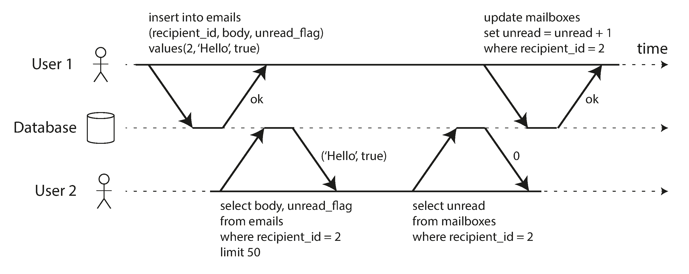
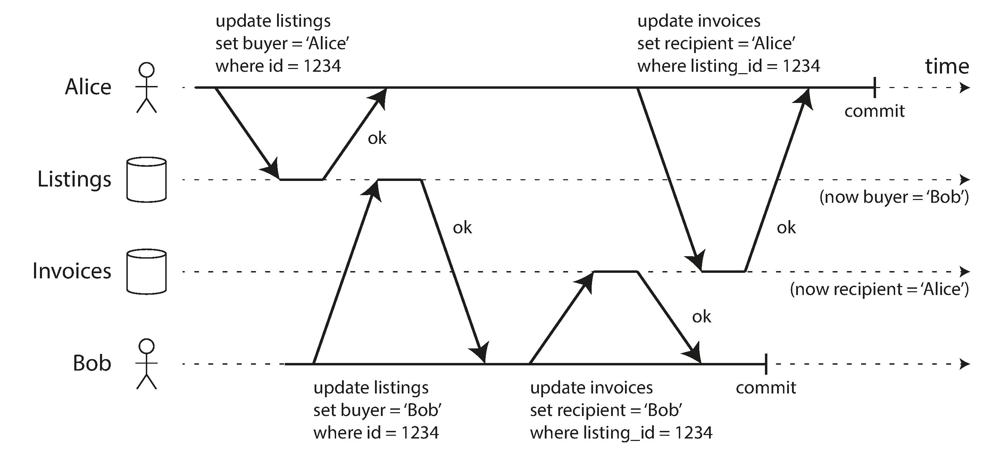
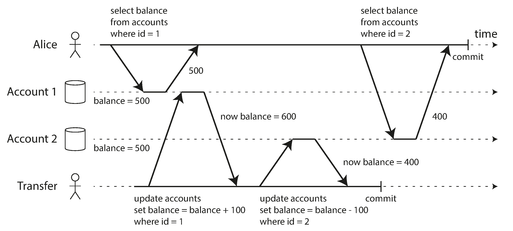
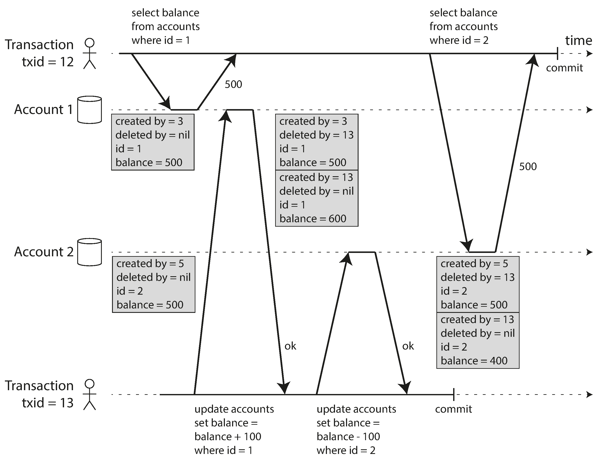
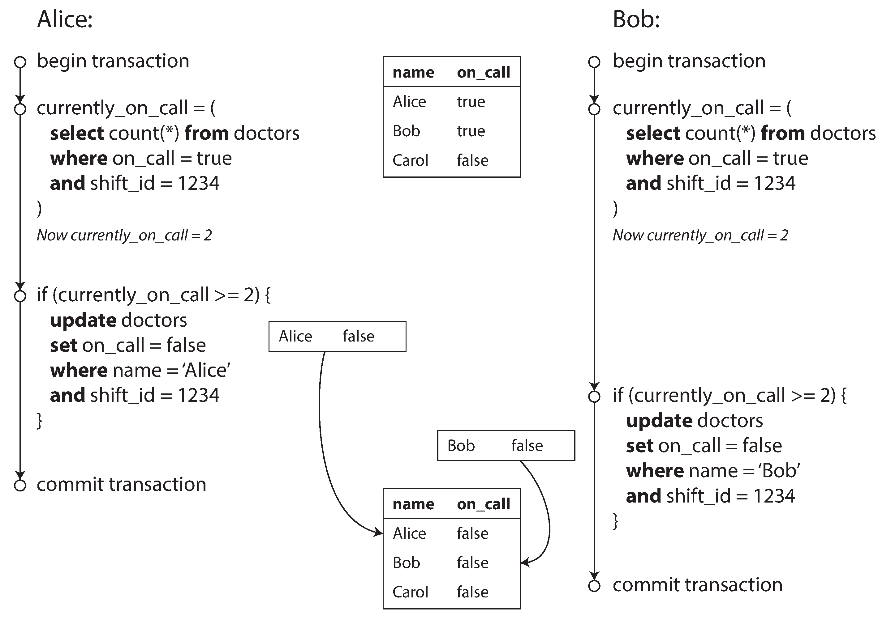
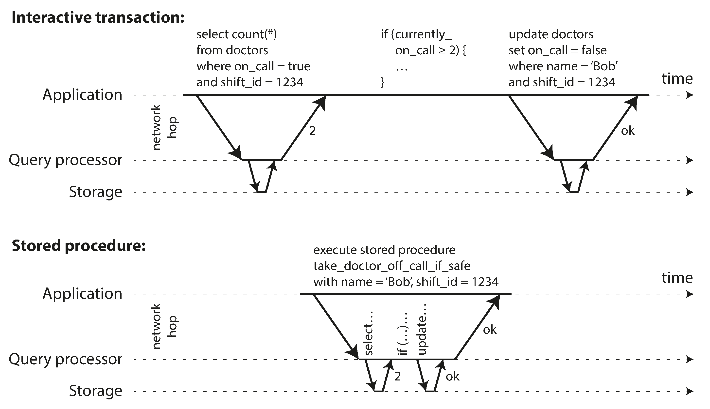
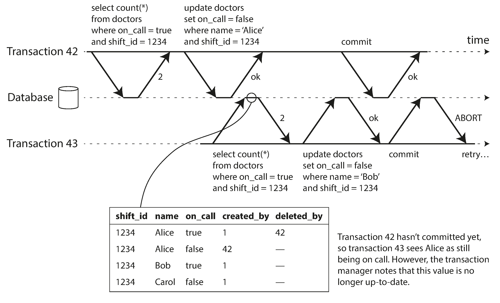
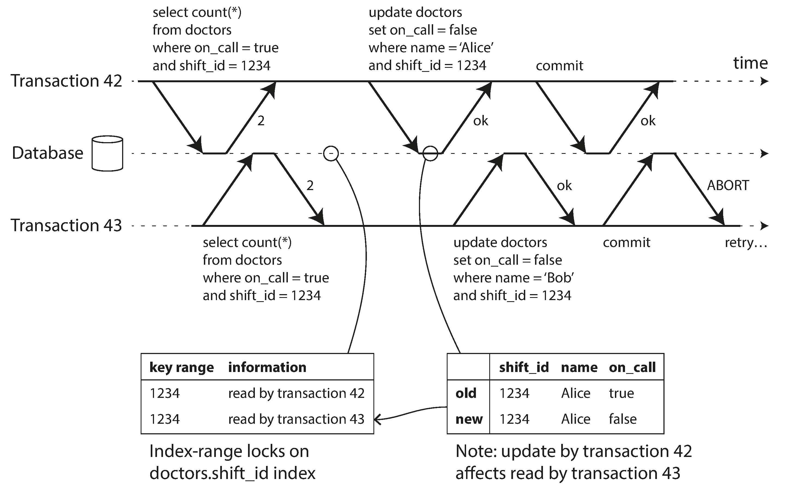

> 一些作者聲稱，支援通用的兩階段提交代價太大，會帶來效能與可用性的問題。讓程式設計師來處理過度使用交易導致的效能問題，總比缺少交易程式設計好得多。
>
> —— James Corbett 等人，Spanner：Google 的全球分散式資料庫（2012）

在資料系統的殘酷現實中，很多事情都可能出錯：

- 資料庫軟體、硬體可能在任意時刻發生故障（包括寫操作進行到一半時）。
- 應用程式可能在任意時刻崩潰（包括一系列操作的中間）。
- 網路中斷可能會意外切斷資料庫與應用的連線，或資料庫之間的連線。
- 多個客戶端可能會同時寫入資料庫，覆蓋彼此的更改。
- 客戶端可能讀取到無意義的資料，因為資料只更新了一部分。
- 客戶端之間的競爭條件可能導致令人驚訝的錯誤。

為了實現可靠性，系統必須處理這些故障，確保它們不會導致整個系統的災難性故障。但是實現容錯機制工作量巨大。需要仔細考慮所有可能出錯的事情，並進行大量的測試，以確保解決方案真正管用。

數十年來，**交易（transaction）** 一直是簡化這些問題的首選機制。交易是應用程式將多個讀寫操作組合成一個邏輯單元的一種方式。從概念上講，交易中的所有讀寫操作被視作單個操作來執行：整個交易要麼成功 **提交**（commit），要麼失敗 **中止**（abort）或 **回滾**（rollback）。如果失敗，應用程式可以安全地重試。對於交易來說，應用程式的錯誤處理變得簡單多了，因為它不用再擔心部分失敗的情況了，即某些操作成功，某些失敗（無論出於何種原因）。

和交易打交道時間長了，你可能會覺得它顯而易見。但我們不應將其視為理所當然。交易不是天然存在的；它們是為了 **簡化應用程式設計模型** 而建立的。透過使用交易，應用程式可以自由地忽略某些潛在的錯誤情況和併發問題，因為資料庫會替應用處理好這些。（我們稱之為 **安全保證**，即 safety guarantees）。

並不是所有的應用都需要交易，有時候弱化交易保證、或完全放棄交易也是有好處的（例如，為了獲得更高效能或更高可用性）。一些安全屬性也可以在沒有交易的情況下實現。

怎樣知道你是否需要交易？為了回答這個問題，首先需要確切理解交易可以提供的安全保障，以及它們的代價。儘管乍看交易似乎很簡單，但實際上有許多微妙但重要的細節在起作用。

本章將研究許多出錯案例，並探索資料庫用於防範這些問題的演算法。尤其會深入 **併發控制** 的領域，討論各種可能發生的競爭條件，以及資料庫如何實現 **讀已提交（read committed）**，**快照隔離（snapshot isolation）** 和 **可序列化（serializability）** 等隔離級別。

本章同時適用於單機資料庫與分散式資料庫；在 [第八章](./ch8) 中將重點討論僅出現在分散式系統中的特殊挑戰。


## 交易的棘手概念

現今，幾乎所有的關係型資料庫和一些非關係資料庫都支援 **交易**。其中大多數遵循 IBM System R（第一個 SQL 資料庫）在 1975 年引入的風格[^ref_1] [^ref_2] [^ref_3]。40 年裡，儘管一些實現細節發生了變化，但總體思路大同小異：MySQL、PostgreSQL、Oracle 和 SQL Server 等資料庫中的交易支援與 System R 異乎尋常地相似。

2000 年以後，非關係（NoSQL）資料庫開始普及。它們的目標是在關係資料庫的現狀基礎上，透過提供新的資料模型選擇（請參閱 [第二章](./ch2)）並預設包含複製（第五章）和分割槽（第六章）來進一步提升。交易是這次運動的主要犧牲品：這些新一代資料庫中的許多資料庫完全放棄了交易，或者重新定義了這個詞，描述比以前所理解的更弱得多的一套保證[^ref_4]。

隨著這種新型分散式資料庫的炒作，人們普遍認為交易是可伸縮性的對立面，任何大型系統都必須放棄交易以保持良好的效能和高可用性[^ref_5] [^ref_6]。另一方面，資料庫廠商有時將交易保證作為 “重要應用” 和 “有價值資料” 的基本要求。這兩種觀點都是 **純粹的誇張**。

事實並非如此簡單：與其他技術設計選擇一樣，交易有其優勢和侷限性。為了理解這些權衡，讓我們瞭解交易所提供保證的細節 —— 無論是在正常執行中還是在各種極端（但是現實存在）的情況下。

### ACID的含義

交易所提供的安全保證，通常由眾所周知的首字母縮略詞 ACID 來描述，ACID 代表 **原子性（Atomicity）**，**一致性（Consistency）**，**隔離性（Isolation）** 和 **永續性（Durability）**。它由 Theo Härder 和 Andreas Reuter 於 1983 年提出，旨在為資料庫中的容錯機制建立精確的術語。

但實際上，不同資料庫的 ACID 實現並不相同。例如，我們將會看到，關於 **隔離性** 的含義就有許多含糊不清[^ref_8]。高層次上的想法很美好，但魔鬼隱藏在細節裡。今天，當一個系統聲稱自己 “符合 ACID” 時，實際上能期待的是什麼保證並不清楚。不幸的是，ACID 現在幾乎已經變成了一個營銷術語。

（不符合 ACID 標準的系統有時被稱為 BASE，它代表 **基本可用性（Basically Available）**，**軟狀態（Soft State）** 和 **最終一致性（Eventual consistency）**[^ref_9]，這比 ACID 的定義更加模糊，似乎 BASE 的唯一合理的定義是 “不是 ACID”，即它幾乎可以代表任何你想要的東西。）

讓我們深入瞭解原子性，一致性，隔離性和永續性的定義，這可以讓我們提煉出交易的思想。

#### 原子性

一般來說，原子是指不能分解成小部分的東西。這個詞在計算機的不同領域中意味著相似但又微妙不同的東西。例如，在多執行緒程式設計中，如果一個執行緒執行一個原子操作，這意味著另一個執行緒無法看到該操作的一半結果。系統只能處於操作之前或操作之後的狀態，而不是介於兩者之間的狀態。

相比之下，ACID 的原子性並 **不** 是關於 **併發（concurrent）** 的。它並不是在描述如果幾個程序試圖同時訪問相同的資料會發生什麼情況，這種情況包含在 [**隔離性**](#隔離性) 中。

ACID 的原子性描述了當客戶想進行多次寫入，但在一些寫操作處理完之後出現故障的情況。例如程序崩潰，網路連線中斷，磁碟變滿或者某種完整性約束被違反。如果這些寫操作被分組到一個原子交易中，並且該交易由於錯誤而不能完成（提交），則該交易將被中止，並且資料庫必須丟棄或撤消該交易中迄今為止所做的任何寫入。

如果沒有原子性，在多處更改進行到一半時發生錯誤，很難知道哪些更改已經生效，哪些沒有生效。該應用程式可以再試一次，但冒著進行兩次相同變更的風險，可能會導致資料重複或錯誤的資料。原子性簡化了這個問題：如果交易被 **中止（abort）**，應用程式可以確定它沒有改變任何東西，所以可以安全地重試。

ACID 原子性的定義特徵是：**能夠在錯誤時中止交易，丟棄該交易進行的所有寫入變更的能力。** 或許 **可中止性（abortability）** 是更好的術語，但本書將繼續使用原子性，因為這是慣用詞。

#### 一致性

一致性這個詞被賦予太多含義：

* 在 [第五章](./ch5) 中，我們討論了副本一致性，以及非同步複製系統中的最終一致性問題（請參閱 “[複製延遲問題](./ch5#複製延遲問題)”）。
* [一致性雜湊](./ch6#一致性雜湊) 是某些系統用於重新分割槽的一種分割槽方法。
* 在 [CAP 定理](./ch9#CAP定理) 中，一致性一詞用於表示 [線性一致性](./ch9#線性一致性)。
* 在 ACID 的上下文中，**一致性** 是指資料庫在應用程式的特定概念中處於 “良好狀態”。

很不幸，這一個詞就至少有四種不同的含義。

ACID 一致性的概念是，**對資料的一組特定約束必須始終成立**，即 **不變式（invariants）**。例如，在會計系統中，所有賬戶整體上必須借貸相抵。如果一個交易開始於一個滿足這些不變式的有效資料庫，且在交易處理期間的任何寫入操作都保持這種有效性，那麼可以確定，不變式總是滿足的。

但是，一致性的這種概念取決於應用程式對不變式的理解，應用程式負責正確定義它的交易，並保持一致性。這並不是資料庫可以保證的事情：如果你寫入違反不變式的髒資料，資料庫也無法阻止你（一些特定型別的不變式可以由資料庫檢查，例如外部索引鍵約束或唯一約束，但是一般來說，是應用程式來定義什麼樣的資料是有效的，什麼樣是無效的。—— 資料庫只管儲存）。

原子性、隔離性和永續性是資料庫的屬性，而一致性（在 ACID 意義上）是應用程式的屬性。應用可能依賴資料庫的原子性和隔離性來實現一致性，但這並不僅取決於資料庫。因此，字母 C 不屬於 ACID [^i]。

[^i]: 喬・海勒斯坦（Joe Hellerstein）指出，在 Härder 與 Reuter 的論文中，“ACID 中的 C” 是被 “扔進去湊縮寫單詞的”[^ref_7]，而且那時候大家都不怎麼在乎一致性。

#### 隔離性

大多數資料庫都會同時被多個客戶端訪問。如果它們各自讀寫資料庫的不同部分，這是沒有問題的，但是如果它們訪問相同的資料庫記錄，則可能會遇到 **併發** 問題（**競爭條件**，即 race conditions）。

[圖 7-1](./v1/ddia_0701.png) 是這類問題的一個簡單例子。假設你有兩個客戶端同時在資料庫中增長一個計數器。（假設資料庫沒有內建的自增操作）每個客戶端需要讀取計數器的當前值，加 1 ，再回寫新值。[圖 7-1](./v1/ddia_0701.png) 中，因為發生了兩次增長，計數器應該從 42 增至 44；但由於競態條件，實際上只增至 43 。

ACID 意義上的隔離性意味著，**同時執行的交易是相互隔離的**：它們不能相互冒犯。傳統的資料庫教科書將隔離性形式化為 **可序列化（Serializability）**，這意味著每個交易可以假裝它是唯一在整個資料庫上執行的交易。資料庫確保當多個交易被提交時，結果與它們序列執行（一個接一個）是一樣的，儘管實際上它們可能是併發執行的[^ref_10]。


**圖 7-1 兩個客戶之間的競爭狀態同時遞增計數器**

然而實踐中很少會使用可序列的隔離，因為它有效能損失。一些流行的資料庫如 Oracle 11g，甚至沒有實現它。在 Oracle 中有一個名為 “可序列的” 隔離級別，但實際上它實現了一種叫做 **快照隔離（snapshot isolation）** 的功能，**這是一種比可序列化更弱的保證**[^ref_8] [^ref_11]。我們將在 “[弱隔離級別](#弱隔離級別)” 中研究快照隔離和其他形式的隔離。

#### 永續性

資料庫系統的目的是，提供一個安全的地方儲存資料，而不用擔心丟失。**永續性** 是一個承諾，即一旦交易成功完成，即使發生硬體故障或資料庫崩潰，寫入的任何資料也不會丟失。

在單節點資料庫中，永續性通常意味著資料已被寫入非易失性儲存裝置，如硬碟或 SSD。它通常還包括預寫日誌或類似的檔案（請參閱 “[讓 B 樹更可靠](./ch3#讓B樹更可靠)”），以便在磁碟上的資料結構損壞時進行恢復。在帶複製的資料庫中，永續性可能意味著資料已成功複製到一些節點。為了提供永續性保證，資料庫必須等到這些寫入或複製完成後，才能報告交易成功提交。

如 “[可靠性](./ch1#可靠性)” 一節所述，**完美的永續性是不存在的** ：如果所有硬碟和所有備份同時被銷燬，那顯然沒有任何資料庫能救得了你。

#### 複製與永續性

> 在歷史上，永續性意味著寫入歸檔磁帶。後來它被理解為寫入磁碟或 SSD。再後來它又有了新的內涵即 “複製（replication）”。哪種實現更好一些？
>
> 真相是，沒有什麼是完美的：
>
> * 如果你寫入磁碟然後機器宕機，即使資料沒有丟失，在修復機器或將磁碟轉移到其他機器之前，也是無法訪問的。這種情況下，複製系統可以保持可用性。
> * 一個相關性故障（停電，或一個特定輸入導致所有節點崩潰的 Bug）可能會一次性摧毀所有副本（請參閱「[可靠性](./ch1#可靠性)」），任何僅儲存在記憶體中的資料都會丟失，故記憶體資料庫仍然要和磁碟寫入打交道。
> * 在非同步複製系統中，當主庫不可用時，最近的寫入操作可能會丟失（請參閱「[處理節點宕機](./ch5#處理節點宕機)」）。
> * 當電源突然斷電時，特別是固態硬碟，有證據顯示有時會違反應有的保證：甚至 fsync 也不能保證正常工作[^ref_12]。硬碟韌體可能有錯誤，就像任何其他型別的軟體一樣[^ref_13] [^ref_14]。
> * 儲存引擎和檔案系統之間的微妙互動可能會導致難以追蹤的錯誤，並可能導致磁碟上的檔案在崩潰後被損壞[^ref_15] [^ref_16]。
> * 磁碟上的資料可能會在沒有檢測到的情況下逐漸損壞[^ref_17]。如果資料已損壞一段時間，副本和最近的備份也可能損壞。這種情況下，需要嘗試從歷史備份中恢復資料。
> * 一項關於固態硬碟的研究發現，在執行的前四年中，30% 到 80% 的硬碟會產生至少一個壞塊[^ref_18]。相比固態硬碟，磁碟的壞道率較低，但完全失效的機率更高。
> * 如果 SSD 斷電，可能會在幾周內開始丟失資料，具體取決於溫度[^ref_19]。
>
> 在實踐中，沒有一種技術可以提供絕對保證。只有各種降低風險的技術，包括寫入磁碟，複製到遠端機器和備份 —— 它們可以且應該一起使用。與往常一樣，最好抱著懷疑的態度接受任何理論上的 “保證”。

### 單物件和多物件操作

回顧一下，在 ACID 中，原子性和隔離性描述了客戶端在同一交易中執行多次寫入時，資料庫應該做的事情：

- **原子性**：如果在一系列寫操作的中途發生錯誤，則應中止交易處理，並丟棄當前交易的所有寫入。換句話說，資料庫免去了使用者對部分失敗的擔憂 —— 透過提供 "**寧為玉碎，不為瓦全（all-or-nothing）**" 的保證。

- **隔離性**：同時執行的交易不應該互相干擾。例如，如果一個交易進行多次寫入，則另一個交易要麼看到全部寫入結果，要麼什麼都看不到，但不應該是一些子集。

這些定義假設你想同時修改多個物件（行，文件，記錄）。通常需要 **多物件交易（multi-object transaction）** 來保持多塊資料同步。[圖 7-2](./v1/ddia_0702.png) 展示了一個來自電郵應用的例子。執行以下查詢來顯示使用者未讀郵件數量：

```sql
SELECT COUNT（*）FROM emails WHERE recipient_id = 2 AND unread_flag = true
```

但如果郵件太多，你可能會覺得這個查詢太慢，並決定用單獨的欄位儲存未讀郵件的數量（一種反規範化 Denormalization）。現在每當一個新訊息寫入時，必須也增長未讀計數器，每當一個訊息被標記為已讀時，也必須減少未讀計數器。

在 [圖 7-2](./v1/ddia_0702.png) 中，使用者 2 遇到異常情況：郵件列表裡顯示有未讀訊息，但計數器顯示為零未讀訊息，因為計數器增長還沒有發生 [^ii]。隔離性可以避免這個問題：透過確保使用者 2 要麼同時看到新郵件和增長後的計數器，要麼都看不到，而不是一個前後矛盾的中間結果。

[^ii]: 可以說郵件應用中的錯誤計數器並不是什麼特別重要的問題。但換種方式來看，你可以把未讀計數器換成客戶賬戶餘額，把郵件收發看成支付交易。



**圖 7-2 違反隔離性：一個交易讀取另一個交易的未被執行的寫入（“髒讀”）。**

[圖 7-3](./v1/ddia_0703.png) 說明了對原子性的需求：如果在交易過程中發生錯誤，郵箱和未讀計數器的內容可能會失去同步。在原子交易中，如果對計數器的更新失敗，交易將被中止，並且插入的電子郵件將被回滾。


**圖 7-3 原子性確保發生錯誤時，交易先前的任何寫入都會被撤消，以避免狀態不一致**

多物件交易需要某種方式來確定哪些讀寫操作屬於同一個交易。在關係型資料庫中，通常基於客戶端與資料庫伺服器的 TCP 連線：在任何特定連線上，`BEGIN TRANSACTION` 和 `COMMIT` 語句之間的所有內容，被認為是同一交易的一部分.[^iii]

[^iii]: 這並不完美。如果 TCP 連線中斷，則交易必須中止。如果中斷發生在客戶端請求提交之後，但在伺服器確認提交發生之前，客戶端並不知道交易是否已提交。為了解決這個問題，交易管理器可以透過一個唯一交易識別符號來對操作進行分組，這個識別符號並未繫結到特定 TCP 連線。後續再 “[資料庫的端到端原則](./ch12#資料庫的端到端原則)” 一節將回到這個主題。

另一方面，許多非關係資料庫並沒有將這些操作組合在一起的方法。即使存在多物件 API（例如，某鍵值儲存可能具有在一個操作中更新幾個鍵的 multi-put 操作），但這並不一定意味著它具有交易語義：該命令可能在一些鍵上成功，在其他的鍵上失敗，使資料庫處於部分更新的狀態。

#### 單物件寫入

當單個物件發生改變時，原子性和隔離性也是適用的。例如，假設你正在向資料庫寫入一個 20 KB 的 JSON 文件：

- 如果在傳送第一個 10 KB 之後網路連線中斷，資料庫是否儲存了不可解析的 10KB JSON 片段？
- 如果在資料庫正在覆蓋磁碟上的前一個值的過程中電源發生故障，是否最終將新舊值拼接在一起？
- 如果另一個客戶端在寫入過程中讀取該文件，是否會看到部分更新的值？

這些問題非常讓人頭大，故儲存引擎一個幾乎普遍的目標是：對單節點上的單個物件（例如鍵值對）上提供原子性和隔離性。原子性可以透過使用日誌來實現崩潰恢復（請參閱 “[讓 B 樹更可靠](./ch3#讓B樹更可靠)”），並且可以使用每個物件上的鎖來實現隔離（每次只允許一個執行緒訪問物件） 。

一些資料庫也提供更複雜的原子操作 [^iv]，例如自增操作，這樣就不再需要像 [圖 7-1](./v1/ddia_0701.png) 那樣的讀取 → 修改 → 寫入序列了。同樣流行的是 **[比較和設定（CAS, compare-and-set）](#比較並設定（CAS）)** 操作，僅當值沒有被其他併發修改過時，才允許執行寫操作。

[^iv]: 嚴格地說，**原子自增（atomic increment）** 這個術語在多執行緒程式設計的意義上使用了原子這個詞。在 ACID 的情況下，它實際上應該被稱為 **隔離的（isolated）** 的或 **可序列的（serializable）** 的增量。但這就太吹毛求疵了。

這些單物件操作很有用，因為它們可以防止在多個客戶端嘗試同時寫入同一個物件時丟失更新（請參閱 “[防止丟失更新](#防止丟失更新)”）。但它們不是通常意義上的交易。CAS 以及其他單一物件操作被稱為 “輕量級交易”，甚至出於營銷目的被稱為 “ACID”[^ref_20] [^ref_21] [^ref_22]，但是這個術語是誤導性的。交易通常被理解為，**將多個物件上的多個操作合併為一個執行單元的機制**。

#### 多物件交易的需求

許多分散式資料儲存已經放棄了多物件交易，因為多物件交易很難跨分割槽實現，而且在需要高可用性或高效能的情況下，它們可能會礙事。但說到底，在分散式資料庫中實現交易，並沒有什麼根本性的障礙。[第九章](./ch9) 將討論分散式交易的實現。

但是我們是否需要多物件交易？**是否有可能只用鍵值資料模型和單物件操作來實現任何應用程式？**

有一些場景中，單物件插入，更新和刪除是足夠的。但是許多其他場景需要協調寫入幾個不同的物件：

* 在關係資料模型中，一個表中的行通常具有對另一個表中的行的外部索引鍵引用。（類似的是，在一個圖資料模型中，一個頂點有著到其他頂點的邊）。多物件交易使你確保這些引用始終有效：當插入幾個相互引用的記錄時，外部索引鍵（Foreign key）必須是正確的和最新的，不然資料就沒有意義。
* 在文件資料模型中，需要一起更新的欄位通常在同一個文件中，這被視為單個物件 —— 更新單個文件時不需要多物件交易。但是，缺乏關聯功能的文件資料庫會鼓勵非規範化（請參閱 “[關係型資料庫與文件資料庫在今日的對比](./ch2#關係型資料庫與文件資料庫在今日的對比)”）。當需要更新非規範化的資訊時，如 [圖 7-2](./v1/ddia_0702.png) 所示，需要一次更新多個文件。交易在這種情況下非常有用，可以防止非規範化的資料不同步。
* 在具有次級索引的資料庫中（除了純粹的鍵值儲存以外幾乎都有），每次更改值時都需要更新索引。從交易角度來看，這些索引是不同的資料庫物件：例如，如果沒有交易隔離性，記錄可能出現在一個索引中，但沒有出現在另一個索引中，因為第二個索引的更新還沒有發生。

這些應用仍然可以在沒有交易的情況下實現。然而，**沒有原子性，錯誤處理就要複雜得多，缺乏隔離性，就會導致併發問題**。我們將在 “[弱隔離級別](#弱隔離級別)” 中討論這些問題，並在 [第十二章](./ch12) 中探討其他方法。

#### 處理錯誤和中止

交易的一個關鍵特性是，如果發生錯誤，它可以中止並安全地重試。ACID 資料庫基於這樣的哲學：如果資料庫有違反其原子性，隔離性或永續性的危險，則寧願完全放棄交易，而不是留下半成品。

然而並不是所有的系統都遵循這個哲學。特別是具有 [無主複製](./ch5#無主複製) 的資料儲存，主要是在 “盡力而為” 的基礎上進行工作。可以概括為 “資料庫將做盡可能多的事，執行遇到錯誤時，它不會撤消它已經完成的事情” —— 所以，從錯誤中恢復是應用程式的責任。

錯誤發生不可避免，但許多軟體開發人員傾向於只考慮樂觀情況，而不是錯誤處理的複雜性。例如，像 Rails 的 ActiveRecord 和 Django 這樣的 **物件關係對映（ORM, object-relation Mapping）** 框架不會重試中斷的交易 —— 這個錯誤通常會導致一個從堆疊向上傳播的異常，所以任何使用者輸入都會被丟棄，使用者拿到一個錯誤資訊。這實在是太恥辱了，因為中止的重點就是允許安全的重試。

儘管重試一個中止的交易是一個簡單而有效的錯誤處理機制，但它並不完美：

- 如果交易實際上成功了，但是在伺服器試圖向客戶端確認提交成功時網路發生故障（所以客戶端認為提交失敗了），那麼重試交易會導致交易被執行兩次 —— 除非你有一個額外的應用級去重機制。
- 如果錯誤是由於負載過大造成的，則重試交易將使問題變得更糟，而不是更好。為了避免這種正反饋迴圈，可以限制重試次數，使用指數退避演算法，並單獨處理與過載相關的錯誤（如果允許）。
- 僅在臨時性錯誤（例如，由於死鎖，異常情況，臨時性網路中斷和故障切換）後才值得重試。在發生永久性錯誤（例如，違反約束）之後重試是毫無意義的。
- 如果交易在資料庫之外也有副作用，即使交易被中止，也可能發生這些副作用。例如，如果你正在傳送電子郵件，那你肯定不希望每次重試交易時都重新發送電子郵件。如果你想確保幾個不同的系統一起提交或放棄，**兩階段提交（2PC, two-phase commit）** 可以提供幫助（“[原子提交與兩階段提交](./ch9#原子提交與兩階段提交)” 中將討論這個問題）。
- 如果客戶端程序在重試中失效，任何試圖寫入資料庫的資料都將丟失。

## 弱隔離級別

如果兩個交易不觸及相同的資料，它們可以安全地 **並行（parallel）** 執行，因為兩者都不依賴於另一個。當一個交易讀取由另一個交易同時修改的資料時，或者當兩個交易試圖同時修改相同的資料時，併發問題（競爭條件）才會出現。

併發 BUG 很難透過測試找到，因為這樣的錯誤只有在特殊時序下才會觸發。這樣的時序問題可能非常少發生，通常很難重現 [^譯註i]。併發性也很難推理，特別是在大型應用中，你不一定知道哪些其他程式碼正在訪問資料庫。在一次只有一個使用者時，應用開發已經很麻煩了，有許多併發使用者使得它更加困難，因為任何一個數據都可能隨時改變。

[^譯註i]: 軼事：偶然出現的瞬時錯誤有時稱為 ***Heisenbug***，而確定性的問題對應地稱為 ***Bohrbugs***

出於這個原因，資料庫一直試圖透過提供 **交易隔離（transaction isolation）** 來隱藏應用程式開發者的併發問題。從理論上講，隔離可以透過假裝沒有併發發生，讓你的生活更加輕鬆：**可序列的（serializable）** 隔離等級意味著資料庫保證交易的效果如同序列執行（即一次一個，沒有任何併發）。

實際上不幸的是：隔離並沒有那麼簡單。**可序列的隔離** 會有效能損失，許多資料庫不願意支付這個代價[^ref_8]。因此，系統通常使用較弱的隔離級別來防止一部分，而不是全部的併發問題。這些隔離級別難以理解，並且會導致微妙的錯誤，但是它們仍然在實踐中被使用[^ref_23]。

弱交易隔離級別導致的併發性錯誤不僅僅是一個理論問題。它們造成了很多的資金損失[^ref_24] [^ref_25]，耗費了財務審計人員的調查[^ref_26]，並導致客戶資料被破壞[^ref_27]。關於這類問題的一個流行的評論是 “如果你正在處理財務資料，請使用 ACID 資料庫！” —— 但是這一點沒有提到。即使是很多流行的關係型資料庫系統（通常被認為是 “ACID”）也使用弱隔離級別，所以它們也不一定能防止這些錯誤的發生。

比起盲目地依賴工具，我們需要對存在的各種併發問題，以及如何防止這些問題有深入的理解。然後就可以使用我們所掌握的工具來構建可靠和正確的應用程式。

在本節中，我們將看幾個在實踐中使用的弱（**非序列的**，即 nonserializable）隔離級別，並詳細討論哪種競爭條件可能發生也可能不發生，以便你可以決定什麼級別適合你的應用程式。一旦我們完成了這個工作，我們將詳細討論可序列化（請參閱 “[可序列化](#可序列化)”）。我們討論的隔離級別將是非正式的，透過示例來進行。如果你需要嚴格的定義和分析它們的屬性，你可以在學術文獻中找到它們[^ref_28] [^ref_29] [^ref_30]。

### 讀已提交

最基本的交易隔離級別是 **讀已提交（Read Committed）**[^v]，它提供了兩個保證：

1. 從資料庫讀時，只能看到已提交的資料（沒有 **髒讀**，即 dirty reads）。
2. 寫入資料庫時，只會覆蓋已提交的資料（沒有 **髒寫**，即 dirty writes）。

我們來更詳細地討論這兩個保證。

[^v]: 某些資料庫支援甚至更弱的隔離級別，稱為 **讀未提交（Read uncommitted）**。它可以防止髒寫，但不防止髒讀。

#### 沒有髒讀

設想一個交易已經將一些資料寫入資料庫，但交易還沒有提交或中止。另一個交易可以看到未提交的資料嗎？如果是的話，那就叫做 **髒讀（dirty reads）**[^ref_2]。

在 **讀已提交** 隔離級別執行的交易必須防止髒讀。這意味著交易的任何寫入操作只有在該交易提交時才能被其他人看到（然後所有的寫入操作都會立即變得可見）。如 [圖 7-4](./v1/ddia_0704.png) 所示，使用者 1 設定了 `x = 3`，但使用者 2 的 `get x` 仍舊返回舊值 2 （當用戶 1 尚未提交時）。


**圖 7-4 沒有髒讀：使用者 2 只有在使用者 1 的交易已經提交後才能看到 x 的新值。**

為什麼要防止髒讀，有幾個原因：

- 如果交易需要更新多個物件，髒讀取意味著另一個交易可能會只看到一部分更新。例如，在 [圖 7-2](./v1/ddia_0702.png) 中，使用者看到新的未讀電子郵件，但看不到更新的計數器。這就是電子郵件的髒讀。看到處於部分更新狀態的資料庫會讓使用者感到困惑，並可能導致其他交易做出錯誤的決定。
- 如果交易中止，則所有寫入操作都需要回滾（如 [圖 7-3](./v1/ddia_0703.png) 所示）。如果資料庫允許髒讀，那就意味著一個交易可能會看到稍後需要回滾的資料，即從未實際提交給資料庫的資料。想想後果就讓人頭大。

#### 沒有髒寫

如果兩個交易同時嘗試更新資料庫中的相同物件，會發生什麼情況？我們不知道寫入的順序是怎樣的，但是我們通常認為後面的寫入會覆蓋前面的寫入。

但是，如果先前的寫入是尚未提交交易的一部分，使得後面的寫入覆蓋了一個尚未提交的值，這時會發生什麼呢？這被稱作 **髒寫（dirty write）**[^ref_28]。在 **讀已提交** 的隔離級別上執行的交易必須防止髒寫，通常是延遲第二次寫入，直到第一次寫入交易提交或中止為止。

透過防止髒寫，這個隔離級別避免了一些併發問題：

- 如果交易更新多個物件，髒寫會導致不好的結果。例如，考慮 [圖 7-5](./v1/ddia_0705.png)，以一個二手車銷售網站為例，Alice 和 Bob 兩個人同時試圖購買同一輛車。購買汽車需要兩次資料庫寫入：網站上的商品列表需要更新，以反映買家的購買，銷售發票需要傳送給買家。在 [圖 7-5](./v1/ddia_0705.png) 的情況下，銷售是屬於 Bob 的（因為他成功更新了商品列表），但發票卻寄送給了 Alice（因為她成功更新了發票表）。讀已提交會防止這樣的事故。
- 但是，讀已提交並不能防止 [圖 7-1](./v1/ddia_0701.png) 中兩個計數器增量之間的競爭狀態。在這種情況下，第二次寫入發生在第一個交易提交後，所以它不是一個髒寫。這仍然是不正確的，但是出於不同的原因，在 “[防止丟失更新](#防止丟失更新)” 中將討論如何使這種計數器增量安全。



**圖 7-5 如果存在髒寫，來自不同交易的衝突寫入可能會混淆在一起**

#### 實現讀已提交

**讀已提交** 是一個非常流行的隔離級別。這是 Oracle 11g、PostgreSQL、SQL Server 2012、MemSQL 和其他許多資料庫的預設設定[^ref_8]。

最常見的情況是，資料庫透過使用 **行鎖（row-level lock）** 來防止髒寫：當交易想要修改特定物件（行或文件）時，它必須首先獲得該物件的鎖。然後必須持有該鎖直到交易被提交或中止。一次只有一個交易可持有任何給定物件的鎖；如果另一個交易要寫入同一個物件，則必須等到第一個交易提交或中止後，才能獲取該鎖並繼續。這種鎖定是讀已提交模式（或更強的隔離級別）的資料庫自動完成的。

如何防止髒讀？一種選擇是使用相同的鎖，並要求任何想要讀取物件的交易來簡單地獲取該鎖，然後在讀取之後立即再次釋放該鎖。這將確保在物件具有髒的、未提交的值時不會發生讀取（因為在此期間，鎖將由進行寫入的交易持有）。

但是要求 read 交易等待鎖的辦法在實踐中效果並不好。因為一個長時間執行的 write 交易會迫使許多支 read 交易等到這個 slow write 交易完成。這會影響 read-only 交易的響應時間，並且不利於可操作性：因為等待鎖，應用某個部分的遲緩可能由於連鎖效應，導致其他部分出現問題。

出於這個原因，大多數資料庫 [^vi] 使用 [圖 7-4](./v1/ddia_0704.png) 的方式防止髒讀：對於寫入的每個物件，資料庫都會記住「舊的已提交值」，和由當前持有寫入鎖的交易設定的新值。當交易正在進行時，任何其他讀取（read）物件的交易都會拿到舊值。只有當新值提交後，交易才會切換到讀取新值。

[^vi]: 在撰寫本文時，唯一在讀已提交隔離級別使用讀鎖的主流資料庫是 IBM DB2 和使用 `read_committed_snapshot = off` 配置的 Microsoft SQL Server[^ref_23] [^ref_36]。

### 快照隔離和可重複讀

如果只從表面上看讀已提交隔離級別，你可能就認為它完成了交易所需的一切，這是情有可原的。它允許 **中止**（原子性的要求）；它防止讀取不完整的交易結果，並且防止併發寫入造成的混亂。事實上這些功能非常有用，比起沒有交易的系統來，可以提供更多的保證。

但是在使用此隔離級別時，仍然有很多地方可能會產生併發錯誤。例如 [圖 7-6](./v1/ddia_0706.png) 說明了讀已提交時可能發生的問題。



**圖 7-6 讀取偏差：Alice 觀察資料庫處於不一致的狀態**

Alice 在銀行有 1000 美元的儲蓄，分為兩個賬戶，每個 500 美元。現在有一筆交易從她的一個賬戶轉移了 100 美元到另一個賬戶。如果她非常不幸地在交易處理的過程中檢視其賬戶餘額列表，她可能會在收到付款之前先看到一個賬戶的餘額（收款賬戶，餘額仍為 500 美元），在發出轉賬之後再看到另一個賬戶的餘額（付款賬戶，新的餘額為 400 美元）。對 Alice 來說，現在她的賬戶似乎總共只有 900 美元 —— 看起來有 100 美元已經憑空消失了。

這種異常被稱為 **不可重複讀（nonrepeatable read）** 或 **讀取偏差（read skew）**：如果 Alice 在交易結束時再次讀取 $Account_1$ 的餘額，她將看到與她之前的查詢中看到的不同的值（600 美元）。在讀已提交的隔離條件下，**不可重複讀** 被認為是可接受的：Alice 看到的帳戶餘額確實在閱讀時已經提交了。

> 不幸的是，術語 **偏差（skew）** 這個詞是過載的：以前使用它是因為熱點的不平衡工作量（請參閱 “[負載偏斜與熱點消除](./ch6#負載偏斜與熱點消除)”），而這裡偏差意味著異常的時序。

對於 Alice 的情況，這不是一個長期持續的問題。因為如果她幾秒鐘後重新整理銀行網站的頁面，她很可能會看到一致的帳戶餘額。但是有些情況下，不能容忍這種暫時的不一致：

- **備份**：進行備份需要複製整個資料庫，對大型資料庫而言可能需要花費數小時才能完成。備份程序執行時，資料庫仍然會接受寫入操作。因此備份可能會包含一些舊的部分和一些新的部分。如果從這樣的備份中恢復，那麼不一致（如消失的錢）就會變成永久的。

- **分析查詢和完整性檢查**：有時，你可能需要執行一個查詢，掃描大部分的資料庫。這樣的查詢在分析中很常見（請參閱 "[交易處理還是分析？](./ch3#交易處理還是分析？)"），也可能是定期完整性檢查（即監視資料損壞）的一部分。如果這些查詢在不同時間點觀察資料庫的不同部分，則可能會返回毫無意義的結果。

**快照隔離（snapshot isolation）**[^ref_28]是這個問題最常見的解決方案。想法是，每個交易都從資料庫的 **一致快照（consistent snapshot）** 中讀取 —— 也就是說，交易可以看到交易開始時在資料庫中提交的所有資料。即使這些資料隨後被另一個交易更改，每個交易也只能看到該特定時間點的舊資料。

快照隔離對長時間執行的 read-only 查詢（如備份和分析）非常有用。如果查詢的資料在查詢執行的同時發生變化，則很難理解查詢的含義。當一個交易可以看到資料庫在某個特定時間點凍結時的一致快照，理解起來就很容易了。

快照隔離是一個流行的功能：PostgreSQL、使用 InnoDB 引擎的 MySQL、Oracle、SQL Server 等都支援[^ref_23] [^ref_31] [^ref_32]。

#### 實現快照隔離

與讀取提交的隔離類似，快照隔離的實現通常使用寫鎖來防止髒寫（請參閱 “[讀已提交](#讀已提交)”），這意味著進行寫入的交易會阻止另一個交易修改同一個物件。但是讀取則不需要加鎖。從效能的角度來看，快照隔離的一個關鍵原則是：**讀不阻塞寫，寫不阻塞讀**。這允許資料庫在處理一致性快照上的長時間查詢時，可以正常地同時處理寫入操作，且兩者間沒有任何鎖爭用。

為了實現快照隔離，資料庫使用了我們看到的用於防止 [圖 7-4](./v1/ddia_0704.png) 中的髒讀的機制的一般化。資料庫必須可能保留一個物件的幾個不同的提交版本，因為各種正在進行的交易可能需要看到資料庫在不同的時間點的狀態。因為它同時維護著單個物件的多個版本，所以這種技術被稱為 **多版本併發控制（MVCC, multi-version concurrency control）**。

如果一個數據庫只需要提供 **讀已提交** 的隔離級別，而不提供 **快照隔離**，那麼保留一個物件的兩個版本就足夠了：

1. 已提交的版本
2. 被覆蓋但尚未提交的版本

不過支援快照隔離的儲存引擎通常也使用 MVCC 來實現 **讀已提交** 隔離級別。一種典型的方法是 **讀已提交** 為每個查詢使用單獨的快照，而 **快照隔離** 對整個交易使用相同的快照。

[圖 7-7](./v1/ddia_0707.png) 說明了 PostgreSQL 如何實現基於 MVCC 的快照隔離[^ref_31]（其他實現類似）。當一個交易開始時，它被賦予一個唯一的，永遠增長 [^vii] 的交易 ID（`txid`）。每當交易向資料庫寫入任何內容時，它所寫入的資料都會被標記上寫入者的交易 ID。

[^vii]: 事實上，交易 ID 是 32 位整數，所以大約會在 40 億次交易之後溢位。PostgreSQL 的 Vacuum 過程會清理老舊的交易 ID，確保交易 ID 溢位（回捲）不會影響到資料。



**圖 7-7 使用多版本物件實現快照隔離**

表中的每一行都有一個 `created_by` 欄位，其中包含將該行插入到表中的的交易 ID。此外，每行都有一個 `deleted_by` 欄位，最初是空的。如果某個交易刪除了一行，那麼該行實際上並未從資料庫中刪除，而是透過將 `deleted_by` 欄位設定為請求刪除的交易的 ID 來標記為刪除。在稍後的時間，當確定沒有交易可以再訪問已刪除的資料時，資料庫中的垃圾收集（GC）過程會將所有帶有刪除標記的行移除，並釋放其空間。[^譯註ii]

[^譯註ii]: 在 PostgreSQL 中，`created_by` 的實際名稱為 `xmin`，`deleted_by` 的實際名稱為 `xmax`

`UPDATE` 操作在內部翻譯為 `DELETE` + `INSERT` 。例如，在 [圖 7-7](./v1/ddia_0707.png) 中，交易 13 從 $Account_2$ 中扣除 100 美元，將餘額從 500 美元改為 400 美元。實際上包含兩條 $Account_2$ 的記錄：餘額為 \$500 的行被標記為 **被交易 13 刪除**，餘額為 \$400 的行 **由交易 13 建立**。

#### 觀察一致性快照的可見性規則

當一個交易從資料庫中讀取時，交易 ID 用於決定它可以看見哪些物件，看不見哪些物件。透過仔細定義可見性規則，資料庫可以嚮應用程式呈現一致的資料庫快照。工作如下：

1. 在每次交易開始時，資料庫列出當時所有其他（尚未提交或尚未中止）的交易清單，即使之後提交了，這些交易已執行的任何寫入也都會被忽略。
2. 被中止交易所執行的任何寫入都將被忽略。
3. 由具有較晚交易 ID（即，在當前交易開始之後開始的）的交易所做的任何寫入都被忽略，而不管這些交易是否已經提交。
4. 所有其他寫入，對應用都是可見的。

這些規則適用於建立和刪除物件。在 [圖 7-7](./v1/ddia_0707.png) 中，當交易 12 從 $Account_2$ 讀取時，它會看到 \$500 的餘額，因為 \$500 餘額的刪除是由交易 13 完成的（根據規則 3，交易 12 看不到交易 13 執行的刪除），且 400 美元記錄的建立也是不可見的（按照相同的規則）。

換句話說，如果以下兩個條件都成立，則可見一個物件：

- 讀交易開始時，建立該物件的交易已經提交。
- 物件未被標記為刪除，或如果被標記為刪除，請求刪除的交易在讀交易開始時尚未提交。

長時間執行的交易可能會長時間使用快照，並繼續讀取（從其他交易的角度來看）早已被覆蓋或刪除的值。由於從來不原地更新值，而是每次值改變時建立一個新的版本，資料庫可以在提供一致快照的同時只產生很小的額外開銷。

#### 索引和快照隔離

索引如何在多版本資料庫中工作？一種選擇是使索引簡單地指向物件的所有版本，並且需要索引查詢來過濾掉當前交易不可見的任何物件版本。當垃圾收集（GC）刪除任何交易不再可見的舊物件版本時，相應的索引條目也可以被刪除。

在實踐中，許多實現細節決定了多版本併發控制的效能。例如，如果同一物件的不同版本可以放入同一個頁面中，PostgreSQL 的最佳化可以避免更新索引[^ref_31]。

在 CouchDB、Datomic 和 LMDB 中使用另一種方法。雖然它們也使用 [B 樹](./ch3#B樹)，但它們使用的是一種 **僅追加 / 寫時複製（append-only/copy-on-write）** 的變體，它們在更新時不覆蓋樹的頁面，而為每個修改頁面建立一份副本。從父頁面直到樹根都會連動（Cascade）更新，以指向它們子頁面的新版本。任何不受寫入影響的頁面都不需要被複制，並且保持不變[^ref_33] [^ref_34] [^ref_35]。

使用僅追加的 B 樹，每個寫入交易（或一批交易）都會建立一棵新的 B 樹，當建立時，從該特定樹根生長的樹就是資料庫的一個一致性快照。沒必要根據交易 ID 過濾掉物件，因為後續寫入不能修改現有的 B 樹；它們只能建立新的樹根。但這種方法也需要一個負責壓縮和垃圾收集的後臺程序。

#### 可重複讀與命名混淆

快照隔離是一個有用的隔離級別，特別對於 read only 交易而言。但是，許多資料庫實現了它，卻用不同的名字來稱呼。在 Oracle 中稱為 **可序列化（Serializable）** 的，在 PostgreSQL 和 MySQL 中稱為 **可重複讀（repeatable read）**[^ref_23]。

這種命名混淆的原因是 SQL 標準沒有 **快照隔離** 的概念，因為標準是基於 System R 1975 年定義的隔離級別[^ref_2]，那時候 **快照隔離** 尚未發明。相反，它定義了 **可重複讀**，表面上看起來與快照隔離很相似。PostgreSQL 和 MySQL 稱其 **快照隔離** 級別為 **可重複讀（repeatable read）**，因為這樣符合標準要求，所以它們可以聲稱自己 “標準相容”。

不幸的是，SQL 標準對隔離級別的定義是有缺陷的 —— 模糊，不精確，並不像標準應有的樣子獨立於實現[^ref_28]。有幾個資料庫實現了可重複讀，但它們實際提供的保證存在很大的差異，儘管表面上是標準化的[^ref_23]。在研究文獻[^ref_29] [^ref_30]中已經有了可重複讀的正式定義，但大多數的實現並不能滿足這個正式定義。最後，IBM DB2 使用 “可重複讀” 來引用可序列化[^ref_8]。

結果，沒有人真正知道 **可重複讀** 的意思。

### 防止丟失更新

到目前為止已經討論的 **讀已提交** 和 **快照隔離** 級別，主要保證了 **read only 交易在併發寫入時** 可以看到什麼。卻忽略了兩個交易併發寫入的問題 —— 我們只討論了髒寫（請參閱 “[沒有髒寫](#沒有髒寫)”），一種特定型別的寫 —— 寫衝突是可能出現的。

併發的寫入交易之間還有其他幾種有趣的衝突。其中最著名的是 **丟失更新（lost update）** 問題，如 [圖 7-1](./v1/ddia_0701.png) 所示，以兩個併發計數器增量為例。

如果應用從資料庫中讀取一些值，修改它並寫回修改的值（讀取 → 修改 → 寫入序列），則可能會發生丟失更新的問題。如果兩個交易同時執行，則其中一個的修改可能會丟失，因為第二個寫入的內容並沒有包括第一個交易的修改（有時會說後面寫入 **狠揍（clobber）** 了前面的寫入）這種模式發生在各種不同的情況下：

- 增加計數器或更新賬戶餘額（需要讀取當前值，計算新值並寫回更新後的值）
- 將本地修改寫入一個複雜值中：例如，將元素新增到 JSON 文件中的一個列表（需要解析文件，進行更改並寫回修改的文件）
- 兩個使用者同時編輯 wiki 頁面，每個使用者透過將整個頁面內容傳送到伺服器來儲存其更改，覆寫資料庫中當前的任何內容。

這是一個普遍的問題，所以已經開發了各種解決方案。

#### 原子寫

許多資料庫提供了原子更新操作，從而消除了在應用程式程式碼中執行讀取 → 修改 → 寫入序列的需要。如果你的程式碼可以用這些操作來表達，那這通常是最好的解決方案。例如，下面的指令在大多數關係資料庫中是併發安全的：

```sql
UPDATE counters SET value = value + 1 WHERE key = 'foo';
```

類似地，像 MongoDB 這樣的文件資料庫提供了對 JSON 文件的一部分進行本地修改的原子操作，Redis 提供了修改資料結構（如優先順序佇列）的原子操作。並不是所有的寫操作都可以用原子操作的方式來表達，例如 wiki 頁面的更新涉及到任意文字編輯 [^viii]，但是在可以使用原子操作的情況下，它們通常是最好的選擇。

[^viii]: 將文字文件的編輯表示為原子的變化流是可能的，儘管相當複雜。請參閱 “[自動衝突解決](./ch5#自動衝突解決)”。

原子操作通常透過在讀取物件時，獲取其上的排它鎖來實現。以便更新完成之前沒有其他交易可以讀取它。這種技術有時被稱為 **遊標穩定性（cursor stability）**[^ref_36] [^ref_37]。另一個選擇是簡單地強制所有的原子操作在單一執行緒上執行。

不幸的是，ORM 框架很容易意外地執行不安全的讀取 → 修改 → 寫入序列，而不是使用資料庫提供的原子操作[^ref_38]。如果你知道自己在做什麼那當然不是問題，但它經常產生那種很難測出來的微妙 Bug。

#### 顯式鎖定

如果資料庫的內建原子操作沒有提供必要的功能，防止丟失更新的另一個選擇是讓應用程式顯式地鎖定將要更新的物件。然後應用程式可以執行讀取 → 修改 → 寫入序列，如果任何其他交易嘗試同時讀取同一個物件，則強制等待，直到第一個 **讀取 → 修改 → 寫入序列** 完成。

例如，考慮一個多人遊戲，其中幾個玩家可以同時移動相同的棋子。在這種情況下，一個原子操作可能是不夠的，因為應用程式還需要確保玩家的移動符合遊戲規則，這可能涉及到一些不能合理地用資料庫查詢實現的邏輯。但你可以使用鎖來防止兩名玩家同時移動相同的棋子，如 [例 7-1](#例-7-1-顯式鎖定行以防止丟失更新) 所示。

#### 例 7-1 顯式鎖定行以防止丟失更新

```sql
BEGIN TRANSACTION;
SELECT * FROM figures
  WHERE name = 'robot' AND game_id = 222
FOR UPDATE;

-- 檢查玩家的操作是否有效，然後更新先前 SELECT 返回棋子的位置。
UPDATE figures SET position = 'c4' WHERE id = 1234;
COMMIT;
```

- `FOR UPDATE` 子句告訴資料庫應該對該查詢返回的「所有行（row）」加鎖。

這是有效的，但要做對，你需要仔細考慮應用邏輯。忘記在程式碼某處加鎖很容易引入競爭條件。

#### 自動檢測丟失的更新

原子操作和鎖是透過強制 **讀取 → 修改 → 寫入序列** 按順序發生，來防止丟失更新的方法。另一種方法是允許它們並行執行，如果交易管理器檢測到丟失更新，則中止交易並強制它們重試其 **讀取 → 修改 → 寫入序列**。

這種方法的一個優點是，資料庫可以結合快照隔離高效地執行此檢查。事實上，PostgreSQL 的可重複讀，Oracle 的可序列化和 SQL Server 的快照隔離級別，都會自動檢測到丟失更新，並中止惹麻煩的交易。但是，MySQL/InnoDB 的可重複讀並不會檢測 **丟失更新**[^ref_23]。一些作者[^ref_28] [^ref_30]認為，資料庫必須能防止丟失更新才稱得上是提供了 **快照隔離**，所以在這個定義下，MySQL 下不提供快照隔離。

丟失更新檢測是一個很好的功能，因為它不需要應用程式碼使用任何特殊的資料庫功能，你可能會忘記使用鎖或原子操作，從而引入錯誤；但丟失更新的檢測是自動發生的，因此不太容易出錯。

#### 比較並設定（CAS）

在不提供交易的資料庫中，有時會發現一種原子操作：**比較並設定**（CAS, 即 Compare And Set，先前在 “[單物件寫入](#單物件寫入)” 中提到）。此操作的目的是為了避免丟失更新：只有當前值從上次讀取時一直未改變，才允許更新發生。如果當前值與先前讀取的值不匹配，則更新不起作用，且必須重試讀取 → 修改 → 寫入序列。

例如，為了防止兩個使用者同時更新同一個 wiki 頁面，可以嘗試類似這樣的方式，只有當用戶開始編輯後頁面內容未發生改變時，才會更新成功：

```sql
-- 根據資料庫的實現情況，這可能安全也可能不安全
UPDATE wiki_pages SET content = '新內容'
  WHERE id = 1234 AND content = '舊內容';
```

如果內容已經更改並且不再與 “舊內容” 相匹配，則此更新將不起作用，因此你需要檢查更新是否生效，必要時重試。但是，如果資料庫允許 `WHERE` 子句從舊快照中讀取，則此語句可能無法防止丟失更新，因為即使發生了另一個併發寫入，`WHERE` 條件也可能為真。在依賴資料庫的 CAS 操作前要檢查其是否安全。

#### 衝突解決和複製

在複製資料庫中（請參閱 [第五章](./ch5)），防止丟失的更新需要考慮另一個維度：由於在多個節點上存在資料副本，並且在不同節點上的資料可能被併發地修改，因此需要採取一些額外的步驟來防止丟失更新。

鎖和 CAS 操作假定只有一個最新的資料副本。但是多主或無主複製的資料庫通常允許多個寫入併發執行，並非同步複製到副本上，因此無法保證只有一個最新資料的副本。所以基於鎖或 CAS 操作的技術不適用於這種情況（我們將在 “[線性一致性](./ch9#線性一致性)” 中更詳細地討論這個問題）。

相反，如 “[檢測併發寫入](./ch5#檢測併發寫入)” 一節所述，這種複製資料庫中的一種常見方法是允許併發寫入建立多個衝突版本的值（也稱為兄弟），並使用應用程式碼或特殊資料結構在事實發生之後解決和合併這些版本。

原子操作可以在複製的上下文中很好地工作，尤其當它們具有可交換性時（即，可以在不同的副本上以不同的順序應用它們，且仍然可以得到相同的結果）。例如，遞增計數器或向集合新增元素是可交換的操作。這是 Riak 2.0 資料型別背後的思想，它可以防止複製副本丟失更新。當不同的客戶端同時更新一個值時，Riak 自動將更新合併在一起，以免丟失更新[^ref_39]。

另一方面，最後寫入勝利（LWW）的衝突解決方法很容易丟失更新，如 “[最後寫入勝利（丟棄併發寫入）](./ch5#最後寫入勝利（丟棄併發寫入）)” 中所述。不幸的是，LWW 是許多複製資料庫中的預設方案。

### 寫入偏差與幻讀

前面的章節中，我們看到了 **髒寫** 和 **丟失更新**，當不同的交易併發地嘗試寫入相同的物件時，會出現這兩種競爭條件。為了避免資料損壞，這些競爭條件需要被阻止 —— 既可以由資料庫自動執行，也可以透過鎖和原子寫操作這類手動安全措施來防止。

但是，併發寫入間可能發生的競爭條件還沒有完。在本節中，我們將看到一些更微妙的衝突例子。

首先，想象一下這個例子：你正在為醫院寫一個醫生輪班管理程式。醫院通常會同時要求幾位醫生待命，但底線是至少有一位醫生在待命。醫生可以放棄他們的班次（例如，如果他們自己生病了），只要至少有一個同事在這一班中繼續工作[^ref_40] [^ref_41]。

現在想象一下，Alice 和 Bob 是兩位值班醫生。兩人都感到不適，所以他們都決定請假。不幸的是，他們恰好在同一時間點選按鈕下班。[圖 7-8](./v1/ddia_0708.png) 說明了接下來的事情。



**圖 7-8 寫入偏差導致應用程式錯誤的示例**

在兩個交易中，應用首先檢查是否有兩個或以上的醫生正在值班；如果是的話，它就假定一名醫生可以安全地休班。由於資料庫使用快照隔離，兩次檢查都返回 2 ，所以兩個交易都進入下一個階段。Alice 更新自己的記錄休班了，而 Bob 也做了一樣的事情。兩個交易都成功提交了，現在沒有醫生值班了。違反了至少有一名醫生在值班的要求。

#### 寫入偏差的特徵

這種異常稱為 **寫入偏差**[^ref_28]。它既不是 **髒寫**，也不是 **丟失更新**，因為這兩個交易「==**正在更新兩個不同的物件**==」（Alice 和 Bob 各自的待命記錄）。在這裡發生的衝突並不是那麼明顯，但是這顯然是一個競爭條件：如果兩個交易一個接一個地執行，那麼第二個醫生就不能歇班了。異常行為只有在交易併發進行時才有可能發生。

可以將寫入偏差視為丟失更新問題的一般化。

- ==**讀相同物件，寫不同物件**==：如果兩個交易讀取相同的物件，然後更新其中一些物件（不同的交易可能更新不同的物件），則可能發生寫入偏差。
- ==**寫相同物件**==：在多個交易更新同一個物件的特殊情況下，就會發生髒寫或丟失更新（取決於時序）。

我們已經看到，有各種不同的方法來防止丟失的更新。但對於寫入偏差，我們的選擇更受限制：

* 由於涉及多個物件，單物件的原子操作不起作用。
* 不幸的是，在一些快照隔離的實現中，自動檢測丟失更新對此並沒有幫助。在 PostgreSQL 的可重複讀，MySQL/InnoDB 的可重複讀，Oracle 可序列化或 SQL Server 的快照隔離級別中，都不會自動檢測寫入偏差[^ref_23]。自動防止寫入偏差需要真正的可序列化隔離（請參閱 “[可序列化](#可序列化)”）。
* 某些資料庫允許配置約束，然後由資料庫強制執行（例如，唯一性，外部索引鍵約束或特定值限制）。但是為了指定至少有一名醫生必須線上，需要一個涉及多個物件的約束。大多數資料庫沒有內建對這種約束的支援，但是你可以使用觸發器，或者物化檢視來實現它們，這取決於不同的資料庫[^ref_42]。
* 如果無法使用可序列化的隔離級別，則此情況下的次優選項可能是顯式鎖定交易所依賴的行。在例子中，你可以寫下如下的程式碼：

```sql
BEGIN TRANSACTION;
SELECT * FROM doctors
  WHERE on_call = TRUE
  AND shift_id = 1234 FOR UPDATE;

UPDATE doctors
  SET on_call = FALSE
  WHERE name = 'Alice'
  AND shift_id = 1234;

COMMIT;
```

* 和以前一樣，`FOR UPDATE` 告訴資料庫鎖定返回的「所有行（row）」以用於更新。

#### 寫入偏差的更多例子

寫入偏差乍看像是一個深奧的問題，但一旦意識到這一點，很容易會注意到它可能發生在更多場景下。以下是一些例子：

- **會議室預訂系統**：比如你想要規定不能在同一時間對同一個會議室進行多次的預訂[^ref_43]。當有人想要預訂時，首先檢查是否存在相互衝突的預訂（即預訂時間範圍重疊的同一房間），如果沒有找到，則建立會議（請參閱 [例 7-2](#例-7-2-會議室預訂系統試圖避免重複預訂在快照隔離下不安全)）[^ix]。

  [^ix]: 在 PostgreSQL 中，你可以使用範圍型別優雅地執行此操作，但在其他資料庫中並未得到廣泛支援。

#### 例 7-2 會議室預訂系統試圖避免重複預訂（在快照隔離下不安全）

  ```sql
  BEGIN TRANSACTION;

  -- 檢查所有現存的與 12:00~13:00 重疊的預定
  SELECT COUNT(*) FROM bookings
  WHERE room_id = 123 AND
    end_time > '2015-01-01 12:00' AND start_time < '2015-01-01 13:00';

  -- 如果之前的查詢返回 0
  INSERT INTO bookings(room_id, start_time, end_time, user_id)
    VALUES (123, '2015-01-01 12:00', '2015-01-01 13:00', 666);

  COMMIT;
  ```

  不幸的是，快照隔離並不能防止另一個使用者同時插入衝突的會議。為了確保不會遇到排程衝突，你又需要可序列化的隔離級別了。

- **多人遊戲**：在 [例 7-1](#例-7-1-顯式鎖定行以防止丟失更新) 中，我們使用一個鎖來防止丟失更新（也就是確保兩個玩家不能同時移動同一個棋子）。但是鎖定並不妨礙玩家將兩個不同的棋子移動到棋盤上的相同位置，或者採取其他違反遊戲規則的行為。取決於你正在執行的規則型別，也許可以使用唯一約束（unique constraint），否則你很容易發生寫入偏差。

- **搶注使用者名稱**：在每個使用者擁有唯一使用者名稱的網站上，兩個使用者可能會嘗試同時建立具有相同使用者名稱的帳戶。可以在交易檢查名稱是否被搶佔，如果沒有則使用該名稱建立賬戶。但是像在前面的例子中那樣，在快照隔離下這是不安全的。幸運的是，唯一約束是一個簡單的解決辦法（第二個交易在提交時會因為違反使用者名稱唯一約束而被中止）。

- **防止雙重開支**：允許使用者花錢或使用積分的服務，需要檢查使用者的支付數額不超過其餘額。可以透過在使用者的帳戶中插入一個試探性的消費專案來實現這一點，列出帳戶中的所有專案，並檢查總和是否為正值[^ref_44]。在寫入偏差場景下，可能會發生兩個支出專案同時插入，一起導致餘額變為負值，但這兩個交易都不會注意到另一個。

#### 導致寫入偏差的幻讀

所有這些例子都遵循類似的模式：

1. 一個 `SELECT` 查詢找出符合條件的行，並檢查是否符合一些要求。（例如：至少有兩名醫生在值班；不存在對該會議室同一時段的預定；棋盤上的位置沒有被其他棋子佔據；使用者名稱還沒有被搶注；賬戶裡還有足夠餘額）

2. 按照第一個查詢的結果，應用程式碼決定是否繼續。（可能會繼續操作，也可能中止並報錯）

3. 如果應用決定繼續操作，就執行寫入（插入、更新或刪除），並提交交易。

   這個寫入的效果改變了步驟 2 中的先決條件。換句話說，如果在提交寫入後，重複執行一次步驟 1 的 SELECT 查詢，將會得到不同的結果。因為寫入改變了符合搜尋條件的行集（現在少了一個醫生值班，那時候的會議室現在已經被預訂了，棋盤上的這個位置已經被佔據了，使用者名稱已經被搶注，賬戶餘額不夠了）。

這些步驟可能以不同的順序發生。例如可以首先進行寫入，然後進行 SELECT 查詢，最後根據查詢結果決定是放棄還是提交。

在醫生值班的例子中，在步驟 3 中修改的行，是步驟 1 中返回的行之一，所以我們可以透過鎖定步驟 1 中的行（`SELECT FOR UPDATE`）來使交易安全並避免寫入偏差。但是其他四個例子是不同的：它們檢查是否 **不存在** 某些滿足條件的行，寫入會 **新增** 一個匹配相同條件的行。如果步驟 1 中的查詢沒有返回任何行，則 `SELECT FOR UPDATE` 鎖不了任何東西。

這種效應：一個交易中的寫入改變另一個交易的搜尋查詢的結果，被稱為 **幻讀**[^ref_3]。快照隔離避免了 read only 查詢中幻讀，但是在像我們討論的例子那樣的讀寫交易中，幻讀會導致特別棘手的寫入偏差情況。

#### 物化衝突

如果幻讀的問題是沒有物件可以加鎖，也許可以人為地在資料庫中引入一個鎖物件？

例如，在會議室預訂的場景中，可以想象建立一個關於時間槽和房間的表。此表中的每一行對應於特定時間段（例如 15 分鐘）的特定房間。可以提前插入房間和時間的所有可能組合行（例如接下來的六個月）。

現在，要建立預訂的交易可以鎖定（`SELECT FOR UPDATE`）表中與所需房間和時間段對應的行。在獲得鎖定之後，它可以檢查重疊的預訂並像以前一樣插入新的預訂。請注意，這個表並不是用來儲存預訂相關的資訊 —— 它完全就是一組鎖，用於防止同時修改同一房間和時間範圍內的預訂。

這種方法被稱為 **物化衝突（materializing conflicts）**，因為它將幻讀變為資料庫中一組具體行上的鎖衝突[^ref_11]。不幸的是，弄清楚如何物化衝突可能很難，也很容易出錯，並且讓併發控制機制洩漏到應用資料模型是很醜陋的做法。出於這些原因，如果沒有其他辦法可以實現，物化衝突應被視為最後的手段。在大多數情況下。**可序列化（Serializable）** 的隔離級別是更可取的。


## 可序列化

在本章中，已經看到了幾個易於出現競爭條件的交易例子。**讀已提交** 和 **快照隔離** 級別會阻止某些競爭條件，但不會阻止另一些。我們遇到了一些特別棘手的例子，**寫入偏差** 和 **幻讀**。這是一個可悲的情況：

- 隔離級別難以理解，並且在不同的資料庫中實現的不一致（例如，“可重複讀” 的含義天差地別）。
- 光檢查應用程式碼很難判斷在特定的隔離級別執行是否安全。特別是在大型應用程式中，你可能並不知道併發發生的所有事情。
- 沒有檢測競爭條件的好工具。原則上來說，靜態分析可能會有幫助[^ref_26]，但研究中的技術還沒法實際應用。併發問題的測試是很難的，因為它們通常是非確定性的 —— 只有在倒楣的時序下才會出現問題。

這不是一個新問題，從 20 世紀 70 年代以來就一直是這樣了，當時首先引入了較弱的隔離級別[^ref_2]。一直以來，研究人員的答案都很簡單：使用 **可序列化（serializable）** 的隔離級別！

**可序列化（Serializability）** 隔離通常被認為是最強的隔離級別。它保證即使交易可以並行執行，最終的結果也是一樣的，就好像它們沒有任何併發性，連續挨個執行一樣。因此資料庫保證，如果交易在單獨執行時正常執行，則它們在併發執行時繼續保持正確 —— 換句話說，資料庫可以防止 **所有** 可能的競爭條件。

但如果可序列化隔離級別比弱隔離級別的爛攤子要好得多，那為什麼沒有人見人愛？為了回答這個問題，我們需要看看實現可序列化的選項，以及它們如何執行。目前大多數提供可序列化的資料庫都使用了三種技術之一，本章的剩餘部分將會介紹這些技術：

- 字面意義上地序列順序執行交易（請參閱 “[真的序列執行](#真的序列執行)”）
- **兩階段鎖定（2PL, two-phase locking）**，幾十年來唯一可行的選擇（請參閱 “[兩階段鎖定](#兩階段鎖定)”）
- 樂觀併發控制技術，例如 **可序列化快照隔離**（serializable snapshot isolation，請參閱 “[可序列化快照隔離](#可序列化快照隔離)”）

現在將主要在單節點資料庫的背景下討論這些技術；在 [第九章](./ch9) 中，我們將研究如何將它們推廣到涉及分散式系統中多個節點的交易。

### 真的序列執行

避免併發問題的最簡單方法就是完全不要併發：在單個執行緒上按順序一次只執行一個交易。這樣做就完全繞開了檢測 / 防止交易間衝突的問題，由此產生的隔離，正是可序列化的定義。

儘管這似乎是一個明顯的主意，但資料庫設計人員只是在 2007 年左右才決定，單執行緒迴圈執行交易是可行的[^ref_45]。如果多執行緒併發在過去的 30 年中被認為是獲得良好效能的關鍵所在，那麼究竟是什麼改變致使單執行緒執行變為可能呢？

兩個進展引發了這個反思：

- RAM 足夠便宜了，許多場景現在都可以將完整的活躍資料集儲存在記憶體中（請參閱 “[在記憶體中儲存一切](./ch3#在記憶體中儲存一切)”）。當交易需要訪問的所有資料都在記憶體中時，交易處理的執行速度要比等待資料從磁碟載入時快得多。
- 資料庫設計人員意識到 OLTP 交易通常很短，而且只進行少量的讀寫操作（請參閱 “[交易處理還是分析？](./ch3#交易處理還是分析？)”）。相比之下，長時間執行的分析查詢通常是隻讀的，因此它們可以在序列執行迴圈之外的一致快照（使用快照隔離）上執行。

序列執行交易的方法在 VoltDB/H-Store、Redis 和 Datomic 中實現[^ref_46] [^ref_47] [^ref_48]。設計用於單執行緒執行的系統有時可以比支援併發的系統性能更好，因為它可以避免鎖的協調開銷。但是其吞吐量僅限於單個 CPU 核的吞吐量。為了充分利用單一執行緒，需要有與傳統形式的交易不同的結構。

#### 在預存程序中封裝交易

在資料庫的早期階段，初衷是資料庫交易可以包含整個使用者活動流程。例如，預訂機票是一個多階段的過程（搜尋路線，票價和可用座位，決定行程，在每段行程的航班上訂座，輸入乘客資訊，付款）。資料庫設計者認為，如果整個過程是一個交易，那麼它就可以被原子化地執行。

不幸的是，人類做出決定和回應的速度非常緩慢。如果資料庫交易需要等待來自使用者的輸入，則資料庫需要支援潛在的大量併發交易，其中大部分是空閒的。大多數資料庫不能高效完成這項工作，因此幾乎所有的 OLTP 應用程式都避免在交易中等待互動式的使用者輸入，以此來保持交易的簡短。在 Web 上，這意味著交易在同一個 HTTP 請求中被提交 —— 一個交易不會跨越多個請求。一個新的 HTTP 請求開始一個新的交易。

即使已經將人類從關鍵路徑中排除，交易仍然以互動式的客戶端 / 伺服器風格執行，一次一個語句。應用程式進行查詢，讀取結果，可能根據第一個查詢的結果進行另一個查詢，依此類推。查詢和結果在應用程式程式碼（在一臺機器上執行）和資料庫伺服器（在另一臺機器上）之間來回傳送。

在這種「互動式」的交易方式中，應用程式和資料庫之間的網路通訊耗費了大量的時間。如果不允許在資料庫中進行併發處理，且一次只處理一個交易，則吞吐量將會非常糟糕，因為資料庫大部分的時間都花費在等待應用程式發出當前交易的下一個查詢。在這種資料庫中，為了獲得合理的效能，需要同時處理多個交易。

出於這個原因，具有單執行緒序列交易處理的系統不允許互動式的多語句交易。取而代之，應用程式必須==提前將整個交易程式碼作為預存程序提交給資料庫==。這些方法之間的差異如 [圖 7-9](./v1/ddia_0709.png) 所示。如果交易所需的所有資料都在記憶體中，則預存程序可以非常快地執行，而不用等待任何網路或磁碟 I/O。



**圖 7-9 互動式交易和預存程序之間的區別（使用圖 7-8 的示例交易）**

#### 預存程序的優點和缺點

預存程序在關係型資料庫中已經存在了一段時間了，自 1999 年以來它們一直是 SQL 標準（SQL/PSM）的一部分。出於各種原因，它們的名聲有點不太好：

- 每個資料庫廠商都有自己的預存程序語言（Oracle 有 PL/SQL，SQL Server 有 T-SQL，PostgreSQL 有 PL/pgSQL，等等）。這些語言並沒有跟上通用程式語言的發展，所以從今天的角度來看，它們看起來相當醜陋和陳舊，而且缺乏大多數程式語言中能找到的庫的生態系統。
- 在資料庫中執行的程式碼難以管理：與應用伺服器相比，它更難除錯，更難以保持版本控制和部署，更難測試，並且難以整合到指標收集系統來進行監控。
- 資料庫通常比應用伺服器對效能敏感的多，因為單個數據庫例項通常由許多應用伺服器共享。資料庫中一個寫得不好的預存程序（例如，佔用大量記憶體或 CPU 時間）會比在應用伺服器中相同的程式碼造成更多的麻煩。

但是這些問題都是可以克服的。現代的預存程序實現放棄了 PL/SQL，而是使用現有的通用程式語言：VoltDB 使用 Java 或 Groovy，Datomic 使用 Java 或 Clojure，而 Redis 使用 Lua。

**預存程序與記憶體儲存**，使得在單個執行緒上執行所有交易變得可行。由於不需要等待 I/O，且避免了併發控制機制的開銷，它們可以在單個執行緒上實現相當好的吞吐量。

VoltDB 還使用預存程序進行復制：但不是將交易的寫入結果從一個節點複製到另一個節點，而是在每個節點上執行相同的預存程序。因此 VoltDB 要求預存程序是 **確定性的**（在不同的節點上執行時，它們必須產生相同的結果）。舉個例子，如果交易需要使用當前的日期和時間，則必須透過特殊的確定性 API 來實現。

#### 分割槽

順序執行所有交易使併發控制簡單多了，但資料庫的交易吞吐量被限制為單機單核的速度。Read only 交易可以使用快照隔離在其它地方執行，但對於寫入吞吐量較高的應用，單執行緒交易處理器可能成為一個嚴重的瓶頸。

為了伸縮至多個 CPU 核心和多個節點，可以對資料進行分割槽（請參閱 [第六章](./ch6)），在 VoltDB 中支援這樣做。如果你可以找到一種對資料集進行分割槽的方法，以便每個交易只需要在單個分割槽中讀寫資料，那麼每個分割槽就可以擁有自己獨立執行的交易處理執行緒。在這種情況下可以為每個分割槽指派一個獨立的 CPU 核，交易吞吐量就可以與 CPU 核數保持線性伸縮[^ref_47]。

但是，對於需要訪問多個分割槽的任何交易，資料庫必須在觸及的所有分割槽之間協調交易。預存程序需要跨越所有分割槽鎖定執行，以確保整個系統的可序列性。

由於跨分割槽交易具有額外的協調開銷，所以它們比單分割槽交易慢得多。VoltDB 報告的吞吐量大約是每秒 1000 個跨分割槽寫入，比單分割槽吞吐量低幾個數量級，並且不能透過增加更多的機器來增加吞吐量[^ref_49]。

交易是否可以是劃分至單個分割槽很大程度上取決於應用資料的結構。簡單的鍵值資料通常可以非常容易地進行分割槽，但是具有多個次級索引的資料可能需要大量的跨分割槽協調（請參閱 “[分割槽與次級索引](./ch6#分割槽與次級索引)”）。

#### 序列執行小結

在特定約束條件下，真的序列執行交易，已經成為一種實現可序列化隔離等級的可行辦法。

- 每個交易都必須小而快，只要有一個緩慢的交易，就會拖慢所有交易處理。
- 僅限於活躍資料集可以放入記憶體的情況。很少訪問的資料可能會被移動到磁碟，但如果需要在單執行緒執行的交易中訪問這些磁碟中的資料，系統就會變得非常慢 [^x]。
- 寫入吞吐量必須低到能在單個 CPU 核上處理，如若不然，交易需要能劃分至單個分割槽，且不需要跨分割槽協調。
- 跨分割槽交易是可能的，但是它們能被使用的程度有很大的限制。

[^x]: 如果交易需要訪問不在記憶體中的資料，最好的解決方案可能是中止交易，非同步地將資料提取到記憶體中，同時繼續處理其他交易，然後在資料載入完畢時重新啟動交易。這種方法被稱為 **反快取（anti-caching）**，正如前面在 “[在記憶體中儲存一切](./ch3#在記憶體中儲存一切)” 中所述。

### 兩階段鎖定

大約 30 年來，在資料庫中只有一種廣泛使用的序列化演算法：**兩階段鎖定（2PL，two-phase locking）** [^xi]

[^xi]: 有時也稱為 **嚴格兩階段鎖定（SS2PL, strong strict two-phase locking）**，以便和其他 2PL 變體區分。

#### 2PL不是2PC

> 請注意，雖然兩階段鎖定（2PL）聽起來非常類似於兩階段提交（2PC），但它們是完全不同的東西。我們將在 [第九章](./ch9) 討論 2PC。

之前我們看到鎖通常用於防止髒寫（請參閱 “[沒有髒寫](#沒有髒寫)” 一節）：如果兩個交易同時嘗試寫入同一個物件，則鎖可確保第二個寫入必須等到第一個寫入完成交易（中止或提交），然後才能繼續。

兩階段鎖定類似，但是鎖的要求更強得多。只要沒有寫入，就允許多個交易同時讀取同一個物件。但物件只要有寫入（修改或刪除），就需要 **獨佔訪問（exclusive access）** 許可權：

- 如果交易 A 讀取了一個物件，並且交易 B 想要寫入該物件，那麼 B 必須等到 A 提交或中止才能繼續（這確保 B 不能在 A 底下意外地改變物件）。
- 如果交易 A 寫入了一個物件，並且交易 B 想要讀取該物件，則 B 必須等到 A 提交或中止才能繼續（像 [圖 7-1](./v1/ddia_0701.png) 那樣讀取舊版本的物件在 2PL 下是不可接受的）。

在 2PL 中，寫入不僅會阻塞其他寫入，也會阻塞讀，反之亦然。快照隔離使得 **讀不阻塞寫，寫也不阻塞讀**（請參閱 “[實現快照隔離](#實現快照隔離)”），這是 2PL 和快照隔離之間的關鍵區別。另一方面，因為 2PL 提供了可序列化的性質，它可以防止早先討論的所有競爭條件，包括丟失更新和寫入偏差。

#### 實現兩階段鎖

2PL 用於 MySQL（InnoDB）和 SQL Server 中的可序列化隔離級別，以及 DB2 中的可重複讀隔離級別[^ref_23] [^ref_36]。

讀與寫的阻塞是透過為資料庫中每個物件新增鎖來實現的。鎖可以處於 **共享模式（shared mode）** 或 **獨佔模式（exclusive mode）**。鎖使用如下：

- 若交易要讀取物件，則須先以共享模式獲取鎖。允許多個交易同時持有共享鎖。但如果另一個交易已經在物件上持有排它鎖，則這些交易必須等待。
- 若交易要寫入一個物件，它必須首先以獨佔模式獲取該鎖。沒有其他交易可以同時持有鎖（無論是共享模式還是獨佔模式），所以如果物件上存在任何鎖，該交易必須等待。
- 如果交易先讀取再寫入物件，則它可能會將其共享鎖升級為獨佔鎖。升級鎖的工作與直接獲得獨佔鎖相同。
- 交易獲得鎖之後，必須繼續持有鎖直到交易結束（提交或中止）。這就是 “兩階段” 這個名字的來源：第一階段（當交易正在執行時）獲取鎖，第二階段（在交易結束時）釋放所有的鎖。

由於使用了這麼多的鎖，因此很可能會發生：交易 A 等待交易 B 釋放它的鎖，反之亦然。這種情況叫做 **死鎖（Deadlock）**。資料庫會自動檢測交易之間的死鎖，並中止其中一個，以便另一個繼續執行。被中止的交易需要由應用程式重試。

#### 兩階段鎖定的效能

兩階段鎖定的巨大缺點，以及 70 年代以來沒有被所有人使用的原因，是其效能問題。兩階段鎖定下的交易吞吐量與查詢響應時間要比弱隔離級別下要差得多。

這一部分是由於獲取和釋放所有這些鎖的開銷，但更重要的是由於併發性的降低。按照設計，如果兩個併發交易試圖做任何可能導致競爭條件的事情，那麼必須等待另一個完成。

傳統的關係資料庫不限制交易的持續時間，因為它們是為等待人類輸入的互動式應用而設計的。因此，當一個交易需要等待另一個交易時，等待的時長並沒有限制。即使你保證所有的交易都很短，如果有多個交易想要訪問同一個物件，那麼可能會形成一個佇列，所以交易可能需要等待幾個其他交易才能完成。

因此，執行 2PL 的資料庫可能具有相當不穩定的延遲，如果在工作負載中存在爭用，那麼可能高百分位點處的響應會非常的慢（請參閱 “[描述效能](./ch1#描述效能)”）。可能只需要一個緩慢的交易，或者一個訪問大量資料並獲取許多鎖的交易，就能把系統的其他部分拖慢，甚至迫使系統停機。當需要穩健的操作時，這種不穩定性是有問題的。

基於鎖實現的讀已提交隔離級別可能發生死鎖，但在基於 2PL 實現的可序列化隔離級別中，它們會出現的頻繁的多（取決於交易的訪問模式）。這可能是一個額外的效能問題：當交易由於死鎖而被中止並被重試時，它需要從頭重做它的工作。如果死鎖很頻繁，這可能意味著巨大的浪費。

#### 謂詞鎖

在前面關於鎖的描述中，我們掩蓋了一個微妙而重要的細節。在 “[導致寫入偏差的幻讀](#導致寫入偏差的幻讀)” 中，我們討論了 **幻讀（phantoms）** 的問題。即一個交易改變另一個交易的搜尋查詢的結果。具有可序列化隔離級別的資料庫必須防止 **幻讀**。

在會議室預訂的例子中，這意味著如果一個交易在某個時間視窗內搜尋了一個房間的現有預訂（見 [例 7-2](#例-7-2-會議室預訂系統試圖避免重複預訂在快照隔離下不安全)），則另一個交易不能同時插入或更新同一時間視窗與同一房間的另一個預訂 （可以同時插入其他房間的預訂，或在不影響另一個預定的條件下預定同一房間的其他時間段）。

如何實現這一點？從概念上講，我們需要一個 **謂詞鎖（predicate lock）**[^ref_3]。它類似於前面描述的共享 / 排它鎖，但不屬於特定的物件（例如，表中的一行），它屬於所有符合某些搜尋條件的物件，如：

```sql
SELECT * FROM bookings
WHERE room_id = 123 AND
      end_time > '2018-01-01 12:00' AND
      start_time < '2018-01-01 13:00';
```

謂詞鎖限制訪問，如下所示：

- 如果交易 A 想要讀取匹配某些條件的物件，就像在這個 `SELECT` 查詢中那樣，它必須獲取查詢條件上的 **共享謂詞鎖（shared-mode predicate lock）**。如果另一個交易 B 持有任何滿足這一查詢條件物件的排它鎖，那麼 A 必須等到 B 釋放它的鎖之後才允許進行查詢。
- 如果交易 A 想要插入，更新或刪除任何物件，則必須首先檢查舊值或新值是否與任何現有的謂詞鎖匹配。如果交易 B 持有匹配的謂詞鎖，那麼 A 必須等到 B 已經提交或中止後才能繼續。

這裡的關鍵思想是，謂詞鎖甚至適用於資料庫中尚不存在，但將來可能會新增的物件（幻象）。如果兩階段鎖定包含謂詞鎖，則資料庫將阻止所有形式的寫入偏差和其他競爭條件，因此其隔離實現了可序列化。

#### 索引範圍鎖

不幸的是謂詞鎖效能不佳：**如果活躍交易持有很多鎖，檢查匹配的鎖會非常耗時。** 因此，大多數使用 2PL 的資料庫實際上實現了索引範圍鎖（index-range locking，也稱為 **next-key locking**），這是一個簡化的近似版謂詞鎖[^ref_41] [^ref_50]。

透過使謂詞匹配到一個更大的集合來簡化謂詞鎖是安全的。例如，如果你有在中午和下午 1 點之間預訂 123 號房間的謂詞鎖，則鎖定 123 號房間的所有時間段，或者鎖定 12:00~13:00 時間段的所有房間（不只是 123 號房間）是一個安全的近似，因為任何滿足原始謂詞的寫入也一定會滿足這種更鬆散的近似。

在房間預訂資料庫中，你可能會在 `room_id` 列上有一個索引，並且 / 或者在 `start_time` 和 `end_time` 上有索引（否則前面的查詢在大型資料庫上的速度會非常慢）：

- 假設你的索引位於 `room_id` 上，並且資料庫使用此索引查詢 123 號房間的現有預訂。現在資料庫可以簡單地將共享鎖附加到這個索引項上，指示交易已搜尋 123 號房間用於預訂。
- 或者，如果資料庫使用基於時間的索引來查詢現有預訂，那麼它可以將共享鎖附加到該索引中的一系列值，指示交易已經將 12:00~13:00 時間段標記為用於預定。

無論哪種方式，搜尋條件的近似值都附加到其中一個索引上。現在，如果另一個交易想要插入、更新或刪除同一個房間和 / 或重疊時間段的預訂，則它將不得不更新索引的相同部分。在這樣做的過程中，它會遇到共享鎖，它將被迫等到鎖被釋放。

這種方法能夠有效防止幻讀和寫入偏差。索引範圍鎖並不像謂詞鎖那樣精確（它們可能會鎖定更大範圍的物件，而不是維持可序列化所必需的範圍），但是由於它們的開銷較低，所以是一個很好的折衷。

如果沒有可以掛載範圍鎖的索引，資料庫可以退化到使用整個表上的共享鎖。這對效能不利，因為它會阻止所有其他交易寫入表格，但這是一個安全的回退位置。


### 可序列化快照隔離

本章描繪了資料庫中併發控制的黯淡畫面。一方面，我們實現了效能不好（2PL）或者伸縮性不好（序列執行）的可序列化隔離級別。另一方面，我們有效能良好的弱隔離級別，但容易出現各種競爭條件（丟失更新、寫入偏差、幻讀等）。序列化的隔離級別和高效能是從根本上相互矛盾的嗎？

也許不是：一個稱為 **可序列化快照隔離（SSI, serializable snapshot isolation）** 的演算法是非常有前途的。它提供了完整的可序列化隔離級別，但與快照隔離相比只有很小的效能損失。SSI 是相當新的：它在 2008 年首次被描述[^ref_40]，並且是 Michael Cahill 的博士論文[^ref_51]的主題。

今天，SSI 既用於單節點資料庫（PostgreSQL9.1 以後的可序列化隔離級別），也用於分散式資料庫（FoundationDB 使用類似的演算法）。由於 SSI 與其他併發控制機制相比還很年輕，還處於在實踐中證明自己表現的階段。但它有可能因為足夠快而在未來成為新的預設選項。

#### 悲觀與樂觀的併發控制

兩階段鎖是一種所謂的 **悲觀併發控制機制（pessimistic）** ：它是基於這樣的原則：如果有事情可能出錯（如另一個交易所持有的鎖所表示的），最好等到情況安全後再做任何事情。這就像互斥，用於保護多執行緒程式設計中的資料結構。

從某種意義上說，序列執行可以稱為悲觀到了極致：在交易持續期間，每個交易對整個資料庫（或資料庫的一個分割槽）具有排它鎖，作為對悲觀的補償，我們讓每筆交易執行得非常快，所以只需要短時間持有 “鎖”。

相比之下，**序列化快照隔離** 是一種 **樂觀（optimistic）** 的併發控制技術。在這種情況下，樂觀意味著，如果存在潛在的危險也不阻止交易，而是繼續執行交易，希望一切都會好起來。當一個交易想要提交時，資料庫檢查是否有什麼不好的事情發生（即隔離是否被違反）；如果是的話，交易將被中止，並且必須重試。只有可序列化的交易才被允許提交。

樂觀併發控制是一個古老的想法[^ref_52]，其優點和缺點已經爭論了很長時間[^ref_53]。如果存在很多 **爭用**（contention，即很多交易試圖訪問相同的物件），則表現不佳，因為這會導致很大一部分交易需要中止。如果系統已經接近最大吞吐量，來自重試交易的額外負載可能會使效能變差。

但是，如果有足夠的空閒容量，並且交易之間的爭用不是太高，樂觀的併發控制技術往往比悲觀的效能要好。可交換的原子操作可以減少爭用：例如，如果多個交易同時要增加一個計數器，那麼應用增量的順序（只要計數器不在同一個交易中讀取）就無關緊要了，所以併發增量可以全部應用且不會有衝突。

顧名思義，SSI 基於快照隔離 —— 也就是說，交易中的所有讀取都是來自資料庫的一致性快照（請參閱 “[快照隔離和可重複讀取](#快照隔離和可重複讀)”）。與早期的樂觀併發控制技術相比這是主要的區別。在快照隔離的基礎上，SSI 添加了一種演算法來檢測寫入之間的序列化衝突，並確定要中止哪些交易。

#### 基於過時前提的決策

先前討論了快照隔離中的寫入偏差（請參閱 “[寫入偏差與幻讀](#寫入偏差與幻讀)”）時，我們觀察到一個迴圈模式：交易從資料庫讀取一些資料，檢查查詢的結果，並根據它看到的結果決定採取一些操作（寫入資料庫）。但是，在快照隔離的情況下，原始查詢的結果在交易提交時可能不再是最新的，因為資料可能在同一時間被修改。

換句話說，交易基於一個 **前提（premise）** 採取行動（交易開始時候的事實，例如：“目前有兩名醫生正在值班”）。之後當交易要提交時，原始資料可能已經改變 —— 前提可能不再成立。

當應用程式進行查詢時（例如，“當前有多少醫生正在值班？”），資料庫不知道應用邏輯如何使用該查詢結果。在這種情況下為了安全，資料庫需要假設任何對該結果集的變更都可能會使該交易中的寫入變得無效。換而言之，交易中的查詢與寫入可能存在因果依賴。為了提供可序列化的隔離級別，如果交易在過時的前提下執行操作，資料庫必須能檢測到這種情況，並中止交易。

資料庫如何知道查詢結果是否可能已經改變？有兩種情況需要考慮：

- 檢測對舊 MVCC 物件版本的讀取（讀之前存在未提交的寫入）
- 檢測影響先前讀取的寫入（讀之後發生寫入）

#### 檢測舊MVCC讀取

回想一下，快照隔離通常是透過多版本併發控制（MVCC；見 [圖 7-10](./v1/ddia_0710.png)）來實現的。當一個交易從 MVCC 資料庫中的一致快照讀時，它將忽略取快照時尚未提交的任何其他交易所做的寫入。在 [圖 7-10](./v1/ddia_0710.png) 中，交易 43 認為 Alice 的 `on_call = true` ，因為交易 42（修改 Alice 的待命狀態）未被提交。然而，在交易 43 想要提交時，交易 42 已經提交。這意味著在讀一致性快照時被忽略的寫入已經生效，交易 43 的前提不再為真。



**圖 7-10 檢測交易何時從 MVCC 快照讀取過時的值**

為了防止這種異常，資料庫需要跟蹤一個交易由於 MVCC 可見性規則而忽略另一個交易的寫入。當交易想要提交時，資料庫檢查是否有任何被忽略的寫入現在已經被提交。如果是這樣，交易必須中止。

為什麼要等到提交？當檢測到陳舊的讀取時，為什麼不立即中止交易 43 ？因為如果交易 43 是隻讀交易，則不需要中止，因為沒有寫入偏差的風險。當交易 43 進行讀取時，資料庫還不知道交易是否要稍後執行寫操作。此外，交易 42 可能在交易 43 被提交的時候中止或者可能仍然未被提交，因此讀取可能終究不是陳舊的。透過避免不必要的中止，SSI 保留了快照隔離從一致快照中長時間讀取的能力。

#### 檢測影響之前讀取的寫入

第二種情況要考慮的是另一個交易在讀取資料之後修改資料。這種情況如 [圖 7-11](./v1/ddia_0711.png) 所示。



**圖 7-11 在可序列化快照隔離中，檢測一個交易何時修改另一個交易的讀取。**

在兩階段鎖定的上下文中，我們討論了索引範圍鎖（請參閱 “[索引範圍鎖](#索引範圍鎖)”），它允許資料庫鎖定與某個搜尋查詢匹配的所有行的訪問權，例如 `WHERE shift_id = 1234`。可以在這裡使用類似的技術，除了 SSI 鎖不會阻塞其他交易。

在 [圖 7-11](./v1/ddia_0711.png) 中，交易 42 和 43 都在班次 1234 查詢值班醫生。如果在 `shift_id` 上有索引，則資料庫可以使用索引項 1234 來記錄交易 42 和 43 讀取這個資料的事實。（如果沒有索引，這個資訊可以在表級別進行跟蹤）。這個資訊只需要保留一段時間：在一個交易完成（提交或中止），並且所有的併發交易完成之後，資料庫就可以忘記它讀取的資料了。

當交易寫入資料庫時，它必須在索引中查詢最近曾讀取受影響資料的其他交易。這個過程類似於在受影響的鍵範圍上獲取寫鎖，但鎖並不會阻塞交易直到其他讀交易完成，而是像警戒線一樣只是簡單通知其他交易：你們讀過的資料可能不是最新的啦。

在 [圖 7-11](./v1/ddia_0711.png) 中，交易 43 通知交易 42 其先前讀已過時，反之亦然。交易 42 首先提交並成功，儘管交易 43 的寫影響了 42 ，但因為交易 43 尚未提交，所以寫入尚未生效。然而當交易 43 想要提交時，來自交易 42 的衝突寫入已經被提交，所以交易 43 必須中止。

#### 可序列化快照隔離的效能

與往常一樣，許多工程細節會影響演算法的實際表現。例如一個權衡是跟蹤交易的讀取和寫入的 **粒度（granularity）**。如果資料庫詳細地跟蹤每個交易的活動（細粒度），那麼可以準確地確定哪些交易需要中止，但是簿記開銷可能變得很顯著。簡略的跟蹤速度更快（粗粒度），但可能會導致更多不必要的交易中止。

在某些情況下，交易可以讀取被另一個交易覆蓋的資訊：這取決於發生了什麼，有時可以證明執行結果無論如何都是可序列化的。PostgreSQL 使用這個理論來減少不必要的中止次數[^ref_11] [^ref_41]。

與兩階段鎖定相比，可序列化快照隔離的最大優點是一個交易不需要阻塞等待另一個交易所持有的鎖。就像在快照隔離下一樣，寫不會阻塞讀，反之亦然。這種設計原則使得查詢延遲更可預測，波動更少。特別是，Read only 查詢可以執行在一致快照上，而不需要任何鎖定，這對於讀取繁重的工作負載非常有吸引力。

與序列執行相比，可序列化快照隔離並不侷限於單個 CPU 核的吞吐量：FoundationDB 將序列化衝突的檢測分佈在多臺機器上，允許擴充套件到很高的吞吐量。即使資料可能跨多臺機器進行分割槽，交易也可以在保證可序列化隔離等級的同時讀寫多個分割槽中的資料[^ref_54]。

中止率顯著影響 SSI 的整體表現。例如，長時間讀取和寫入資料的交易很可能會發生衝突並中止，因此 SSI 要求同時讀寫的交易儘量短（Read only 的長交易可能沒問題）。對於慢交易，SSI 可能比兩階段鎖定或序列執行更不敏感。


## 本章小結

交易是一個抽象層，允許應用程式假裝某些併發問題和某些型別的硬體和軟體故障不存在。各式各樣的錯誤被簡化為一種簡單情況：**交易中止（transaction abort）**，而應用需要的僅僅是重試。

在本章中介紹了很多問題，交易有助於防止這些問題發生。並非所有應用都易受此類問題影響：具有非常簡單訪問模式的應用（例如每次讀寫單條記錄）可能無需交易管理。但是對於更複雜的訪問模式，交易可以大大減少需要考慮的潛在錯誤情景數量。

如果沒有交易處理，各種錯誤情況（程序崩潰、網路中斷、停電、磁碟已滿、意外併發等）意味著資料可能以各種方式變得不一致。例如，非規範化的資料可能很容易與源資料不同步。如果沒有交易處理，就很難推斷複雜的互動訪問可能對資料庫造成的影響。

本章深入討論了 **併發控制** 的話題。我們討論了幾個廣泛使用的隔離級別，特別是 **讀已提交**、**快照隔離**（有時稱為可重複讀）和 **可序列化**。並透過研究競爭條件的各種例子，來描述這些隔離等級：

- **髒讀**：一個客戶端讀取到另一個客戶端尚未提交的寫入。**讀已提交** 或更強的隔離級別可以防止髒讀。

- **髒寫**：一個客戶端覆蓋寫入了另一個客戶端尚未提交的寫入。幾乎所有的交易實現都可以防止髒寫。

- **讀偏差（不可重複讀）**：在同一個交易中，客戶端在不同的時間點會看見資料庫的不同狀態。**快照隔離** 經常用於解決這個問題，它允許交易從一個特定時間點的一致性快照中讀取資料。快照隔離通常使用 **多版本併發控制（MVCC）** 來實現。

- **丟失更新**：兩個客戶端同時執行 **讀取 → 修改 → 寫入序列**。其中一個寫操作，在沒有合併另一個寫入變更情況下，直接覆蓋了另一個寫操作的結果。所以導致資料丟失。快照隔離的一些實現可以自動防止這種異常，而另一些實現則需要手動鎖定（`SELECT FOR UPDATE`）。

- **寫偏差**：一個交易讀取一些東西，根據它所看到的值作出決定，並將該決定寫入資料庫。但是，寫入時，該決定的前提不再是真實的。只有可序列化的隔離才能防止這種異常。

- **幻讀**：交易讀取符合某些搜尋條件的物件。另一個客戶端進行寫入，影響搜尋結果。快照隔離可以防止直接的幻像讀取，但是寫入偏差上下文中的幻讀需要特殊處理，例如索引範圍鎖定。

弱隔離級別可以防止其中一些異常情況，但要求你，也就是應用程式開發人員手動處理剩餘那些（例如，使用顯式鎖定）。只有可序列化的隔離才能防範所有這些問題。我們討論了實現可序列化交易的三種不同方法：

- **字面意義上的序列執行**：如果每個交易的執行速度非常快，並且交易吞吐量足夠低，足以在單個 CPU 核上處理，這是一個簡單而有效的選擇。

- **兩階段鎖定**：數十年來，兩階段鎖定一直是實現可序列化的標準方式，但是許多應用出於效能問題的考慮避免使用它。

- **可序列化快照隔離（SSI）**：一個相當新的演算法，避免了先前方法的大部分缺點。它使用樂觀的方法，允許交易執行而無需阻塞。當一個交易想要提交時，它會進行檢查，如果執行不可序列化，交易就會被中止。

本章中的示例主要是在關係資料模型的上下文中。但是，正如在 **“[多物件交易的需求](#多物件交易的需求)”** 中所討論的，無論使用哪種資料模型，交易都是有價值的資料庫功能。

本章主要是在單機資料庫的上下文中，探討了各種想法和演算法。分散式資料庫中的交易，則引入了一系列新的困難挑戰，我們將在接下來的兩章中討論。


## 參考文獻

[^ref_1]: Donald D. Chamberlin, Morton M. Astrahan, Michael W. Blasgen, et al.: “[A History and Evaluation of System R](https://citeseerx.ist.psu.edu/pdf/ebb29a0ca16e04e7eeb6b606b22a9eadb3a9d531),” *Communications of the ACM*, volume 24, number 10, pages 632–646, October 1981. [doi:10.1145/358769.358784](http://dx.doi.org/10.1145/358769.358784)

[^ref_2]: Jim N. Gray, Raymond A. Lorie, Gianfranco R. Putzolu, and Irving L. Traiger: “[Granularity of Locks and Degrees of Consistency in a Shared Data Base](https://citeseerx.ist.psu.edu/pdf/e127f0a6a912bb9150ecfe03c0ebf7fbc289a023),” in *Modelling in Data Base Management Systems: Proceedings of the IFIP Working Conference on Modelling in Data Base Management Systems*, edited by G. M. Nijssen, pages 364–394, Elsevier/North Holland Publishing, 1976. Also in *Readings in Database Systems*, 4th edition, edited by Joseph M. Hellerstein and Michael Stonebraker, MIT Press, 2005. ISBN: 978-0-262-69314-1

[^ref_3]: Kapali P. Eswaran, Jim N. Gray, Raymond A. Lorie, and Irving L. Traiger: “[The Notions of Consistency and Predicate Locks in a Database System](http://research.microsoft.com/en-us/um/people/gray/papers/On%20the%20Notions%20of%20Consistency%20and%20Predicate%20Locks%20in%20a%20Database%20System%20CACM.pdf),” *Communications of the ACM*, volume 19, number 11, pages 624–633, November 1976.

[^ref_4]: “[ACID Transactions Are Incredibly Helpful](http://web.archive.org/web/20150320053809/https://foundationdb.com/acid-claims),” FoundationDB, LLC, 2013.

[^ref_5]: John D. Cook: “[ACID Versus BASE for Database Transactions](http://www.johndcook.com/blog/2009/07/06/brewer-cap-theorem-base/),” *johndcook.com*, July 6, 2009.

[^ref_6]: Gavin Clarke: “[NoSQL's CAP Theorem Busters: We Don't Drop ACID](http://www.theregister.co.uk/2012/11/22/foundationdb_fear_of_cap_theorem/),” *theregister.co.uk*, November 22, 2012.

[^ref_7]: Theo Härder and Andreas Reuter: “[Principles of Transaction-Oriented Database Recovery](https://citeseerx.ist.psu.edu/pdf/11ef7c142295aeb1a28a0e714c91fc8d610c3047),” *ACM Computing Surveys*, volume 15, number 4, pages 287–317, December 1983. [doi:10.1145/289.291](http://dx.doi.org/10.1145/289.291)

[^ref_8]: Peter Bailis, Alan Fekete, Ali Ghodsi, et al.: “[HAT, not CAP: Towards Highly Available Transactions](http://www.bailis.org/papers/hat-hotos2013.pdf),” at *14th USENIX Workshop on Hot Topics in Operating Systems* (HotOS), May 2013.

[^ref_9]: Armando Fox, Steven D. Gribble, Yatin Chawathe, et al.: “[Cluster-Based Scalable Network Services](https://people.eecs.berkeley.edu/~brewer/cs262b/TACC.pdf),” at *16th ACM Symposium on Operating Systems Principles* (SOSP), October 1997.

[^ref_10]: Philip A. Bernstein, Vassos Hadzilacos, and Nathan Goodman: [*Concurrency Control and Recovery in Database Systems*](https://www.microsoft.com/en-us/research/people/philbe/book/). Addison-Wesley, 1987. ISBN: 978-0-201-10715-9, available online at *research.microsoft.com*.

[^ref_11]: Alan Fekete, Dimitrios Liarokapis, Elizabeth O'Neil, et al.: “[Making Snapshot Isolation Serializable](https://www.cse.iitb.ac.in/infolab/Data/Courses/CS632/2009/Papers/p492-fekete.pdf),” *ACM Transactions on Database Systems*, volume 30, number 2, pages 492–528, June 2005. [doi:10.1145/1071610.1071615](http://dx.doi.org/10.1145/1071610.1071615)

[^ref_12]: Mai Zheng, Joseph Tucek, Feng Qin, and Mark Lillibridge: “[Understanding the Robustness of SSDs Under Power Fault](https://www.usenix.org/system/files/conference/fast13/fast13-final80.pdf),” at *11th USENIX Conference on File and Storage Technologies* (FAST), February 2013.

[^ref_13]: Laurie Denness: “[SSDs: A Gift and a Curse](https://laur.ie/blog/2015/06/ssds-a-gift-and-a-curse/),” *laur.ie*, June 2, 2015.

[^ref_14]: Adam Surak: “[When Solid State Drives Are Not That Solid](https://blog.algolia.com/when-solid-state-drives-are-not-that-solid/),” *blog.algolia.com*, June 15, 2015.

[^ref_15]: Thanumalayan Sankaranarayana Pillai, Vijay Chidambaram, Ramnatthan Alagappan, et al.: “[All File Systems Are Not Created Equal: On the Complexity of Crafting Crash-Consistent Applications](http://research.cs.wisc.edu/wind/Publications/alice-osdi14.pdf),” at *11th USENIX Symposium on Operating Systems Design and Implementation* (OSDI), October 2014.

[^ref_16]: Chris Siebenmann: “[Unix's File Durability Problem](https://utcc.utoronto.ca/~cks/space/blog/unix/FileSyncProblem),” *utcc.utoronto.ca*, April 14, 2016.

[^ref_17]: Lakshmi N. Bairavasundaram, Garth R. Goodson, Bianca Schroeder, et al.: “[An Analysis of Data Corruption in the Storage Stack](http://research.cs.wisc.edu/adsl/Publications/corruption-fast08.pdf),” at *6th USENIX Conference on File and Storage Technologies* (FAST), February 2008.

[^ref_18]: Bianca Schroeder, Raghav Lagisetty, and Arif Merchant: “[Flash Reliability in Production: The Expected and the Unexpected](https://www.usenix.org/conference/fast16/technical-sessions/presentation/schroeder),” at *14th USENIX Conference on File and Storage Technologies* (FAST), February 2016.

[^ref_19]: Don Allison: “[SSD Storage – Ignorance of Technology Is No Excuse](https://blog.korelogic.com/blog/2015/03/24),” *blog.korelogic.com*, March 24, 2015.

[^ref_20]: Dave Scherer: “[Those Are Not Transactions (Cassandra 2.0)](http://web.archive.org/web/20150526065247/http://blog.foundationdb.com/those-are-not-transactions-cassandra-2-0),” *blog.foundationdb.com*, September 6, 2013.

[^ref_21]: Kyle Kingsbury: “[Call Me Maybe: Cassandra](http://aphyr.com/posts/294-call-me-maybe-cassandra/),” *aphyr.com*, September 24, 2013.

[^ref_22]: “[ACID Support in Aerospike](https://web.archive.org/web/20170305002118/https://www.aerospike.com/docs/architecture/assets/AerospikeACIDSupport.pdf),” Aerospike, Inc., June 2014.

[^ref_23]: Martin Kleppmann: “[Hermitage: Testing the 'I' in ACID](http://martin.kleppmann.com/2014/11/25/hermitage-testing-the-i-in-acid.html),” *martin.kleppmann.com*, November 25, 2014.

[^ref_24]: Tristan D'Agosta: “[BTC Stolen from Poloniex](https://bitcointalk.org/index.php?topic=499580),” *bitcointalk.org*, March 4, 2014.

[^ref_25]: bitcointhief2: “[How I Stole Roughly 100 BTC from an Exchange and How I Could Have Stolen More!](http://www.reddit.com/r/Bitcoin/comments/1wtbiu/how_i_stole_roughly_100_btc_from_an_exchange_and/),” *reddit.com*, February 2, 2014.

[^ref_26]: Sudhir Jorwekar, Alan Fekete, Krithi Ramamritham, and S. Sudarshan: “[Automating the Detection of Snapshot Isolation Anomalies](http://www.vldb.org/conf/2007/papers/industrial/p1263-jorwekar.pdf),” at *33rd International Conference on Very Large Data Bases* (VLDB), September 2007.

[^ref_27]: Michael Melanson: “[Transactions: The Limits of Isolation](https://www.michaelmelanson.net/posts/transactions-the-limits-of-isolation/),” *michaelmelanson.net*, November 30, 2014.

[^ref_28]: Hal Berenson, Philip A. Bernstein, Jim N. Gray, et al.: “[A Critique of ANSI SQL Isolation Levels](https://www.microsoft.com/en-us/research/wp-content/uploads/2016/02/tr-95-51.pdf),” at *ACM International Conference on Management of Data* (SIGMOD), May 1995.

[^ref_29]: Atul Adya: “[Weak Consistency: A Generalized Theory and Optimistic Implementations for Distributed Transactions](http://pmg.csail.mit.edu/papers/adya-phd.pdf),” PhD Thesis, Massachusetts Institute of Technology, March 1999.

[^ref_30]: Peter Bailis, Aaron Davidson, Alan Fekete, et al.: “[Highly Available Transactions: Virtues and Limitations (Extended Version)](http://arxiv.org/pdf/1302.0309.pdf),” at *40th International Conference on Very Large Data Bases* (VLDB), September 2014.

[^ref_31]: Bruce Momjian: “[MVCC Unmasked](http://momjian.us/main/presentations/internals.html#mvcc),” *momjian.us*, July 2014.

[^ref_32]: Annamalai Gurusami: “[Repeatable Read Isolation Level in InnoDB – How Consistent Read View Works](https://web.archive.org/web/20161225080947/https://blogs.oracle.com/mysqlinnodb/entry/repeatable_read_isolation_level_in),” *blogs.oracle.com*, January 15, 2013.

[^ref_33]: Nikita Prokopov: “[Unofficial Guide to Datomic Internals](http://tonsky.me/blog/unofficial-guide-to-datomic-internals/),” *tonsky.me*, May 6, 2014.

[^ref_34]: Baron Schwartz: “[Immutability, MVCC, and Garbage Collection](https://web.archive.org/web/20220122020806/https://www.xaprb.com/blog/2013/12/28/immutability-mvcc-and-garbage-collection/),” *xaprb.com*, December 28, 2013.

[^ref_35]: J. Chris Anderson, Jan Lehnardt, and Noah Slater: *CouchDB: The Definitive Guide*. O'Reilly Media, 2010. ISBN: 978-0-596-15589-6

[^ref_36]: Rikdeb Mukherjee: “[Isolation in DB2 (Repeatable Read, Read Stability, Cursor Stability, Uncommitted Read) with Examples](http://mframes.blogspot.co.uk/2013/07/isolation-in-cursor.html),” *mframes.blogspot.co.uk*, July 4, 2013.

[^ref_37]: Steve Hilker: “[Cursor Stability (CS) – IBM DB2 Community](https://web.archive.org/web/20150420001721/http://www.toadworld.com/platforms/ibmdb2/w/wiki/6661.cursor-stability-cs.aspx),” *toadworld.com*, March 14, 2013.

[^ref_38]: Nate Wiger: “[An Atomic Rant](https://nateware.com/2010/02/18/an-atomic-rant/),” *nateware.com*, February 18, 2010.

[^ref_39]: Joel Jacobson: “[Riak 2.0: Data Types](https://web.archive.org/web/20160327135816/http://blog.joeljacobson.com/riak-2-0-data-types/),” *blog.joeljacobson.com*, March 23, 2014.

[^ref_40]: Michael J. Cahill, Uwe Röhm, and Alan Fekete: “[Serializable Isolation for Snapshot Databases](https://web.archive.org/web/20200709144151/https://cs.nyu.edu/courses/Fall12/CSCI-GA.2434-001/p729-cahill.pdf),” at *ACM International Conference on Management of Data* (SIGMOD), June 2008. [doi:10.1145/1376616.1376690](http://dx.doi.org/10.1145/1376616.1376690)

[^ref_41]: Dan R. K. Ports and Kevin Grittner: “[Serializable Snapshot Isolation in PostgreSQL](http://drkp.net/papers/ssi-vldb12.pdf),” at *38th International Conference on Very Large Databases* (VLDB), August 2012.

[^ref_42]: Tony Andrews: “[Enforcing Complex Constraints in Oracle](http://tonyandrews.blogspot.co.uk/2004/10/enforcing-complex-constraints-in.html),” *tonyandrews.blogspot.co.uk*, October 15, 2004.

[^ref_43]: Douglas B. Terry, Marvin M. Theimer, Karin Petersen, et al.: “[Managing Update Conflicts in Bayou, a Weakly Connected Replicated Storage System](https://citeseerx.ist.psu.edu/pdf/20c450f099b661c5a2dff3f348773a0d1af1b09b),” at *15th ACM Symposium on Operating Systems Principles* (SOSP), December 1995. [doi:10.1145/224056.224070](http://dx.doi.org/10.1145/224056.224070)

[^ref_44]: Gary Fredericks: “[Postgres Serializability Bug](https://github.com/gfredericks/pg-serializability-bug),” *github.com*, September 2015.

[^ref_45]: Michael Stonebraker, Samuel Madden, Daniel J. Abadi, et al.: “[The End of an Architectural Era (It’s Time for a Complete Rewrite)](https://citeseerx.ist.psu.edu/pdf/775d54c66d271028a7d4dadf07cce6f918584cd3),” at *33rd International Conference on Very Large Data Bases* (VLDB), September 2007.

[^ref_46]: John Hugg: “[H-Store/VoltDB Architecture vs. CEP Systems and Newer Streaming Architectures](https://www.youtube.com/watch?v=hD5M4a1UVz8),” at *Data @Scale Boston*, November 2014.

[^ref_47]: Robert Kallman, Hideaki Kimura, Jonathan Natkins, et al.: “[H-Store: A High-Performance, Distributed Main Memory Transaction Processing System](http://www.vldb.org/pvldb/vol1/1454211.pdf),” *Proceedings of the VLDB Endowment*, volume 1, number 2, pages 1496–1499, August 2008.

[^ref_48]: Rich Hickey: “[The Architecture of Datomic](http://www.infoq.com/articles/Architecture-Datomic),” *infoq.com*, November 2, 2012.

[^ref_49]: John Hugg: “[Debunking Myths About the VoltDB In-Memory Database](https://dzone.com/articles/debunking-myths-about-voltdb),” *dzone.com*, May 28, 2014.

[^ref_50]: Joseph M. Hellerstein, Michael Stonebraker, and James Hamilton: “[Architecture of a Database System](https://dsf.berkeley.edu/papers/fntdb07-architecture.pdf),” *Foundations and Trends in Databases*, volume 1, number 2, pages 141–259, November 2007. [doi:10.1561/1900000002](http://dx.doi.org/10.1561/1900000002)

[^ref_51]: Michael J. Cahill: “[Serializable Isolation for Snapshot Databases](https://ses.library.usyd.edu.au/bitstream/handle/2123/5353/michael-cahill-2009-thesis.pdf),” PhD Thesis, University of Sydney, July 2009.

[^ref_52]: D. Z. Badal: “[Correctness of Concurrency Control and Implications in Distributed Databases](http://ieeexplore.ieee.org/abstract/document/762563/),” at *3rd International IEEE Computer Software and Applications Conference* (COMPSAC), November 1979.

[^ref_53]: Rakesh Agrawal, Michael J. Carey, and Miron Livny: “[Concurrency Control Performance Modeling: Alternatives and Implications](http://www.eecs.berkeley.edu/~brewer/cs262/ConcControl.pdf),” *ACM Transactions on Database Systems* (TODS), volume 12, number 4, pages 609–654, December 1987. [doi:10.1145/32204.32220](http://dx.doi.org/10.1145/32204.32220)

[^ref_54]: Dave Rosenthal: “[Databases at 14.4MHz](http://web.archive.org/web/20150427041746/http://blog.foundationdb.com/databases-at-14.4mhz),” *blog.foundationdb.com*, December 10, 2014.
