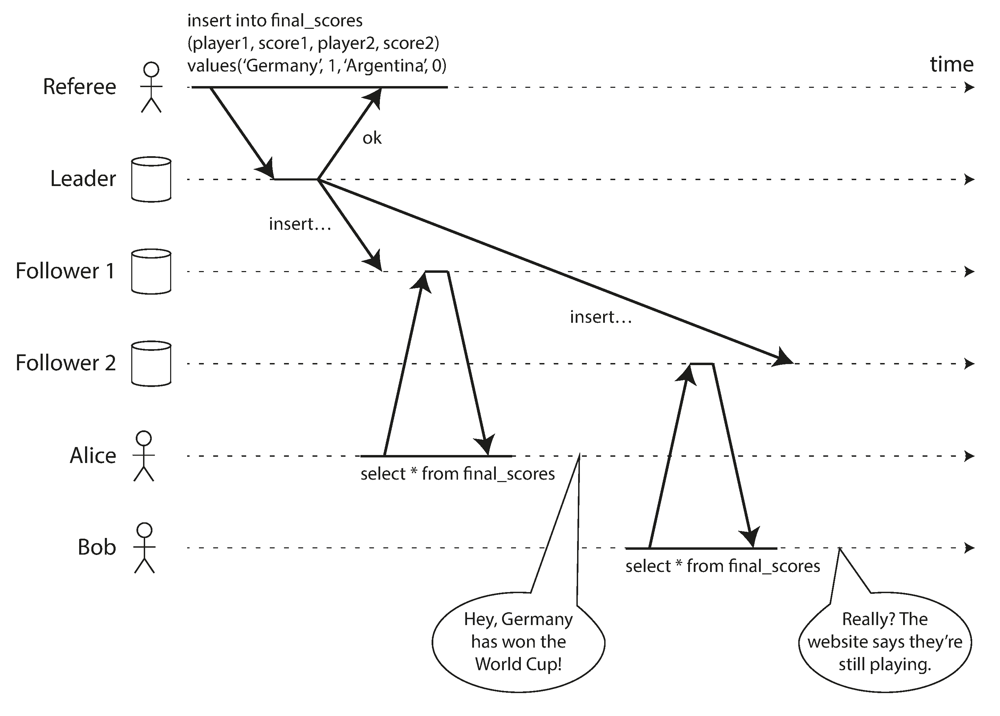
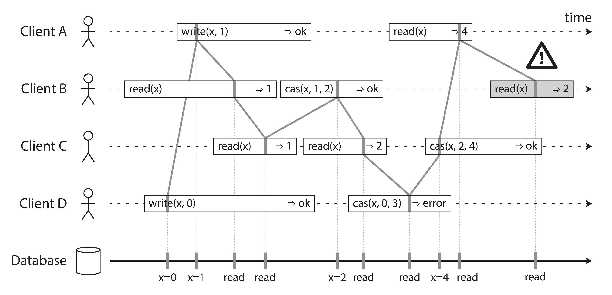
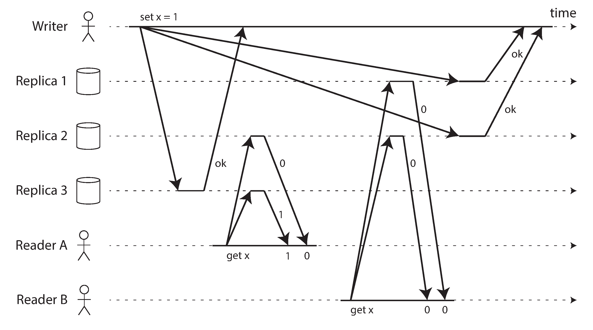
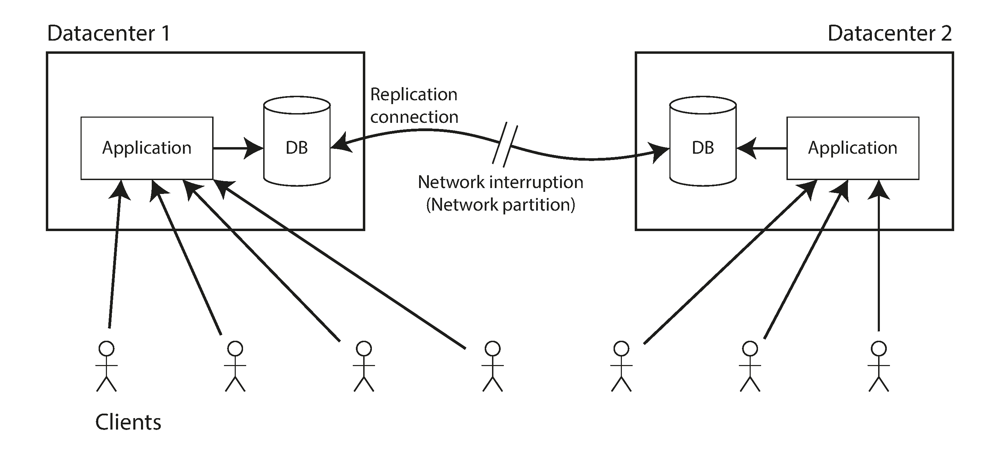
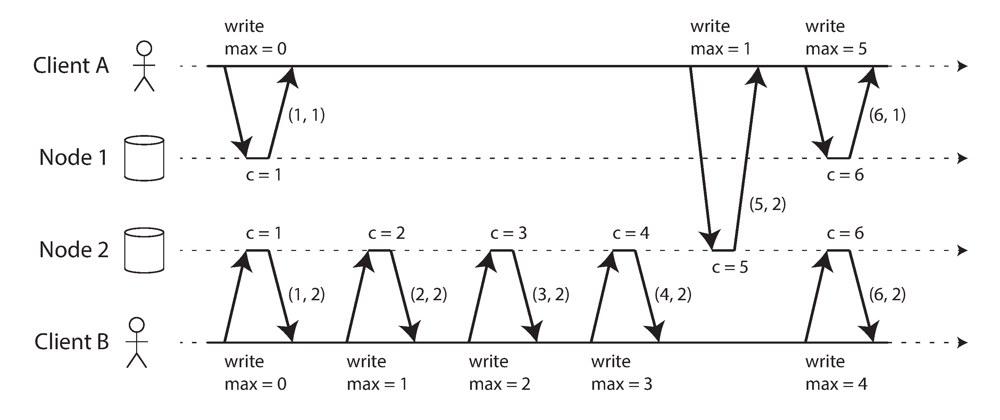
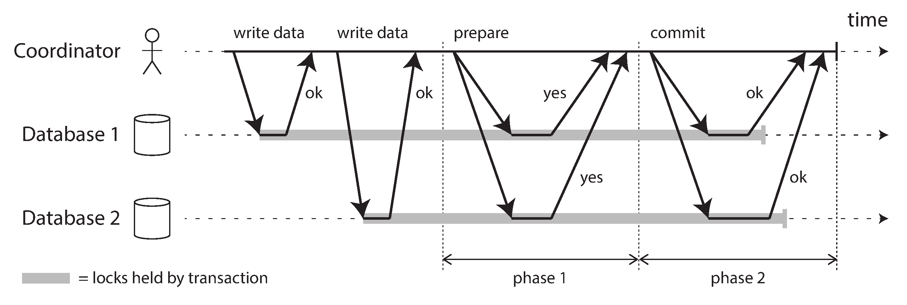
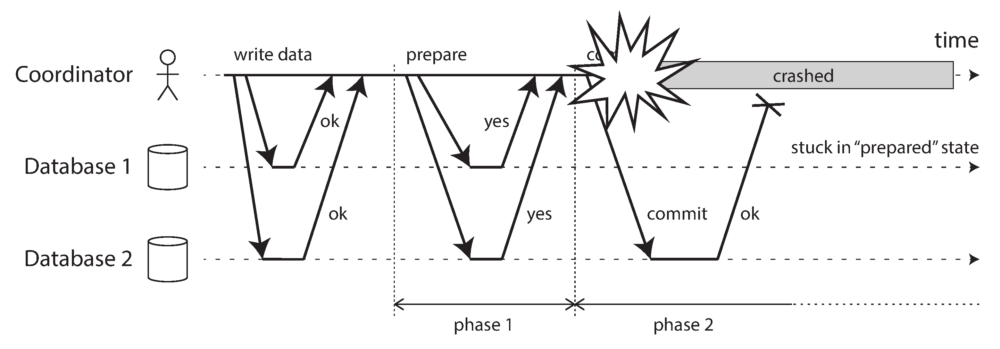

> 好死還是賴活著？
> —— Jay Kreps, 關於 Kafka 與 Jepsen 的若干筆記 (2013)

正如 [第八章](./ch8) 所討論的，分散式系統中的許多事情可能會出錯。處理這種故障的最簡單方法是簡單地讓整個服務失效，並向用戶顯示錯誤訊息。如果無法接受這個解決方案，我們就需要找到容錯的方法 —— 即使某些內部元件出現故障，服務也能正常執行。

在本章中，我們將討論構建容錯分散式系統的演算法和協議的一些例子。我們將假設 [第八章](./ch8) 的所有問題都可能發生：網路中的資料包可能會丟失、重新排序、重複推送或任意延遲；時鐘只是盡其所能地近似；且節點可以暫停（例如，由於垃圾收集）或隨時崩潰。

構建容錯系統的最好方法，是找到一些帶有實用保證的通用抽象，實現一次，然後讓應用依賴這些保證。這與 [第七章](./ch7) 中的事務處理方法相同：透過使用事務，應用可以假裝沒有崩潰（原子性），沒有其他人同時訪問資料庫（隔離），儲存裝置是完全可靠的（永續性）。即使發生崩潰，競態條件和磁碟故障，事務抽象隱藏了這些問題，因此應用不必擔心它們。

現在我們將繼續沿著同樣的路線前進，尋求可以讓應用忽略分散式系統部分問題的抽象概念。例如，分散式系統最重要的抽象之一就是 **共識（consensus）**：**就是讓所有的節點對某件事達成一致**。正如我們在本章中將會看到的那樣，要可靠地達成共識，且不被網路故障和程序故障所影響，是一個令人驚訝的棘手問題。

一旦達成共識，應用可以將其用於各種目的。例如，假設你有一個單主複製的資料庫。如果主庫掛掉，並且需要故障切換到另一個節點，剩餘的資料庫節點可以使用共識來選舉新的領導者。正如在 “[處理節點宕機](./ch5#處理節點宕機)” 中所討論的那樣，重要的是隻有一個領導者，且所有的節點都認同其領導。如果兩個節點都認為自己是領導者，這種情況被稱為 **腦裂（split brain）**，它經常會導致資料丟失。正確實現共識有助於避免這種問題。

在本章後面的 “[分散式事務與共識](#分散式事務與共識)” 中，我們將研究解決共識和相關問題的演算法。但首先，我們首先需要探索可以在分散式系統中提供的保證和抽象的範圍。

我們需要了解可以做什麼和不可以做什麼的範圍：在某些情況下，系統可以容忍故障並繼續工作；在其他情況下，這是不可能的。我們將深入研究什麼可能而什麼不可能的限制，既透過理論證明，也透過實際實現。我們將在本章中概述這些基本限制。

分散式系統領域的研究人員幾十年來一直在研究這些主題，所以有很多資料 —— 我們只能介紹一些皮毛。在本書中，我們沒有空間去詳細介紹形式模型和證明的細節，所以我們會按照直覺來介紹。如果你有興趣，參考文獻可以提供更多的深度。

## 一致性保證

在 “[複製延遲問題](./ch5#複製延遲問題)” 中，我們看到了資料庫複製中發生的一些時序問題。如果你在同一時刻檢視兩個資料庫節點，則可能在兩個節點上看到不同的資料，因為寫請求在不同的時間到達不同的節點。無論資料庫使用何種複製方法（單主複製、多主複製或無主複製），都會出現這些不一致情況。

大多數複製的資料庫至少提供了 **最終一致性**，這意味著如果你停止向資料庫寫入資料並等待一段不確定的時間，那麼最終所有的讀取請求都會返回相同的值【1】。換句話說，不一致性是暫時的，最終會自行解決（假設網路中的任何故障最終都會被修復）。最終一致性的一個更好的名字可能是 **收斂（convergence）**，因為我們預計所有的副本最終會收斂到相同的值【2】。

然而，這是一個非常弱的保證 —— 它並沒有說什麼時候副本會收斂。在收斂之前，讀操作可能會返回任何東西或什麼都沒有【1】。例如，如果你寫入了一個值，然後立即再次讀取，這並不能保證你能看到剛才寫入的值，因為讀請求可能會被路由到另外的副本上。（請參閱 “[讀己之寫](./ch5#讀己之寫)” ）。

對於應用開發人員而言，最終一致性是很困難的，因為它與普通單執行緒程式中變數的行為有很大區別。對於後者，如果將一個值賦給一個變數，然後很快地再次讀取，不可能讀到舊的值，或者讀取失敗。資料庫表面上看起來像一個你可以讀寫的變數，但實際上它有更複雜的語義【3】。

在與只提供弱保證的資料庫打交道時，你需要始終意識到它的侷限性，而不是意外地作出太多假設。錯誤往往是微妙的，很難找到，也很難測試，因為應用可能在大多數情況下執行良好。當系統出現故障（例如網路中斷）或高併發時，最終一致性的邊緣情況才會顯現出來。

本章將探索資料系統可能選擇提供的更強一致性模型。它不是免費的：具有較強保證的系統可能會比保證較差的系統具有更差的效能或更少的容錯性。儘管如此，更強的保證能夠吸引人，因為它們更容易用對。只有見過不同的一致性模型後，才能更好地決定哪一個最適合自己的需求。

**分散式一致性模型** 和我們之前討論的事務隔離級別的層次結構有一些相似之處【4,5】（請參閱 “[弱隔離級別](./ch7#弱隔離級別)”）。儘管兩者有一部分內容重疊，但它們大多是無關的問題：事務隔離主要是為了 **避免由於同時執行事務而導致的競爭狀態**，而分散式一致性主要關於 **在面對延遲和故障時如何協調副本間的狀態**。

本章涵蓋了廣泛的話題，但我們將會看到這些領域實際上是緊密聯絡在一起的：

* 首先看一下常用的 **最強一致性模型** 之一，**線性一致性（linearizability）**，並考察其優缺點。
* 然後我們將檢查分散式系統中 [**事件順序**](#順序保證) 的問題，特別是因果關係和全域性順序的問題。
* 在第三節的（“[分散式事務與共識](#分散式事務與共識)”）中將探討如何原子地提交分散式事務，這將最終引領我們走向共識問題的解決方案。

## 線性一致性

在 **最終一致** 的資料庫，如果你在同一時刻問兩個不同副本相同的問題，可能會得到兩個不同的答案。這很讓人困惑。如果資料庫可以提供只有一個副本的假象（即，只有一個數據副本），那麼事情就簡單太多了。那麼每個客戶端都會有相同的資料檢視，且不必擔心複製滯後了。

這就是 **線性一致性（linearizability）** 背後的想法【6】（也稱為 **原子一致性（atomic consistency）**【7】，**強一致性（strong consistency）**，**立即一致性（immediate consistency）** 或 **外部一致性（external consistency ）**【8】）。線性一致性的精確定義相當微妙，我們將在本節的剩餘部分探討它。但是基本的想法是讓一個系統看起來好像只有一個數據副本，而且所有的操作都是原子性的。有了這個保證，即使實際中可能有多個副本，應用也不需要擔心它們。

在一個線性一致的系統中，只要一個客戶端成功完成寫操作，所有客戶端從資料庫中讀取資料必須能夠看到剛剛寫入的值。要維護資料的單個副本的假象，系統應保障讀到的值是最近的、最新的，而不是來自陳舊的快取或副本。換句話說，線性一致性是一個 **新鮮度保證（recency guarantee）**。為了闡明這個想法，我們來看看一個非線性一致系統的例子。

**圖 9-1 這個系統是非線性一致的，導致了球迷的困惑**

[圖 9-1](./v1/ddia_0901.png) 展示了一個關於體育網站的非線性一致例子【9】。Alice 和 Bob 正坐在同一個房間裡，都盯著各自的手機，關注著 2014 年 FIFA 世界盃決賽的結果。在最後得分公佈後，Alice 重新整理頁面，看到宣佈了獲勝者，並興奮地告訴 Bob。Bob 難以置信地重新整理了自己的手機，但他的請求路由到了一個落後的資料庫副本上，手機顯示比賽仍在進行。

如果 Alice 和 Bob 在同一時間重新整理並獲得了兩個不同的查詢結果，也許就沒有那麼令人驚訝了。因為他們不知道伺服器處理他們請求的精確時刻。然而 Bob 是在聽到 Alice 驚呼最後得分 **之後**，點選了重新整理按鈕（啟動了他的查詢），因此他希望查詢結果至少與愛麗絲一樣新鮮。但他的查詢返回了陳舊結果，這一事實違背了線性一致性的要求。

### 什麼使得系統線性一致？

線性一致性背後的基本思想很簡單：使系統看起來好像只有一個數據副本。然而確切來講，實際上有更多要操心的地方。為了更好地理解線性一致性，讓我們再看幾個例子。

[圖 9-2](./v1/ddia_0902.png) 顯示了三個客戶端在線性一致資料庫中同時讀寫相同的鍵 `x`。在分散式系統文獻中，`x` 被稱為 **暫存器（register）**，例如，它可以是鍵值儲存中的一個 **鍵**，關係資料庫中的一 **行**，或文件資料庫中的一個 **文件**。

**圖 9-2 如果讀取請求與寫入請求併發，則可能會返回舊值或新值**

為了簡單起見，[圖 9-2](./v1/ddia_0902.png) 採用了使用者請求的視角，而不是資料庫內部的視角。每個橫柱都是由客戶端發出的請求，其中柱頭是請求傳送的時刻，柱尾是客戶端收到響應的時刻。因為網路延遲變化無常，客戶端不知道資料庫處理其請求的精確時間 —— 只知道它發生在傳送請求和接收響應之間的某個時刻。[^i]

[^i]: 這個圖的一個微妙的細節是它假定存在一個全域性時鐘，由水平軸表示。雖然真實的系統通常沒有準確的時鐘（請參閱 “[不可靠的時鐘](./ch8#不可靠的時鐘)”），但這種假設是允許的：為了分析分散式演算法，我們可以假設存在一個精確的全域性時鐘，不過演算法無法訪問它【47】。演算法只能看到由石英振盪器和 NTP 產生的對真實時間的逼近。

在這個例子中，暫存器有兩種型別的操作：

* $read(x)⇒v$表示客戶端請求讀取暫存器 `x` 的值，資料庫返回值 `v`。
* $write(x,v)⇒r$ 表示客戶端請求將暫存器 `x` 設定為值 `v` ，資料庫返回響應 `r` （可能正確，可能錯誤）。

在 [圖 9-2](./v1/ddia_0902.png) 中，`x` 的值最初為 `0`，客戶端 C 執行寫請求將其設定為 `1`。發生這種情況時，客戶端 A 和 B 反覆輪詢資料庫以讀取最新值。A 和 B 的請求可能會收到怎樣的響應？

* 客戶端 A 的第一個讀操作，完成於寫操作開始之前，因此必須返回舊值 `0`。
* 客戶端 A 的最後一個讀操作，開始於寫操作完成之後。如果資料庫是線性一致性的，它必然返回新值 `1`：因為讀操作和寫操作一定是在其各自的起止區間內的某個時刻被處理。如果在寫入結束後開始讀取，則讀取處理一定發生在寫入完成之後，因此它必須看到寫入的新值。
* 與寫操作在時間上重疊的任何讀操作，可能會返回 `0` 或 `1` ，因為我們不知道讀取時，寫操作是否已經生效。這些操作是 **併發（concurrent）** 的。

但是，這還不足以完全描述線性一致性：如果與寫入同時發生的讀取可以返回舊值或新值，那麼讀者可能會在寫入期間看到數值在舊值和新值之間來回翻轉。這個系統對 “單一資料副本” 的模擬還不是我們所期望的。[^ii]

[^ii]: 如果讀取（與寫入同時發生時）可能返回舊值或新值，則稱該暫存器為 **常規暫存器（regular register）**【7,25】

為了使系統線性一致，我們需要新增另一個約束，如 [圖 9-3](./v1/ddia_0903.png) 所示

**圖 9-3 任何一個讀取返回新值後，所有後續讀取（在相同或其他客戶端上）也必須返回新值。**

在一個線性一致的系統中，我們可以想象，在 `x` 的值從 `0` 自動翻轉到 `1` 的時候（在寫操作的開始和結束之間）必定有一個時間點。因此，如果一個客戶端的讀取返回新的值 `1`，即使寫操作尚未完成，所有後續讀取也必須返回新值。

[圖 9-3](./v1/ddia_0903.png) 中的箭頭說明了這個時序依賴關係。客戶端 A 是第一個讀取新的值 `1` 的位置。在 A 的讀取返回之後，B 開始新的讀取。由於 B 的讀取嚴格發生於 A 的讀取之後，因此即使 C 的寫入仍在進行中，也必須返回 `1`（與 [圖 9-1](./v1/ddia_0901.png) 中的 Alice 和 Bob 的情況相同：在 Alice 讀取新值之後，Bob 也希望讀取新的值）。

我們可以進一步細化這個時序圖，展示每個操作是如何在特定時刻原子性生效的。[圖 9-4](./v1/ddia_0904.png) 顯示了一個更複雜的例子【10】。

在 [圖 9-4](./v1/ddia_0904.png) 中，除了讀寫之外，還增加了第三種類型的操作：

* $cas(x, v_{old}, v_{new})⇒r$ 表示客戶端請求進行原子性的 [**比較與設定**](./ch7#比較並設定（CAS）) 操作。如果暫存器 $x$ 的當前值等於 $v_{old}$ ，則應該原子地設定為 $v_{new}$ 。如果 $x$ 不等於 $v_{old}$ ，則操作應該保持暫存器不變並返回一個錯誤。$r$ 是資料庫的響應（正確或錯誤）。

[圖 9-4](./v1/ddia_0904.png) 中的每個操作都在我們認為操作被執行的時候用豎線標出（在每個操作的橫柱之內）。這些標記按順序連在一起，其結果必須是一個有效的暫存器讀寫序列（**每次讀取都必須返回最近一次寫入設定的值**）。

線性一致性的要求是，操作標記的連線總是按時間（從左到右）向前移動，而不是向後移動。這個要求確保了我們之前討論的新鮮度保證：一旦新的值被寫入或讀取，所有後續的讀都會看到寫入的值，直到它被再次覆蓋。

**圖 9-4 將讀取和寫入看起來已經生效的時間點進行視覺化。客戶端 B 的最後一次讀取不是線性一致的**

[圖 9-4](./v1/ddia_0904.png) 中有一些有趣的細節需要指出：

* 第一個客戶端 B 傳送一個讀取 `x` 的請求，然後客戶端 D 傳送一個請求將 `x` 設定為 `0`，然後客戶端 A 傳送請求將 `x` 設定為 `1`。然而，返回給 B 的讀取值為 `1`（由 A 寫入的值）。這是可以的：這意味著資料庫首先處理 D 的寫入，然後是 A 的寫入，最後是 B 的讀取。雖然這不是請求傳送的順序，但這是一個可以接受的順序，因為這三個請求是併發的。也許 B 的讀請求在網路上略有延遲，所以它在兩次寫入之後才到達資料庫。

* 在客戶端 A 從資料庫收到響應之前，客戶端 B 的讀取返回 `1` ，表示寫入值 `1` 已成功。這也是可以的：這並不意味著在寫之前讀到了值，這只是意味著從資料庫到客戶端 A 的正確響應在網路中略有延遲。

* 此模型不假設有任何事務隔離：另一個客戶端可能隨時更改值。例如，C 首先讀取到 `1` ，然後讀取到 `2` ，因為兩次讀取之間的值被 B 所更改。可以使用原子 **比較並設定（cas）** 操作來檢查該值是否未被另一客戶端同時更改：B 和 C 的 **cas** 請求成功，但是 D 的 **cas** 請求失敗（在資料庫處理它時，`x` 的值不再是 `0` ）。

* 客戶 B 的最後一次讀取（陰影條柱中）不是線性一致的。該操作與 C 的 **cas** 寫操作併發（它將 `x` 從 `2` 更新為 `4` ）。在沒有其他請求的情況下，B 的讀取返回 `2` 是可以的。然而，在 B 的讀取開始之前，客戶端 A 已經讀取了新的值 `4`  ，因此不允許 B 讀取比 A 更舊的值。再次，與 [圖 9-1](./v1/ddia_0901.png) 中的 Alice 和 Bob 的情況相同。

  這就是線性一致性背後的直覺。正式的定義【6】更準確地描述了它。透過記錄所有請求和響應的時序，並檢查它們是否可以排列成有效的順序，以測試一個系統的行為是否線性一致性是可能的（儘管在計算上是昂貴的）【11】。

> [!NOTE] 線性一致性與可序列化
>
> **線性一致性** 容易和 [**可序列化**](./ch7#可序列化) 相混淆，因為兩個詞似乎都是類似 “可以按順序排列” 的東西。但它們是兩種完全不同的保證，區分兩者非常重要：
>
> ***可序列化***
> : **可序列化（Serializability）** 是事務的隔離屬性，每個事務可以讀寫多個物件（行，文件，記錄）—— 請參閱 “[單物件和多物件操作](./ch7#單物件和多物件操作)”。它確保事務的行為，與它們按照 **某種** 順序依次執行的結果相同（每個事務在下一個事務開始之前執行完成）。這種執行順序可以與事務實際執行的順序不同。【12】。
>
> ***線性一致性***
> : **線性一致性（Linearizability）** 是讀取和寫入暫存器（單個物件）的 **新鮮度保證**。它不會將操作組合為事務，因此它也不會阻止寫入偏差等問題（請參閱 “[寫入偏差和幻讀](./ch7#寫入偏差與幻讀)”），除非採取其他措施（例如 [物化衝突](./ch7#物化衝突)）。
>
> 一個數據庫可以提供可序列化和線性一致性，這種組合被稱為嚴格的可序列化或 **強的單副本可序列化（strong-1SR）**【4,13】。基於兩階段鎖定的可序列化實現（請參閱 “[兩階段鎖定](./ch7#兩階段鎖定)” 一節）或 **真的序列執行**（請參閱 “[真的序列執行](./ch7#真的序列執行)”一節）通常是線性一致性的。
>
> 但是，可序列化的快照隔離（請參閱 “[可序列化快照隔離](./ch7#可序列化快照隔離)”）不是線性一致性的：按照設計，它從一致的快照中進行讀取，以避免讀者和寫者之間的鎖競爭。一致性快照的要點就在於 **它不會包括該快照之後的寫入**，因此從快照讀取不是線性一致性的。

### 依賴線性一致性

線性一致性在什麼情況下有用？觀看體育比賽的最後得分可能是一個輕率的例子：滯後了幾秒鐘的結果不太可能在這種情況下造成任何真正的傷害。然而對於少數領域，線性一致性是系統正確工作的一個重要條件。

#### 鎖定和領導選舉

一個使用單主複製的系統，需要確保領導者真的只有一個，而不是幾個（腦裂）。一種選擇領導者的方法是使用鎖：每個節點在啟動時嘗試獲取鎖，成功者成為領導者【14】。不管這個鎖是如何實現的，它必須是線性一致的：所有節點必須就哪個節點擁有鎖達成一致，否則就沒用了。

諸如 Apache ZooKeeper 【15】和 etcd 【16】之類的協調服務通常用於實現分散式鎖和領導者選舉。它們使用一致性演算法，以容錯的方式實現線性一致的操作（在本章後面的 “[容錯共識](#容錯共識)” 中討論此類演算法）[^iii]。還有許多微妙的細節來正確地實現鎖和領導者選舉（例如，請參閱 “[領導者和鎖](./ch8#領導者和鎖)” 中的防護問題），而像 Apache Curator 【17】這樣的庫則透過在 ZooKeeper 之上提供更高級別的配方來提供幫助。但是，線性一致性儲存服務是這些協調任務的基礎。

[^iii]: 嚴格地說，ZooKeeper 和 etcd 提供線性一致性的寫操作，但讀取可能是陳舊的，因為預設情況下，它們可以由任何一個副本提供服務。你可以選擇請求線性一致性讀取：etcd 稱之為 **法定人數讀取（quorum read）**【16】，而在 ZooKeeper 中，你需要在讀取之前呼叫 `sync()`【15】。請參閱 “[使用全序廣播實現線性一致的儲存](#使用全序廣播實現線性一致的儲存)”。

分散式鎖也在一些分散式資料庫（如 Oracle Real Application Clusters（RAC）【18】）中有更細粒度級別的使用。RAC 對每個磁碟頁面使用一個鎖，多個節點共享對同一個磁碟儲存系統的訪問許可權。由於這些線性一致的鎖處於事務執行的關鍵路徑上，RAC 部署通常具有用於資料庫節點之間通訊的專用叢集互連網路。

#### 約束和唯一性保證

唯一性約束在資料庫中很常見：例如，使用者名稱或電子郵件地址必須唯一標識一個使用者，而在檔案儲存服務中，不能有兩個具有相同路徑和檔名的檔案。如果要在寫入資料時強制執行此約束（例如，如果兩個人試圖同時建立一個具有相同名稱的使用者或檔案，其中一個將返回一個錯誤），則需要線性一致性。

這種情況實際上類似於一個鎖：當一個使用者註冊你的服務時，可以認為他們獲得了所選使用者名稱的 “鎖”。該操作與原子性的比較與設定（CAS）非常相似：將使用者名稱賦予宣告它的使用者，前提是使用者名稱尚未被使用。

如果想要確保銀行賬戶餘額永遠不會為負數，或者不會出售比倉庫裡的庫存更多的物品，或者兩個人不會都預定了航班或劇院裡同一時間的同一個位置。這些約束條件都要求所有節點都同意一個最新的值（賬戶餘額，庫存水平，座位佔用率）。

在實際應用中，寬鬆地處理這些限制有時是可以接受的（例如，如果航班超額預訂，你可以將客戶轉移到不同的航班併為其提供補償）。在這種情況下，可能不需要線性一致性，我們將在 “[及時性與完整性](./ch12#及時性與完整性)” 中討論這種寬鬆的約束。

然而，一個硬性的唯一性約束（關係型資料庫中常見的那種）需要線性一致性。其他型別的約束，如外部索引鍵或屬性約束，可以不需要線性一致性【19】。

#### 跨通道的時序依賴

注意 [圖 9-1](./v1/ddia_0901.png) 中的一個細節：如果 Alice 沒有驚呼得分，Bob 就不會知道他的查詢結果是陳舊的。他會在幾秒鐘之後再次重新整理頁面，並最終看到最後的分數。由於系統中存在額外的通道（Alice 的聲音傳到了 Bob 的耳朵中），線性一致性的違背才被注意到。

計算機系統也會出現類似的情況。例如，假設有一個網站，使用者可以上傳照片，一個後臺程序會調整照片大小，降低解析度以加快下載速度（縮圖）。該系統的架構和資料流如 [圖 9-5](./v1/ddia_0905.png) 所示。

影像縮放器需要明確的指令來執行尺寸縮放作業，指令是 Web 伺服器透過訊息佇列傳送的（請參閱 [第十一章](./ch11)）。Web 伺服器不會將整個照片放在佇列中，因為大多數訊息代理都是針對較短的訊息而設計的，而一張照片的空間佔用可能達到幾兆位元組。取而代之的是，首先將照片寫入檔案儲存服務，寫入完成後再將給縮放器的指令放入訊息佇列。

**圖 9-5 Web 伺服器和影像縮放器透過檔案儲存和訊息佇列進行通訊，開啟競爭條件的可能性。**

如果檔案儲存服務是線性一致的，那麼這個系統應該可以正常工作。如果它不是線性一致的，則存在競爭條件的風險：訊息佇列（[圖 9-5](./v1/ddia_0905.png) 中的步驟 3 和 4）可能比儲存服務內部的複製（replication）更快。在這種情況下，當縮放器讀取影像（步驟 5）時，可能會看到影像的舊版本，或者什麼都沒有。如果它處理的是舊版本的影像，則檔案儲存中的全尺寸圖和縮圖就產生了永久性的不一致。

出現這個問題是因為 Web 伺服器和縮放器之間存在兩個不同的通道：檔案儲存與訊息佇列。沒有線性一致性的新鮮性保證，這兩個通道之間的競爭條件是可能的。這種情況類似於 [圖 9-1](./v1/ddia_0901.png)，資料庫複製與 Alice 的嘴到 Bob 耳朵之間的真人音訊通道之間也存在競爭條件。

線性一致性並不是避免這種競爭條件的唯一方法，但它是最容易理解的。如果你可以控制額外通道（例如訊息佇列的例子，而不是在 Alice 和 Bob 的例子），則可以使用在 “[讀己之寫](./ch5#讀己之寫)” 討論過的類似方法，不過會有額外的複雜度代價。

### 實現線性一致的系統

我們已經見到了幾個線性一致性有用的例子，讓我們思考一下，如何實現一個提供線性一致語義的系統。

由於線性一致性本質上意味著 “表現得好像只有一個數據副本，而且所有的操作都是原子的”，所以最簡單的答案就是，真的只用一個數據副本。但是這種方法無法容錯：如果持有該副本的節點失效，資料將會丟失，或者至少無法訪問，直到節點重新啟動。

使系統容錯最常用的方法是使用複製。我們再來回顧 [第五章](./ch5) 中的複製方法，並比較它們是否可以滿足線性一致性：

- **單主複製（可能線性一致）**：在具有單主複製功能的系統中（請參閱 "[領導者與追隨者](./ch5#領導者與追隨者)"），主庫具有用於寫入的資料的主副本，而追隨者在其他節點上保留資料的備份副本。如果從主庫或同步更新的從庫讀取資料，它們 **可能（potential）** 是線性一致性的 [^iv]。然而，實際上並不是每個單主資料庫都是線性一致性的，無論是因為設計的原因（例如，因為使用了快照隔離）還是因為在併發處理上存在錯誤【10】。

  [^iv]: 對單主資料庫進行分割槽（分片），使得每個分割槽有一個單獨的領導者，不會影響線性一致性，因為線性一致性只是對單一物件的保證。交叉分割槽事務是一個不同的問題（請參閱 “[分散式事務與共識](#分散式事務與共識)”）。

  從主庫讀取依賴一個假設，你確切地知道領導者是誰。正如在 “[真相由多數所定義](./ch8#真相由多數所定義)” 中所討論的那樣，一個節點很可能會認為它是領導者，而事實上並非如此 —— 如果具有錯覺的領導者繼續為請求提供服務，可能違反線性一致性【20】。使用非同步複製，故障切換時甚至可能會丟失已提交的寫入（請參閱 “[處理節點宕機](./ch5#處理節點宕機)”），這同時違反了永續性和線性一致性。

- **共識演算法（線性一致）**：一些在本章後面討論的共識演算法，與單主複製類似。然而，共識協議包含防止腦裂和陳舊副本的措施。正是由於這些細節，共識演算法可以安全地實現線性一致性儲存。例如，Zookeeper 【21】和 etcd 【22】就是這樣工作的。

- **多主複製（非線性一致）**：具有多主程式複製的系統通常不是線性一致的，因為它們同時在多個節點上處理寫入，並將其非同步複製到其他節點。因此，它們可能會產生需要被解決的寫入衝突（請參閱 "[處理寫入衝突](./ch5#處理寫入衝突)"）。這種衝突是因為缺少單一資料副本所導致的。

- **無主複製（也許不是線性一致的）**：對於無主複製的系統（Dynamo 風格；請參閱 "[無主複製](./ch5#無主複製)"），有時候人們會聲稱透過要求法定人數讀寫（ $w + r > n$ ）可以獲得 "強一致性"。這取決於法定人數的具體配置，以及強一致性如何定義（通常不完全正確）。

  基於日曆時鐘（例如，在 Cassandra 中；請參閱 “[依賴同步時鐘](./ch8#依賴同步時鐘)”）的 “最後寫入勝利” 衝突解決方法幾乎可以確定是非線性一致的，由於時鐘偏差，不能保證時鐘的時間戳與實際事件順序一致。寬鬆的法定人數（請參閱 “[寬鬆的法定人數與提示移交](./ch5#寬鬆的法定人數與提示移交)”）也破壞了線性一致的可能性。即使使用嚴格的法定人數，非線性一致的行為也是可能的，如下節所示。

#### 線性一致性和法定人數

直覺上在 Dynamo 風格的模型中，嚴格的法定人數讀寫應該是線性一致性的。但是當我們有可變的網路延遲時，就可能存在競爭條件，如 [圖 9-6](./v1/ddia_0906.png) 所示。

**圖 9-6 非線性一致的執行，儘管使用了嚴格的法定人數**

在 [圖 9-6](./v1/ddia_0906.png) 中，$x$ 的初始值為 0，寫入客戶端透過向所有三個副本（ $n = 3, w = 3$ ）傳送寫入將 $x$ 更新為 `1`。客戶端 A 併發地從兩個節點組成的法定人群（ $r = 2$ ）中讀取資料，並在其中一個節點上看到新值 `1` 。客戶端 B 也併發地從兩個不同的節點組成的法定人數中讀取，並從兩個節點中取回了舊值 `0` 。

法定人數條件滿足（ $w + r> n$ ），但是這個執行是非線性一致的：B 的請求在 A 的請求完成後開始，但是 B 返回舊值，而 A 返回新值。（又一次，如同 Alice 和 Bob 的例子 [圖 9-1](./v1/ddia_0901.png)）

有趣的是，透過犧牲效能，可以使 Dynamo 風格的法定人數線性化：讀取者必須在將結果返回給應用之前，同步執行讀修復（請參閱 “[讀修復和反熵](./ch5#讀修復和反熵)”） ，並且寫入者必須在傳送寫入之前，讀取法定數量節點的最新狀態【24,25】。然而，由於效能損失，Riak 不執行同步讀修復【26】。Cassandra 在進行法定人數讀取時，**確實** 在等待讀修復完成【27】；但是由於使用了最後寫入勝利的衝突解決方案，當同一個鍵有多個併發寫入時，將不能保證線性一致性。

而且，這種方式只能實現線性一致的讀寫；不能實現線性一致的比較和設定（CAS）操作，因為它需要一個共識演算法【28】。

總而言之，最安全的做法是：假設採用 Dynamo 風格無主複製的系統不能提供線性一致性。

### 線性一致性的代價

一些複製方法可以提供線性一致性，另一些複製方法則不能，因此深入地探討線性一致性的優缺點是很有趣的。

我們已經在 [第五章](./ch5) 中討論了不同複製方法的一些用例。例如對多資料中心的複製而言，多主複製通常是理想的選擇（請參閱 “[運維多個數據中心](./ch5#運維多個數據中心)”）。[圖 9-7](./v1/ddia_0907.png) 說明了這種部署的一個例子。

**圖 9-7 網路中斷迫使在線性一致性和可用性之間做出選擇。**

考慮這樣一種情況：如果兩個資料中心之間發生網路中斷會發生什麼？我們假設每個資料中心內的網路正在工作，客戶端可以訪問資料中心，但資料中心之間彼此無法互相連線。

使用多主資料庫，每個資料中心都可以繼續正常執行：由於在一個數據中心寫入的資料是非同步複製到另一個數據中心的，所以在恢復網路連線時，寫入操作只是簡單地排隊並交換。

另一方面，如果使用單主複製，則主庫必須位於其中一個數據中心。任何寫入和任何線性一致的讀取請求都必須傳送給該主庫，因此對於連線到從庫所在資料中心的客戶端，這些讀取和寫入請求必須透過網路同步傳送到主庫所在的資料中心。

在單主配置的條件下，如果資料中心之間的網路被中斷，則連線到從庫資料中心的客戶端無法聯絡到主庫，因此它們無法對資料庫執行任何寫入，也不能執行任何線性一致的讀取。它們仍能從從庫讀取，但結果可能是陳舊的（非線性一致）。如果應用需要線性一致的讀寫，卻又位於與主庫網路中斷的資料中心，則網路中斷將導致這些應用不可用。

如果客戶端可以直接連線到主庫所在的資料中心，這就不是問題了，那些應用可以繼續正常工作。但只能訪問從庫資料中心的客戶端會中斷執行，直到網路連線得到修復。

#### CAP定理

這個問題不僅僅是單主複製和多主複製的後果：任何線性一致的資料庫都有這個問題，不管它是如何實現的。這個問題也不僅僅侷限於多資料中心部署，而可能發生在任何不可靠的網路上，即使在同一個資料中心內也是如此。問題面臨的權衡如下：[^v]

* 如果應用需要線性一致性，且某些副本因為網路問題與其他副本斷開連線，那麼這些副本掉線時不能處理請求。請求必須等到網路問題解決，或直接返回錯誤。（無論哪種方式，服務都 **不可用**）。
* 如果應用不需要線性一致性，那麼某個副本即使與其他副本斷開連線，也可以獨立處理請求（例如多主複製）。在這種情況下，應用可以在網路問題解決前保持可用，但其行為不是線性一致的。

[^v]: 這兩種選擇有時分別稱為 CP（在網路分割槽下一致但不可用）和 AP（在網路分割槽下可用但不一致）。但是，這種分類方案存在一些缺陷【9】，所以最好不要這樣用。

因此，不需要線性一致性的應用對網路問題有更強的容錯能力。這種見解通常被稱為 CAP 定理【29,30,31,32】，由 Eric Brewer 於 2000 年命名，儘管 70 年代的分散式資料庫設計者早就知道了這種權衡【33,34,35,36】。

CAP 最初是作為一個經驗法則提出的，沒有準確的定義，目的是開始討論資料庫的權衡。那時候許多分散式資料庫側重於在共享儲存的叢集上提供線性一致性的語義【18】，CAP 定理鼓勵資料庫工程師向分散式無共享系統的設計領域深入探索，這類架構更適合實現大規模的網路服務【37】。對於這種文化上的轉變，CAP 值得讚揚 —— 它見證了自 00 年代中期以來新資料庫的技術爆炸（即 NoSQL）。

> #### CAP定理沒有幫助
>
> CAP 有時以這種面目出現：一致性，可用性和分割槽容錯性：三者只能擇其二。不幸的是這種說法很有誤導性【32】，因為網路分割槽是一種故障型別，所以它並不是一個選項：不管你喜不喜歡它都會發生【38】。
>
> 在網路正常工作的時候，系統可以提供一致性（線性一致性）和整體可用性。發生網路故障時，你必須在線性一致性和整體可用性之間做出選擇。因此，CAP 更好的表述成：在分割槽時要麼選擇一致，要麼選擇可用【39】。一個更可靠的網路需要減少這個選擇，但是在某些時候選擇是不可避免的。
>
> 在 CAP 的討論中，術語可用性有幾個相互矛盾的定義，形式化作為一個定理【30】並不符合其通常的含義【40】。許多所謂的 “高可用”（容錯）系統實際上不符合 CAP 對可用性的特殊定義。總而言之，圍繞著 CAP 有很多誤解和困惑，並不能幫助我們更好地理解系統，所以最好避免使用 CAP。

CAP 定理的正式定義僅限於很狹隘的範圍【30】，它只考慮了一個一致性模型（即線性一致性）和一種故障（網路分割槽 [^vi]，或活躍但彼此斷開的節點）。它沒有討論任何關於網路延遲，死亡節點或其他權衡的事。因此，儘管 CAP 在歷史上有一些影響力，但對於設計系統而言並沒有實際價值【9,40】。

在分散式系統中有更多有趣的 “不可能” 的結果【41】，且 CAP 定理現在已經被更精確的結果取代【2,42】，所以它現在基本上成了歷史古蹟了。

[^vi]: 正如 “[真實世界的網路故障](./ch8#真實世界的網路故障)” 中所討論的，本書使用 **分割槽（partition）** 指代將大資料集細分為小資料集的操作（分片；請參閱 [第六章](./ch6)）。與之對應的是，**網路分割槽（network partition）** 是一種特定型別的網路故障，我們通常不會將其與其他型別的故障分開考慮。但是，由於它是 CAP 的 P，所以這種情況下我們無法避免混亂。

#### 線性一致性和網路延遲

雖然線性一致是一個很有用的保證，但實際上，線性一致的系統驚人的少。例如，現代多核 CPU 上的記憶體甚至都不是線性一致的【43】：如果一個 CPU 核上執行的執行緒寫入某個記憶體地址，而另一個 CPU 核上執行的執行緒不久之後讀取相同的地址，並沒有保證一定能讀到第一個執行緒寫入的值（除非使用了 **記憶體屏障（memory barrier）** 或 **圍欄（fence）**【44】）。

這種行為的原因是每個 CPU 核都有自己的記憶體快取和儲存緩衝區。預設情況下，記憶體訪問首先走快取，任何變更會非同步寫入主存。因為快取訪問比主存要快得多【45】，所以這個特性對於現代 CPU 的良好效能表現至關重要。但是現在就有幾個資料副本（一個在主存中，也許還有幾個在不同快取中的其他副本），而且這些副本是非同步更新的，所以就失去了線性一致性。

為什麼要做這個權衡？對多核記憶體一致性模型而言，CAP 定理是沒有意義的：在同一臺計算機中，我們通常假定通訊都是可靠的。並且我們並不指望一個 CPU 核能在脫離計算機其他部分的條件下繼續正常工作。犧牲線性一致性的原因是 **效能（performance）**，而不是容錯。

許多分散式資料庫也是如此：它們是 **為了提高效能** 而選擇了犧牲線性一致性，而不是為了容錯【46】。線性一致的速度很慢 —— 這始終是事實，而不僅僅是網路故障期間。

能找到一個更高效的線性一致儲存實現嗎？看起來答案是否定的：Attiya 和 Welch 【47】證明，如果你想要線性一致性，讀寫請求的響應時間至少與網路延遲的不確定性成正比。在像大多數計算機網路一樣具有高度可變延遲的網路中（請參閱 “[超時與無窮的延遲](./ch8#超時與無窮的延遲)”），線性讀寫的響應時間不可避免地會很高。更快地線性一致演算法不存在，但更弱的一致性模型可以快得多，所以對延遲敏感的系統而言，這類權衡非常重要。在 [第十二章](./ch12) 中將討論一些在不犧牲正確性的前提下，繞開線性一致性的方法。

## 順序保證

之前說過，線性一致暫存器的行為就好像只有單個數據副本一樣，且每個操作似乎都是在某個時間點以原子性的方式生效的。這個定義意味著操作是按照某種良好定義的順序執行的。我們將操作以看上去被執行的順序連線起來，以此說明了 [圖 9-4](./v1/ddia_0904.png) 中的順序。

**順序（ordering）** 這一主題在本書中反覆出現，這表明它可能是一個重要的基礎性概念。讓我們簡要回顧一下其它曾經出現過 **順序** 的上下文：

* 在 [第五章](./ch5) 中我們看到，領導者在單主複製中的主要目的就是，在複製日誌中確定 **寫入順序（order of write）**—— 也就是從庫應用這些寫入的順序。如果不存在一個領導者，則併發操作可能導致衝突（請參閱 “[處理寫入衝突](./ch5#處理寫入衝突)”）。
* 在 [第七章](./ch7) 中討論的 **可序列化**，是關於事務表現的像按 **某種先後順序（some sequential order）** 執行的保證。它可以字面意義上地以 **序列順序（serial order）** 執行事務來實現，或者允許並行執行，但同時防止序列化衝突來實現（透過鎖或中止事務）。
* 在 [第八章](./ch8) 討論過的在分散式系統中使用時間戳和時鐘（請參閱 “[依賴同步時鐘](./ch8#依賴同步時鐘)”）是另一種將順序引入無序世界的嘗試，例如，確定兩個寫入操作哪一個更晚發生。

事實證明，順序、線性一致性和共識之間有著深刻的聯絡。儘管這個概念比本書其他部分更加理論化和抽象，但對於明確系統的能力範圍（可以做什麼和不可以做什麼）而言是非常有幫助的。我們將在接下來的幾節中探討這個話題。

### 順序與因果關係

**順序** 反覆出現有幾個原因，其中一個原因是，它有助於保持 **因果關係（causality）**。在本書中我們已經看到了幾個例子，其中因果關係是很重要的：

* 在 “[一致字首讀](./ch5#一致字首讀)”（[圖 5-5](./v1/ddia_0505.png)）中，我們看到一個例子：一個對話的觀察者首先看到問題的答案，然後才看到被回答的問題。這是令人困惑的，因為它違背了我們對 **因（cause）** 與 **果（effect）** 的直覺：如果一個問題被回答，顯然問題本身得先在那裡，因為給出答案的人必須先看到這個問題（假如他們並沒有預見未來的超能力）。我們認為在問題和答案之間存在 **因果依賴（causal dependency）**。
* [圖 5-9](./v1/ddia_0509.png) 中出現了類似的模式，我們看到三位領導者之間的複製，並注意到由於網路延遲，一些寫入可能會 “壓倒” 其他寫入。從其中一個副本的角度來看，好像有一個對尚不存在的記錄的更新操作。這裡的因果意味著，一條記錄必須先被建立，然後才能被更新。
* 在 “[檢測併發寫入](./ch5#檢測併發寫入)” 中我們觀察到，如果有兩個操作 A 和 B，則存在三種可能性：A 發生在 B 之前，或 B 發生在 A 之前，或者 A 和 B**併發**。這種 **此前發生（happened before）** 關係是因果關係的另一種表述：如果 A 在 B 前發生，那麼意味著 B 可能已經知道了 A，或者建立在 A 的基礎上，或者依賴於 A。如果 A 和 B 是 **併發** 的，那麼它們之間並沒有因果聯絡；換句話說，我們確信 A 和 B 不知道彼此。
* 在事務快照隔離的上下文中（“[快照隔離和可重複讀](./ch7#快照隔離和可重複讀)”），我們說事務是從一致性快照中讀取的。但此語境中 “一致” 到底又是什麼意思？這意味著 **與因果關係保持一致（consistent with causality）**：如果快照包含答案，它也必須包含被回答的問題【48】。在某個時間點觀察整個資料庫，與因果關係保持一致意味著：因果上在該時間點之前發生的所有操作，其影響都是可見的，但因果上在該時間點之後發生的操作，其影響對觀察者不可見。**讀偏差（read skew）** 意味著讀取的資料處於違反因果關係的狀態（不可重複讀，如 [圖 7-6](./v1/ddia_0706.png) 所示）。
* 事務之間 **寫偏差（write skew）** 的例子（請參閱 “[寫入偏差與幻讀](./ch7#寫入偏差與幻讀)”）也說明了因果依賴：在 [圖 7-8](./v1/ddia_0708.png) 中，愛麗絲被允許離班，因為事務認為鮑勃仍在值班，反之亦然。在這種情況下，離班的動作因果依賴於對當前值班情況的觀察。[可序列化快照隔離](./ch7#可序列化快照隔離) 透過跟蹤事務之間的因果依賴來檢測寫偏差。
* 在愛麗絲和鮑勃看球的例子中（[圖 9-1](./v1/ddia_0901.png)），在聽到愛麗絲驚呼比賽結果後，鮑勃從伺服器得到陳舊結果的事實違背了因果關係：愛麗絲的驚呼因果依賴於得分宣告，所以鮑勃應該也能在聽到愛麗斯驚呼後查詢到比分。相同的模式在 “[跨通道的時序依賴](#跨通道的時序依賴)” 一節中，以 “影像大小調整服務” 的偽裝再次出現。

因果關係對事件施加了一種 **順序**：因在果之前；訊息傳送在訊息收取之前。而且就像現實生活中一樣，一件事會導致另一件事：某個節點讀取了一些資料然後寫入一些結果，另一個節點讀取其寫入的內容，並依次寫入一些其他內容，等等。這些因果依賴的操作鏈定義了系統中的因果順序，即，什麼在什麼之前發生。

如果一個系統服從因果關係所規定的順序，我們說它是 **因果一致（causally consistent）** 的。例如，快照隔離提供了因果一致性：當你從資料庫中讀取到一些資料時，你一定還能夠看到其因果前驅（假設在此期間這些資料還沒有被刪除）。

#### 因果順序不是全序的

**全序（total order）** 允許任意兩個元素進行比較，所以如果有兩個元素，你總是可以說出哪個更大，哪個更小。例如，自然數集是全序的：給定兩個自然數，比如說 5 和 13，那麼你可以告訴我，13 大於 5。

然而數學集合並不完全是全序的：`{a, b}` 比 `{b, c}` 更大嗎？好吧，你沒法真正比較它們，因為二者都不是對方的子集。我們說它們是 **無法比較（incomparable）** 的，因此數學集合是 **偏序的（partially ordered）** ：在某些情況下，可以說一個集合大於另一個（如果一個集合包含另一個集合的所有元素），但在其他情況下它們是無法比較的 [^譯註i]。

[^譯註i]: 設 R 為非空集合 A 上的關係，如果 R 是自反的、反對稱的和可傳遞的，則稱 R 為 A 上的偏序關係。簡稱偏序，通常記作≦。一個集合 A 與 A 上的偏序關係 R 一起叫作偏序集，記作 $(A,R)$ 或 $(A, ≦)$。全序、偏序、關係、集合，這些概念的精確定義可以參考任意一本離散數學教材。

全序和偏序之間的差異反映在不同的資料庫一致性模型中：

* 線性一致性

  在線性一致的系統中，操作是全序的：如果系統表現的就好像只有一個數據副本，並且所有操作都是原子性的，這意味著對任何兩個操作，我們總是能判定哪個操作先發生。這個全序在 [圖 9-4](./v1/ddia_0904.png) 中以時間線表示。

* 因果性

  我們說過，如果兩個操作都沒有在彼此 **之前發生**，那麼這兩個操作是併發的（請參閱 [“此前發生” 的關係和併發](./ch5#“此前發生”的關係和併發)）。換句話說，如果兩個事件是因果相關的（一個發生在另一個事件之前），則它們之間是有序的，但如果它們是併發的，則它們之間的順序是無法比較的。這意味著因果關係定義了一個偏序，而不是一個全序：一些操作相互之間是有順序的，但有些則是無法比較的。

因此，根據這個定義，在線性一致的資料儲存中是不存在併發操作的：必須有且僅有一條時間線，所有的操作都在這條時間線上，構成一個全序關係。可能有幾個請求在等待處理，但是資料儲存確保了每個請求都是在唯一時間線上的某個時間點自動處理的，不存在任何併發。

併發意味著時間線會分岔然後合併 —— 在這種情況下，不同分支上的操作是無法比較的（即併發操作）。在 [第五章](./v1_tw/ch5) 中我們看到了這種現象：例如，[圖 5-14](/v1/ddia_0514.png) 並不是一條直線的全序關係，而是一堆不同的操作併發進行。圖中的箭頭指明了因果依賴 —— 操作的偏序。

如果你熟悉像 Git 這樣的分散式版本控制系統，那麼其版本歷史與因果關係圖極其相似。通常，一個 **提交（Commit）** 發生在另一個提交之後，在一條直線上。但是有時你會遇到分支（當多個人同時在一個專案上工作時），**合併（Merge）** 會在這些併發建立的提交相融合時建立。

#### 線性一致性強於因果一致性

那麼因果順序和線性一致性之間的關係是什麼？答案是線性一致性 **隱含著（implies）** 因果關係：任何線性一致的系統都能正確保持因果性【7】。特別是，如果系統中有多個通訊通道（如 [圖 9-5](./v1/ddia_0905.png) 中的訊息佇列和檔案儲存服務），線性一致性可以自動保證因果性，系統無需任何特殊操作（如在不同元件間傳遞時間戳）。

線性一致性確保因果性的事實使線性一致系統變得簡單易懂，更有吸引力。然而，正如 “[線性一致性的代價](#線性一致性的代價)” 中所討論的，使系統線性一致可能會損害其效能和可用性，尤其是在系統具有嚴重的網路延遲的情況下（例如，如果系統在地理上散佈）。出於這個原因，一些分散式資料系統已經放棄了線性一致性，從而獲得更好的效能，但它們用起來也更為困難。

好訊息是存在折衷的可能性。線性一致性並不是保持因果性的唯一途徑 —— 還有其他方法。一個系統可以是因果一致的，而無需承擔線性一致帶來的效能折損（尤其對於 CAP 定理不適用的情況）。實際上在所有的不會被網路延遲拖慢的一致性模型中，因果一致性是可行的最強的一致性模型。而且在網路故障時仍能保持可用【2,42】。

在許多情況下，看上去需要線性一致性的系統，實際上需要的只是因果一致性，因果一致性可以更高效地實現。基於這種觀察結果，研究人員正在探索新型的資料庫，既能保證因果一致性，且效能與可用性與最終一致的系統類似【49,50,51】。

這方面的研究相當新鮮，其中很多尚未應用到生產系統，仍然有不少挑戰需要克服【52,53】。但對於未來的系統而言，這是一個有前景的方向。

#### 捕獲因果關係

我們不會在這裡討論非線性一致的系統如何保證因果性的細節，而只是簡要地探討一些關鍵的思想。

為了維持因果性，你需要知道哪個操作發生在哪個其他操作之前（**happened before**）。這是一個偏序：併發操作可以以任意順序進行，但如果一個操作發生在另一個操作之前，那它們必須在所有副本上以那個順序被處理。因此，當一個副本處理一個操作時，它必須確保所有因果前驅的操作（之前發生的所有操作）已經被處理；如果前面的某個操作丟失了，後面的操作必須等待，直到前面的操作被處理完畢。

為了確定因果依賴，我們需要一些方法來描述系統中節點的 “知識”。如果節點在發出寫入 Y 的請求時已經看到了 X 的值，則 X 和 Y 可能存在因果關係。這個分析使用了那些在欺詐指控刑事調查中常見的問題：CEO 在做出決定 Y 時是否 **知道** X ？

用於確定 *哪些操作發生在其他操作之前* 的技術，與我們在 “[檢測併發寫入](./ch5#檢測併發寫入)” 中所討論的內容類似。那一節討論了無領導者資料儲存中的因果性：為了防止丟失更新，我們需要檢測到對同一個鍵的併發寫入。因果一致性則更進一步：它需要跟蹤整個資料庫中的因果依賴，而不僅僅是一個鍵。可以推廣版本向量以解決此類問題【54】。

為了確定因果順序，資料庫需要知道應用讀取了哪個版本的資料。這就是為什麼在 [圖 5-13](./v1/ddia_0513.png) 中，來自先前操作的版本號在寫入時被傳回到資料庫的原因。在 SSI 的衝突檢測中會出現類似的想法，如 “[可序列化快照隔離](./ch7#可序列化快照隔離)” 中所述：當事務要提交時，資料庫將檢查它所讀取的資料版本是否仍然是最新的。為此，資料庫跟蹤哪些資料被哪些事務所讀取。

### 序列號順序

雖然因果是一個重要的理論概念，但實際上跟蹤所有的因果關係是不切實際的。在許多應用中，客戶端在寫入內容之前會先讀取大量資料，我們無法弄清寫入因果依賴於先前全部的讀取內容，還是僅包括其中一部分。顯式跟蹤所有已讀資料意味著巨大的額外開銷。

但還有一個更好的方法：我們可以使用 **序列號（sequence number）** 或 **時間戳（timestamp）** 來排序事件。時間戳不一定來自日曆時鐘（或物理時鐘，它們存在許多問題，如 “[不可靠的時鐘](./ch8#不可靠的時鐘)” 中所述）。它可以來自一個 **邏輯時鐘（logical clock）**，這是一個用來生成標識操作的數字序列的演算法，典型實現是使用一個每次操作自增的計數器。

這樣的序列號或時間戳是緊湊的（只有幾個位元組大小），它提供了一個全序關係：也就是說每個操作都有一個唯一的序列號，而且總是可以比較兩個序列號，確定哪一個更大（即哪些操作後發生）。

特別是，我們可以使用 **與因果一致（consistent with causality）** 的全序來生成序列號 [^vii]：我們保證，如果操作 A 因果地發生在操作 B 前，那麼在這個全序中 A 在 B 前（ A 具有比 B 更小的序列號）。並行操作之間可以任意排序。這樣一個全序關係捕獲了所有關於因果的資訊，但也施加了一個比因果性要求更為嚴格的順序。

[^vii]: 與因果關係不一致的全序很容易建立，但沒啥用。例如你可以為每個操作生成隨機的 UUID，並按照字典序比較 UUID，以定義操作的全序。這是一個有效的全序，但是隨機的 UUID 並不能告訴你哪個操作先發生，或者操作是否為併發的。

在單主複製的資料庫中（請參閱 “[領導者與追隨者](./ch5#領導者與追隨者)”），複製日誌定義了與因果一致的寫操作。主庫可以簡單地為每個操作自增一個計數器，從而為複製日誌中的每個操作分配一個單調遞增的序列號。如果一個從庫按照它們在複製日誌中出現的順序來應用寫操作，那麼從庫的狀態始終是因果一致的（即使它落後於領導者）。

#### 非因果序列號生成器

如果主庫不存在（可能因為使用了多主資料庫或無主資料庫，或者因為使用了分割槽的資料庫），如何為操作生成序列號就沒有那麼明顯了。在實踐中有各種各樣的方法：

* 每個節點都可以生成自己獨立的一組序列號。例如有兩個節點，一個節點只能生成奇數，而另一個節點只能生成偶數。通常，可以在序列號的二進位制表示中預留一些位，用於唯一的節點識別符號，這樣可以確保兩個不同的節點永遠不會生成相同的序列號。
*可以將日曆時鐘（物理時鐘）的時間戳附加到每個操作上【55】。這種時間戳並不連續，但是如果它具有足夠高的解析度，那也許足以提供一個操作的全序關係。這一事實應用於* 最後寫入勝利 * 的衝突解決方法中（請參閱 “[有序事件的時間戳](./ch8#有序事件的時間戳)”）。
* 可以預先分配序列號區塊。例如，節點 A 可能要求從序列號 1 到 1,000 區塊的所有權，而節點 B 可能要求序列號 1,001 到 2,000 區塊的所有權。然後每個節點可以獨立分配所屬區塊中的序列號，並在序列號告急時請求分配一個新的區塊。

這三個選項都比單一主庫的自增計數器表現要好，並且更具可伸縮性。它們為每個操作生成一個唯一的，近似自增的序列號。然而它們都有同一個問題：生成的序列號與因果不一致。

因為這些序列號生成器不能正確地捕獲跨節點的操作順序，所以會出現因果關係的問題：

* 每個節點每秒可以處理不同數量的操作。因此，如果一個節點產生偶數序列號而另一個產生奇數序列號，則偶數計數器可能落後於奇數計數器，反之亦然。如果你有一個奇數編號的操作和一個偶數編號的操作，你無法準確地說出哪一個操作在因果上先發生。

* 來自物理時鐘的時間戳會受到時鐘偏移的影響，這可能會使其與因果不一致。例如 [圖 8-3](./v1/ddia_0803.png) 展示了一個例子，其中因果上晚發生的操作，卻被分配了一個更早的時間戳。[^viii]

  [^viii]: 可以使物理時鐘時間戳與因果關係保持一致：在 “[全域性快照的同步時鐘](./ch8#全域性快照的同步時鐘)” 中，我們討論了 Google 的 Spanner，它可以估計預期的時鐘偏差，並在提交寫入之前等待不確定性間隔。這種方法確保了實際上靠後的事務會有更大的時間戳。但是大多數時鐘不能提供這種所需的不確定性度量。

* 在分配區塊的情況下，某個操作可能會被賦予一個範圍在 1,001 到 2,000 內的序列號，然而一個因果上更晚的操作可能被賦予一個範圍在 1 到 1,000 之間的數字。這裡序列號與因果關係也是不一致的。

#### 蘭伯特時間戳

儘管剛才描述的三個序列號生成器與因果不一致，但實際上有一個簡單的方法來產生與因果關係一致的序列號。它被稱為蘭伯特時間戳，萊斯利・蘭伯特（Leslie Lamport）於 1978 年提出【56】，現在是分散式系統領域中被引用最多的論文之一。

[圖 9-8](./v1/ddia_0908.png) 說明了蘭伯特時間戳的應用。每個節點都有一個唯一識別符號，和一個儲存自己執行運算元量的計數器。蘭伯特時間戳就是兩者的簡單組合：（計數器，節點 ID）$(counter, node ID)$。兩個節點有時可能具有相同的計數器值，但透過在時間戳中包含節點 ID，每個時間戳都是唯一的。

**圖 9-8  Lamport 時間戳提供了與因果關係一致的全序。**

蘭伯特時間戳與物理的日曆時鐘沒有任何關係，但是它提供了一個全序：如果你有兩個時間戳，則 **計數器** 值大者是更大的時間戳。如果計數器值相同，則節點 ID 越大的，時間戳越大。

迄今，這個描述與上節所述的奇偶計數器基本類似。使蘭伯特時間戳因果一致的關鍵思想如下所示：每個節點和每個客戶端跟蹤迄今為止所見到的最大 **計數器** 值，並在每個請求中包含這個最大計數器值。當一個節點收到最大計數器值大於自身計數器值的請求或響應時，它立即將自己的計數器設定為這個最大值。

這如 [圖 9-8](./v1/ddia_0908.png) 所示，其中客戶端 A 從節點 2 接收計數器值 `5` ，然後將最大值 `5` 傳送到節點 1 。此時，節點 1 的計數器僅為 `1` ，但是它立即前移至 `5` ，所以下一個操作的計數器的值為 `6` 。

只要每一個操作都攜帶著最大計數器值，這個方案確保蘭伯特時間戳的排序與因果一致，因為每個因果依賴都會導致時間戳增長。

蘭伯特時間戳有時會與我們在 “[檢測併發寫入](./ch5#檢測併發寫入)” 中看到的版本向量相混淆。雖然兩者有一些相似之處，但它們有著不同的目的：版本向量可以區分兩個操作是併發的，還是一個因果依賴另一個；而蘭伯特時間戳總是施行一個全序。從蘭伯特時間戳的全序中，你無法分辨兩個操作是併發的還是因果依賴的。蘭伯特時間戳優於版本向量的地方是，它更加緊湊。

#### 光有時間戳排序還不夠

雖然蘭伯特時間戳定義了一個與因果一致的全序，但它還不足以解決分散式系統中的許多常見問題。

例如，考慮一個需要確保使用者名稱能唯一標識使用者帳戶的系統。如果兩個使用者同時嘗試使用相同的使用者名稱建立帳戶，則其中一個應該成功，另一個應該失敗（我們之前在 “[領導者和鎖](./ch8#領導者和鎖)” 中提到過這個問題）。

乍看之下，似乎操作的全序關係足以解決這一問題（例如使用蘭伯特時間戳）：如果建立了兩個具有相同使用者名稱的帳戶，選擇時間戳較小的那個作為勝者（第一個抓到使用者名稱的人），並讓帶有更大時間戳者失敗。由於時間戳上有全序關係，所以這個比較總是可行的。

這種方法適用於事後確定勝利者：一旦你收集了系統中的所有使用者名稱建立操作，就可以比較它們的時間戳。然而當某個節點需要即時處理使用者建立使用者名稱的請求時，這樣的方法就無法滿足了。節點需要 **馬上（right now）** 決定這個請求是成功還是失敗。在那個時刻，節點並不知道是否存在其他節點正在併發執行建立同樣使用者名稱的操作，罔論其它節點可能分配給那個操作的時間戳。

為了確保沒有其他節點正在使用相同的使用者名稱和較小的時間戳併發建立同名賬戶，你必須檢查其它每個節點，看看它在做什麼【56】。如果其中一個節點由於網路問題出現故障或不可達，則整個系統可能被拖至停機。這不是我們需要的那種容錯系統。

這裡的問題是，只有在所有的操作都被收集之後，操作的全序才會出現。如果另一個節點已經產生了一些操作，但你還不知道那些操作是什麼，那就無法構造所有操作最終的全序關係：來自另一個節點的未知操作可能需要被插入到全序中的不同位置。

總之：為了實現諸如使用者名稱上的唯一約束這種東西，僅有操作的全序是不夠的，你還需要知道這個全序何時會塵埃落定。如果你有一個建立使用者名稱的操作，並且確定在全序中沒有任何其他節點可以在你的操作之前插入對同一使用者名稱的聲稱，那麼你就可以安全地宣告操作執行成功。

如何確定全序關係已經塵埃落定，這將在 [全序廣播](#全序廣播) 一節中詳細說明。

### 全序廣播

如果你的程式只執行在單個 CPU 核上，那麼定義一個操作全序是很容易的：可以簡單認為就是 CPU 執行這些操作的順序。但是在分散式系統中，讓所有節點對同一個全域性操作順序達成一致可能相當棘手。在上一節中，我們討論了按時間戳或序列號進行排序，但發現它還不如單主複製給力（如果你使用時間戳排序來實現唯一性約束，就不能容忍任何錯誤，因為你必須要從每個節點都獲取到最新的序列號）。

如前所述，單主複製透過選擇一個節點作為主庫來確定操作的全序，並在主庫的單個 CPU 核上對所有操作進行排序。接下來的挑戰是，如果吞吐量超出單個主庫的處理能力，這種情況下如何擴充套件系統；以及，如果主庫失效（“[處理節點宕機](./ch5#處理節點宕機)”），如何處理故障切換。在分散式系統文獻中，這個問題被稱為 **全序廣播（total order broadcast）** 或 **原子廣播（atomic broadcast）**[^ix]【25,57,58】。

[^ix]: “原子廣播” 是一個傳統的術語，非常混亂，而且與 “原子” 一詞的其他用法不一致：它與 ACID 事務中的原子性沒有任何關係，只是與原子操作（在多執行緒程式設計的意義上 ）或原子暫存器（線性一致儲存）有間接的聯絡。全序組播（total order multicast）是另一個同義詞。

> #### 順序保證的範圍
>
> 每個分割槽各有一個主庫的分割槽資料庫，通常只在每個分割槽內維持順序，這意味著它們不能提供跨分割槽的一致性保證（例如，一致性快照，外部索引鍵引用）。跨所有分割槽的全序是可能的，但需要額外的協調【59】。

全序廣播通常被描述為在節點間交換訊息的協議。非正式地講，它要滿足兩個安全屬性：

* 可靠交付（reliable delivery）

  沒有訊息丟失：如果訊息被傳遞到一個節點，它將被傳遞到所有節點。

* 全序交付（totally ordered delivery）

  訊息以相同的順序傳遞給每個節點。

正確的全序廣播演算法必須始終保證可靠性和有序性，即使節點或網路出現故障。當然在網路中斷的時候，訊息是傳不出去的，但是演算法可以不斷重試，以便在網路最終修復時，訊息能及時透過並送達（當然它們必須仍然按照正確的順序傳遞）。

#### 使用全序廣播

像 ZooKeeper 和 etcd 這樣的共識服務實際上實現了全序廣播。這一事實暗示了全序廣播與共識之間有著緊密聯絡，我們將在本章稍後進行探討。

全序廣播正是資料庫複製所需的：如果每個訊息都代表一次資料庫的寫入，且每個副本都按相同的順序處理相同的寫入，那麼副本間將相互保持一致（除了臨時的複製延遲）。這個原理被稱為 **狀態機複製（state machine replication）**【60】，我們將在 [第十一章](./ch11) 中重新回到這個概念。

與之類似，可以使用全序廣播來實現可序列化的事務：如 “[真的序列執行](./ch7#真的序列執行)” 中所述，如果每個訊息都表示一個確定性事務，以儲存過程的形式來執行，且每個節點都以相同的順序處理這些訊息，那麼資料庫的分割槽和副本就可以相互保持一致【61】。

全序廣播的一個重要表現是，順序在訊息送達時被固化：如果後續的訊息已經送達，節點就不允許追溯地將（先前）訊息插入順序中的較早位置。這個事實使得全序廣播比時間戳排序更強。

考量全序廣播的另一種方式是，這是一種建立日誌的方式（如在複製日誌、事務日誌或預寫式日誌中）：傳遞訊息就像追加寫入日誌。由於所有節點必須以相同的順序傳遞相同的訊息，因此所有節點都可以讀取日誌，並看到相同的訊息序列。

全序廣播對於實現提供防護令牌的鎖服務也很有用（請參閱 “[防護令牌](./ch8#防護令牌)”）。每個獲取鎖的請求都作為一條訊息追加到日誌末尾，並且所有的訊息都按它們在日誌中出現的順序依次編號。序列號可以當成防護令牌用，因為它是單調遞增的。在 ZooKeeper 中，這個序列號被稱為 `zxid` 【15】。

#### 使用全序廣播實現線性一致的儲存

如 [圖 9-4](./v1/ddia_0904.png) 所示，在線性一致的系統中，存在操作的全序。這是否意味著線性一致與全序廣播一樣？不盡然，但兩者之間有著密切的聯絡 [^x]。

[^x]: 從形式上講，線性一致讀寫暫存器是一個 “更容易” 的問題。全序廣播等價於共識【67】，而共識問題在非同步的崩潰 - 停止模型【68】中沒有確定性的解決方案，而線性一致的讀寫暫存器 **可以** 在這種模型中實現【23,24,25】。然而，支援諸如 **比較並設定（CAS, compare-and-set）**，或 **自增並返回（increment-and-get）** 的原子操作使它等價於共識問題【28】。因此，共識問題與線性一致暫存器問題密切相關。

全序廣播是非同步的：訊息被保證以固定的順序可靠地傳送，但是不能保證訊息 **何時** 被送達（所以一個接收者可能落後於其他接收者）。相比之下，線性一致性是新鮮性的保證：讀取一定能看見最新的寫入值。

但如果有了全序廣播，你就可以在此基礎上構建線性一致的儲存。例如，你可以確保使用者名稱能唯一標識使用者帳戶。

設想對於每一個可能的使用者名稱，你都可以有一個帶有 CAS 原子操作的線性一致暫存器。每個暫存器最初的值為空值（表示未使用該使用者名稱）。當用戶想要建立一個使用者名稱時，對該使用者名稱的暫存器執行 CAS 操作，在先前暫存器值為空的條件，將其值設定為使用者的賬號 ID。如果多個使用者試圖同時獲取相同的使用者名稱，則只有一個 CAS 操作會成功，因為其他使用者會看到非空的值（由於線性一致性）。

你可以透過將全序廣播當成僅追加日誌【62,63】的方式來實現這種線性一致的 CAS 操作：

1. 在日誌中追加一條訊息，試探性地指明你要宣告的使用者名稱。
2. 讀日誌，並等待你剛才追加的訊息被讀回。[^xi]
4. 檢查是否有任何訊息聲稱目標使用者名稱的所有權。如果這些訊息中的第一條就是你自己的訊息，那麼你就成功了：你可以提交聲稱的使用者名稱（也許是透過向日志追加另一條訊息）並向客戶端確認。如果所需使用者名稱的第一條訊息來自其他使用者，則中止操作。

[^xi]: 如果你不等待，而是在訊息入隊之後立即確認寫入，則會得到類似於多核 x86 處理器記憶體的一致性模型【43】。該模型既不是線性一致的也不是順序一致的。

由於日誌項是以相同順序送達至所有節點，因此如果有多個併發寫入，則所有節點會對最先到達者達成一致。選擇衝突寫入中的第一個作為勝利者，並中止後來者，以此確定所有節點對某個寫入是提交還是中止達成一致。類似的方法可以在一個日誌的基礎上實現可序列化的多物件事務【62】。

儘管這一過程保證寫入是線性一致的，但它並不保證讀取也是線性一致的 —— 如果你從與日誌非同步更新的儲存中讀取資料，結果可能是陳舊的。（精確地說，這裡描述的過程提供了 **順序一致性（sequential consistency）**【47,64】，有時也稱為 **時間線一致性（timeline consistency）**【65,66】，比線性一致性稍微弱一些的保證）。為了使讀取也線性一致，有幾個選項：

* 你可以透過在日誌中追加一條訊息，然後讀取日誌，直到該訊息被讀回才執行實際的讀取操作。訊息在日誌中的位置因此定義了讀取發生的時間點（etcd 的法定人數讀取有些類似這種情況【16】）。
* 如果日誌允許以線性一致的方式獲取最新日誌訊息的位置，則可以查詢該位置，等待該位置前的所有訊息都傳達到你，然後執行讀取。（這是 Zookeeper `sync()` 操作背後的思想【15】）。
* 你可以從同步更新的副本中進行讀取，因此可以確保結果是最新的（這種技術用於鏈式複製（chain replication）【63】；請參閱 “[關於複製的研究](./ch5#關於複製的研究)”）。

#### 使用線性一致性儲存實現全序廣播

上一節介紹了如何從全序廣播構建一個線性一致的 CAS 操作。我們也可以把它反過來，假設我們有線性一致的儲存，接下來會展示如何在此基礎上構建全序廣播。

最簡單的方法是假設你有一個線性一致的暫存器來儲存一個整數，並且有一個原子 **自增並返回** 操作【28】。或者原子 CAS 操作也可以完成這項工作。

該演算法很簡單：每個要透過全序廣播發送的訊息首先對線性一致暫存器執行 **自增並返回** 操作。然後將從暫存器獲得的值作為序列號附加到訊息中。然後你可以將訊息傳送到所有節點（重新發送任何丟失的訊息），而收件人將按序列號依序傳遞（deliver）訊息。

請注意，與蘭伯特時間戳不同，透過自增線性一致性暫存器獲得的數字形式上是一個沒有間隙的序列。因此，如果一個節點已經發送了訊息 4 並且接收到序列號為 6 的傳入訊息，則它知道它在傳遞訊息 6 之前必須等待訊息 5 。蘭伯特時間戳則與之不同 —— 事實上，這是全序廣播和時間戳排序間的關鍵區別。

實現一個帶有原子性 **自增並返回** 操作的線性一致暫存器有多困難？像往常一樣，如果事情從來不出差錯，那很容易：你可以簡單地把它儲存在單個節點內的變數中。問題在於處理當該節點的網路連線中斷時的情況，並在該節點失效時能恢復這個值【59】。一般來說，如果你對線性一致性的序列號生成器進行過足夠深入的思考，你不可避免地會得出一個共識演算法。

這並非巧合：可以證明，線性一致的 CAS（或自增並返回）暫存器與全序廣播都等價於 **共識** 問題【28,67】。也就是說，如果你能解決其中的一個問題，你可以把它轉化成為其他問題的解決方案。這是相當深刻和令人驚訝的洞察！

現在是時候正面處理共識問題了，我們將在本章的其餘部分進行討論。

## 分散式事務與共識

**共識** 是分散式計算中最重要也是最基本的問題之一。從表面上看似乎很簡單：非正式地講，目標只是 **讓幾個節點達成一致（get serveral nodes to agree on something）**。你也許會認為這不會太難。不幸的是，許多出故障的系統都是因為錯誤地輕信這個問題很容易解決。

儘管共識非常重要，但關於它的內容出現在本書的後半部分，因為這個主題非常微妙，欣賞細微之處需要一些必要的知識。即使在學術界，對共識的理解也是在幾十年的過程中逐漸沉澱而來，一路上也有著許多誤解。現在我們已經討論了複製（[第五章](./ch5)），事務（[第七章](./ch7)），系統模型（[第八章](./ch8)），線性一致以及全序廣播（本章），我們終於準備好解決共識問題了。

節點能達成一致，在很多場景下都非常重要，例如：

* 領導選舉

  在單主複製的資料庫中，所有節點需要就哪個節點是領導者達成一致。如果一些節點由於網路故障而無法與其他節點通訊，則可能會對領導權的歸屬引起爭議。在這種情況下，共識對於避免錯誤的故障切換非常重要。錯誤的故障切換會導致兩個節點都認為自己是領導者（**腦裂**，請參閱 “[處理節點宕機](./ch5#處理節點宕機)”）。如果有兩個領導者，它們都會接受寫入，它們的資料會發生分歧，從而導致不一致和資料丟失。

* 原子提交

  在支援跨多節點或跨多分割槽事務的資料庫中，一個事務可能在某些節點上失敗，但在其他節點上成功。如果我們想要維護事務的原子性（就 ACID 而言，請參閱 “[原子性](./ch7#原子性)”），我們必須讓所有節點對事務的結果達成一致：要麼全部中止 / 回滾（如果出現任何錯誤），要麼它們全部提交（如果沒有出錯）。這個共識的例子被稱為 **原子提交（atomic commit）** 問題 [^xii]。

  [^xii]: 原子提交的形式化與共識稍有不同：原子事務只有在 **所有** 參與者投票提交的情況下才能提交，如果有任何參與者需要中止，則必須中止。共識則允許就 **任意一個** 被參與者提出的候選值達成一致。然而，原子提交和共識可以相互簡化為對方【70,71】。**非阻塞** 原子提交則要比共識更為困難 —— 請參閱 “[三階段提交](#三階段提交)”。

> ### 共識的不可能性
>
> 你可能已經聽說過以作者 Fischer，Lynch 和 Paterson 命名的 FLP 結果【68】，它證明，如果存在節點可能崩潰的風險，則不存在 **總是** 能夠達成共識的演算法。在分散式系統中，我們必須假設節點可能會崩潰，所以可靠的共識是不可能的。然而這裡我們正在討論達成共識的演算法，到底是怎麼回事？
>
> 答案是 FLP 結果是在 **非同步系統模型** 中被證明的（請參閱 “[系統模型與現實](./ch8#系統模型與現實)”），而這是一種限制性很強的模型，它假定確定性演算法不能使用任何時鐘或超時。如果允許演算法使用 **超時** 或其他方法來識別可疑的崩潰節點（即使懷疑有時是錯誤的），則共識變為一個可解的問題【67】。即使僅僅允許演算法使用隨機數，也足以繞過這個不可能的結果【69】。
>
> 因此，雖然 FLP 是關於共識不可能性的重要理論結果，但現實中的分散式系統通常是可以達成共識的。

在本節中，我們將首先更詳細地研究 **原子提交** 問題。具體來說，我們將討論 **兩階段提交（2PC, two-phase commit）** 演算法，這是解決原子提交問題最常見的辦法，並在各種資料庫、訊息佇列和應用伺服器中被實現。事實證明 2PC 是一種共識演算法，但不是一個非常好的共識演算法【70,71】。

透過對 2PC 的學習，我們將繼續努力實現更好的一致性演算法，比如 ZooKeeper（Zab）和 etcd（Raft）中使用的演算法。

### 原子提交與兩階段提交

在 [第七章](./ch7) 中我們瞭解到，事務原子性的目的是在多次寫操作中途出錯的情況下，提供一種簡單的語義。事務的結果要麼是成功提交，在這種情況下，事務的所有寫入都是持久化的；要麼是中止，在這種情況下，事務的所有寫入都被回滾（即撤消或丟棄）。

原子性可以防止失敗的事務攪亂資料庫，避免資料庫陷入半成品結果和半更新狀態。這對於多物件事務（請參閱 “[單物件和多物件操作](./ch7#單物件和多物件操作)”）和維護次級索引的資料庫尤其重要。每個次級索引都是與主資料相分離的資料結構 —— 因此，如果你修改了一些資料，則還需要在次級索引中進行相應的更改。原子性確保次級索引與主資料保持一致（如果索引與主資料不一致，就沒什麼用了）。

#### 從單節點到分散式原子提交

對於在單個數據庫節點執行的事務，原子性通常由儲存引擎實現。當客戶端請求資料庫節點提交事務時，資料庫將使事務的寫入持久化（通常在預寫式日誌中，請參閱 “[讓 B 樹更可靠](./ch3#讓B樹更可靠)”），然後將提交記錄追加到磁碟中的日誌裡。如果資料庫在這個過程中間崩潰，當節點重啟時，事務會從日誌中恢復：如果提交記錄在崩潰之前成功地寫入磁碟，則認為事務被提交；否則來自該事務的任何寫入都被回滾。

因此，在單個節點上，事務的提交主要取決於資料持久化落盤的 **順序**：首先是資料，然後是提交記錄【72】。事務提交或終止的關鍵決定時刻是磁碟完成寫入提交記錄的時刻：在此之前，仍有可能中止（由於崩潰），但在此之後，事務已經提交（即使資料庫崩潰）。因此，是單一的裝置（連線到單個磁碟的控制器，且掛載在單臺機器上）使得提交具有原子性。

但是，如果一個事務中涉及多個節點呢？例如，你也許在分割槽資料庫中會有一個多物件事務，或者是一個按關鍵詞分割槽的次級索引（其中索引條目可能位於與主資料不同的節點上；請參閱 “[分割槽與次級索引](./ch6#分割槽與次級索引)”）。大多數 “NoSQL” 分散式資料儲存不支援這種分散式事務，但是很多關係型資料庫叢集支援（請參閱 “[實踐中的分散式事務](#實踐中的分散式事務)”）。

在這些情況下，僅向所有節點發送提交請求並獨立提交每個節點的事務是不夠的。這樣很容易發生違反原子性的情況：提交在某些節點上成功，而在其他節點上失敗：

* 某些節點可能會檢測到違反約束或衝突，因此需要中止，而其他節點則可以成功進行提交。
* 某些提交請求可能在網路中丟失，最終由於超時而中止，而其他提交請求則透過。
* 在提交記錄完全寫入之前，某些節點可能會崩潰，並在恢復時回滾，而其他節點則成功提交。

如果某些節點提交了事務，但其他節點卻放棄了這些事務，那麼這些節點就會彼此不一致（如 [圖 7-3](./v1/ddia_0703.png) 所示）。而且一旦在某個節點上提交了一個事務，如果事後發現它在其它節點上被中止了，它是無法撤回的。出於這個原因，一旦確定事務中的所有其他節點也將提交，節點就必須進行提交。

事務提交必須是不可撤銷的 —— 事務提交之後，你不能改變主意，並追溯性地中止事務。這個規則的原因是，一旦資料被提交，其結果就對其他事務可見，因此其他客戶端可能會開始依賴這些資料。這個原則構成了 **讀已提交** 隔離等級的基礎，在 “[讀已提交](./ch7#讀已提交)” 一節中討論了這個問題。如果一個事務在提交後被允許中止，所有那些讀取了 **已提交卻又被追溯宣告不存在資料** 的事務也必須回滾。

（提交事務的結果有可能透過事後執行另一個補償事務（compensating transaction）來取消【73,74】，但從資料庫的角度來看，這是一個單獨的事務，因此任何關於跨事務正確性的保證都是應用自己的問題。）

#### 兩階段提交簡介

**兩階段提交（two-phase commit）** 是一種用於實現跨多個節點的原子事務提交的演算法，即確保所有節點提交或所有節點中止。它是分散式資料庫中的經典演算法【13,35,75】。2PC 在某些資料庫內部使用，也以 **XA 事務** 的形式對應用可用【76,77】（例如 Java Transaction API 支援）或以 SOAP Web 服務的 `WS-AtomicTransaction` 形式提供給應用【78,79】。

[圖 9-9](./v1/ddia_0909.png) 說明了 2PC 的基本流程。2PC 中的提交 / 中止過程分為兩個階段（因此而得名），而不是單節點事務中的單個提交請求。

**圖 9-9 兩階段提交（2PC）的成功執行**

> #### 不要把2PC和2PL搞混了
>
> 兩階段提交（2PC）和兩階段鎖定（請參閱 “[兩階段鎖定](./ch7#兩階段鎖定)”）是兩個完全不同的東西。2PC 在分散式資料庫中提供原子提交，而 2PL 提供可序列化的隔離等級。為了避免混淆，最好把它們看作完全獨立的概念，並忽略名稱中不幸的相似性。

2PC 使用一個通常不會出現在單節點事務中的新元件：**協調者**（coordinator，也稱為 **事務管理器**，即 transaction manager）。協調者通常在請求事務的相同應用程序中以庫的形式實現（例如，嵌入在 Java EE 容器中），但也可以是單獨的程序或服務。這種協調者的例子包括 Narayana、JOTM、BTM 或 MSDTC。

正常情況下，2PC 事務以應用在多個數據庫節點上讀寫資料開始。我們稱這些資料庫節點為 **參與者（participants）**。當應用準備提交時，協調者開始階段 1 ：它傳送一個 **準備（prepare）** 請求到每個節點，詢問它們是否能夠提交。然後協調者會跟蹤參與者的響應：

* 如果所有參與者都回答 “是”，表示它們已經準備好提交，那麼協調者在階段 2 發出 **提交（commit）** 請求，然後提交真正發生。
* 如果任意一個參與者回覆了 “否”，則協調者在階段 2 中向所有節點發送 **中止（abort）** 請求。

這個過程有點像西方傳統婚姻儀式：司儀分別詢問新娘和新郎是否要結婚，通常是從兩方都收到 “我願意” 的答覆。收到兩者的回覆後，司儀宣佈這對情侶成為夫妻：事務就提交了，這一幸福事實會廣播至所有的參與者中。如果新娘與新郎之一沒有回覆 “我願意”，婚禮就會中止【73】。

#### 系統承諾

這個簡短的描述可能並沒有說清楚為什麼兩階段提交保證了原子性，而跨多個節點的一階段提交卻沒有。在兩階段提交的情況下，準備請求和提交請求當然也可以輕易丟失。2PC 又有什麼不同呢？

為了理解它的工作原理，我們必須更詳細地分解這個過程：

1. 當應用想要啟動一個分散式事務時，它向協調者請求一個事務 ID。此事務 ID 是全域性唯一的。
2. 應用在每個參與者上啟動單節點事務，並在單節點事務上捎帶上這個全域性事務 ID。所有的讀寫都是在這些單節點事務中各自完成的。如果在這個階段出現任何問題（例如，節點崩潰或請求超時），則協調者或任何參與者都可以中止。
3. 當應用準備提交時，協調者向所有參與者傳送一個 **準備** 請求，並打上全域性事務 ID 的標記。如果任意一個請求失敗或超時，則協調者向所有參與者傳送針對該事務 ID 的中止請求。
4. 參與者收到準備請求時，需要確保在任意情況下都的確可以提交事務。這包括將所有事務資料寫入磁碟（出現崩潰、電源故障或硬碟空間不足都不能是稍後拒絕提交的理由）以及檢查是否存在任何衝突或違反約束。透過向協調者回答 “是”，節點承諾，只要請求，這個事務一定可以不出差錯地提交。換句話說，參與者放棄了中止事務的權利，但沒有實際提交。
5. 當協調者收到所有準備請求的答覆時，會就提交或中止事務作出明確的決定（只有在所有參與者投贊成票的情況下才會提交）。協調者必須把這個決定寫到磁碟上的事務日誌中，如果它隨後就崩潰，恢復後也能知道自己所做的決定。這被稱為 **提交點（commit point）**。
6. 一旦協調者的決定落盤，提交或中止請求會發送給所有參與者。如果這個請求失敗或超時，協調者必須永遠保持重試，直到成功為止。沒有回頭路：如果已經做出決定，不管需要多少次重試它都必須被執行。如果參與者在此期間崩潰，事務將在其恢復後提交 —— 由於參與者投了贊成，因此恢復後它不能拒絕提交。

因此，該協議包含兩個關鍵的 “不歸路” 點：當參與者投票 “是” 時，它承諾它稍後肯定能夠提交（儘管協調者可能仍然選擇放棄）；以及一旦協調者做出決定，這一決定是不可撤銷的。這些承諾保證了 2PC 的原子性（單節點原子提交將這兩個事件合為了一體：將提交記錄寫入事務日誌）。

回到婚姻的比喻，在說 “我願意” 之前，你和你的新娘 / 新郎有中止這個事務的自由，只要回覆 “沒門！” 就行（或者有類似效果的話）。然而在說了 “我願意” 之後，你就不能撤回那個聲明了。如果你說 “我願意” 後暈倒了，沒有聽到司儀說 “你們現在是夫妻了”，那也並不會改變事務已經提交的現實。當你稍後恢復意識時，可以透過查詢司儀的全域性事務 ID 狀態來確定你是否已經成婚，或者你可以等待司儀重試下一次提交請求（因為重試將在你無意識期間一直持續）。

#### 協調者失效

我們已經討論了在 2PC 期間，如果參與者之一或網路發生故障時會發生什麼情況：如果任何一個 **準備** 請求失敗或者超時，協調者就會中止事務。如果任何提交或中止請求失敗，協調者將無條件重試。但是如果協調者崩潰，會發生什麼情況就不太清楚了。

如果協調者在傳送 **準備** 請求之前失敗，參與者可以安全地中止事務。但是，一旦參與者收到了準備請求並投了 “是”，就不能再單方面放棄 —— 必須等待協調者回答事務是否已經提交或中止。如果此時協調者崩潰或網路出現故障，參與者什麼也做不了只能等待。參與者的這種事務狀態稱為 **存疑（in doubt）** 的或 **不確定（uncertain）** 的。

情況如 [圖 9-10](./v1/ddia_0910.png) 所示。在這個特定的例子中，協調者實際上決定提交，資料庫 2 收到提交請求。但是，協調者在將提交請求傳送到資料庫 1 之前發生崩潰，因此資料庫 1 不知道是否提交或中止。即使 **超時** 在這裡也沒有幫助：如果資料庫 1 在超時後單方面中止，它將最終與執行提交的資料庫 2 不一致。同樣，單方面提交也是不安全的，因為另一個參與者可能已經中止了。

**圖 9-10 參與者投贊成票後，協調者崩潰。資料庫 1 不知道是否提交或中止**

沒有協調者的訊息，參與者無法知道是提交還是放棄。原則上參與者可以相互溝通，找出每個參與者是如何投票的，並達成一致，但這不是 2PC 協議的一部分。

可以完成 2PC 的唯一方法是等待協調者恢復。這就是為什麼協調者必須在向參與者傳送提交或中止請求之前，將其提交或中止決定寫入磁碟上的事務日誌：協調者恢復後，透過讀取其事務日誌來確定所有存疑事務的狀態。任何在協調者日誌中沒有提交記錄的事務都會中止。因此，2PC 的 **提交點** 歸結為協調者上的常規單節點原子提交。

#### 三階段提交

兩階段提交被稱為 **阻塞（blocking）**- 原子提交協議，因為存在 2PC 可能卡住並等待協調者恢復的情況。理論上，可以使一個原子提交協議變為 **非阻塞（nonblocking）** 的，以便在節點失敗時不會卡住。但是讓這個協議能在實踐中工作並沒有那麼簡單。

作為 2PC 的替代方案，已經提出了一種稱為 **三階段提交（3PC）** 的演算法【13,80】。然而，3PC 假定網路延遲有界，節點響應時間有限；在大多數具有無限網路延遲和程序暫停的實際系統中（見 [第八章](./ch8)），它並不能保證原子性。

通常，非阻塞原子提交需要一個 **完美的故障檢測器（perfect failure detector）**【67,71】—— 即一個可靠的機制來判斷一個節點是否已經崩潰。在具有無限延遲的網路中，超時並不是一種可靠的故障檢測機制，因為即使沒有節點崩潰，請求也可能由於網路問題而超時。出於這個原因，2PC 仍然被使用，儘管大家都清楚可能存在協調者故障的問題。

### 實踐中的分散式事務

分散式事務的名聲譭譽參半，尤其是那些透過兩階段提交實現的。一方面，它被視作提供了一個難以實現的重要的安全性保證；另一方面，它們因為導致運維問題，造成效能下降，做出超過能力範圍的承諾而飽受批評【81,82,83,84】。許多雲服務由於其導致的運維問題，而選擇不實現分散式事務【85,86】。

分散式事務的某些實現會帶來嚴重的效能損失 —— 例如據報告稱，MySQL 中的分散式事務比單節點事務慢 10 倍以上【87】，所以當人們建議不要使用它們時就不足為奇了。兩階段提交所固有的效能成本，大部分是由於崩潰恢復所需的額外強制刷盤（`fsync`）【88】以及額外的網路往返。

但我們不應該直接忽視分散式事務，而應當更加仔細地審視這些事務，因為從中可以汲取重要的經驗教訓。首先，我們應該精確地說明 “**分散式事務**” 的含義。兩種截然不同的分散式事務型別經常被混淆：

* 資料庫內部的分散式事務

  一些分散式資料庫（即在其標準配置中使用複製和分割槽的資料庫）支援資料庫節點之間的內部事務。例如，VoltDB 和 MySQL Cluster 的 NDB 儲存引擎就有這樣的內部事務支援。在這種情況下，所有參與事務的節點都執行相同的資料庫軟體。

* 異構分散式事務

  在 **異構（heterogeneous）** 事務中，參與者是由兩種或兩種以上的不同技術組成的：例如來自不同供應商的兩個資料庫，甚至是非資料庫系統（如訊息代理）。跨系統的分散式事務必須確保原子提交，儘管系統可能完全不同。

資料庫內部事務不必與任何其他系統相容，因此它們可以使用任何協議，並能針對特定技術進行特定的最佳化。因此資料庫內部的分散式事務通常工作地很好。另一方面，跨異構技術的事務則更有挑戰性。

#### 恰好一次的訊息處理

異構的分散式事務處理能夠以強大的方式整合不同的系統。例如：訊息佇列中的一條訊息可以被確認為已處理，當且僅當用於處理訊息的資料庫事務成功提交。這是透過在同一個事務中原子提交 **訊息確認** 和 **資料庫寫入** 兩個操作來實現的。藉由分散式事務的支援，即使訊息代理和資料庫是在不同機器上執行的兩種不相關的技術，這種操作也是可能的。

如果訊息傳遞或資料庫事務任意一者失敗，兩者都會中止，因此訊息代理可能會在稍後安全地重傳訊息。因此，透過原子提交 **訊息處理及其副作用**，即使在成功之前需要幾次重試，也可以確保訊息被 **有效地（effectively）** 恰好處理一次。中止會拋棄部分完成事務所導致的任何副作用。

然而，只有當所有受事務影響的系統都使用同樣的 **原子提交協議（atomic commit protocol）** 時，這樣的分散式事務才是可能的。例如，假設處理訊息的副作用是傳送一封郵件，而郵件伺服器並不支援兩階段提交：如果訊息處理失敗並重試，則可能會發送兩次或更多次的郵件。但如果處理訊息的所有副作用都可以在事務中止時回滾，那麼這樣的處理流程就可以安全地重試，就好像什麼都沒有發生過一樣。

在 [第十一章](./ch11) 中將再次回到 “恰好一次” 訊息處理的主題。讓我們先來看看允許這種異構分散式事務的原子提交協議。

#### XA事務

*X/Open XA*（**擴充套件架構（eXtended Architecture）** 的縮寫）是跨異構技術實現兩階段提交的標準【76,77】。它於 1991 年推出並得到了廣泛的實現：許多傳統關係資料庫（包括 PostgreSQL、MySQL、DB2、SQL Server 和 Oracle）和訊息代理（包括 ActiveMQ、HornetQ、MSMQ 和 IBM MQ） 都支援 XA。

XA 不是一個網路協議 —— 它只是一個用來與事務協調者連線的 C API。其他語言也有這種 API 的繫結；例如在 Java EE 應用的世界中，XA 事務是使用 **Java 事務 API（JTA, Java Transaction API）** 實現的，而許多使用 **Java 資料庫連線（JDBC, Java Database Connectivity）** 的資料庫驅動，以及許多使用 **Java 訊息服務（JMS）** API 的訊息代理都支援 **Java 事務 API（JTA）**。

XA 假定你的應用使用網路驅動或客戶端庫來與 **參與者**（資料庫或訊息服務）進行通訊。如果驅動支援 XA，則意味著它會呼叫 XA API 以查明操作是否為分散式事務的一部分 —— 如果是，則將必要的資訊發往資料庫伺服器。驅動還會向協調者暴露回撥介面，協調者可以透過回撥來要求參與者準備、提交或中止。

事務協調者需要實現 XA API。標準沒有指明應該如何實現，但實際上協調者通常只是一個庫，被載入到發起事務的應用的同一個程序中（而不是單獨的服務）。它在事務中跟蹤所有的參與者，並在要求它們 **準備** 之後收集參與者的響應（透過驅動回撥），並使用本地磁碟上的日誌記錄每次事務的決定（提交 / 中止）。

如果應用程序崩潰，或者執行應用的機器報銷了，協調者也隨之往生極樂。然後任何帶有 **準備了** 但未提交事務的參與者都會在疑慮中卡死。由於協調程式的日誌位於應用伺服器的本地磁碟上，因此必須重啟該伺服器，且協調程式庫必須讀取日誌以恢復每個事務的提交 / 中止結果。只有這樣，協調者才能使用資料庫驅動的 XA 回撥來要求參與者提交或中止。資料庫伺服器不能直接聯絡協調者，因為所有通訊都必須透過客戶端庫。

#### 懷疑時持有鎖

為什麼我們這麼關心存疑事務？系統的其他部分就不能繼續正常工作，無視那些終將被清理的存疑事務嗎？

問題在於 **鎖（locking）**。正如在 “[讀已提交](./ch7#讀已提交)” 中所討論的那樣，資料庫事務通常獲取待修改的行上的 **行級排他鎖**，以防止髒寫。此外，如果要使用可序列化的隔離等級，則使用兩階段鎖定的資料庫也必須為事務所讀取的行加上共享鎖（請參閱 “[兩階段鎖定](./ch7#兩階段鎖定)”）。

在事務提交或中止之前，資料庫不能釋放這些鎖（如 [圖 9-9](./v1/ddia_0909.png) 中的陰影區域所示）。因此，在使用兩階段提交時，事務必須在整個存疑期間持有這些鎖。如果協調者已經崩潰，需要 20 分鐘才能重啟，那麼這些鎖將會被持有 20 分鐘。如果協調者的日誌由於某種原因徹底丟失，這些鎖將被永久持有 —— 或至少在管理員手動解決該情況之前。

當這些鎖被持有時，其他事務不能修改這些行。根據資料庫的不同，其他事務甚至可能因為讀取這些行而被阻塞。因此，其他事務沒法兒簡單地繼續它們的業務了 —— 如果它們要訪問同樣的資料，就會被阻塞。這可能會導致應用大面積進入不可用狀態，直到存疑事務被解決。

#### 從協調者故障中恢復

理論上，如果協調者崩潰並重新啟動，它應該乾淨地從日誌中恢復其狀態，並解決任何存疑事務。然而在實踐中，**孤立（orphaned）** 的存疑事務確實會出現【89,90】，即無論出於何種理由，協調者無法確定事務的結果（例如事務日誌已經由於軟體錯誤丟失或損壞）。這些事務無法自動解決，所以它們永遠待在資料庫中，持有鎖並阻塞其他事務。

即使重啟資料庫伺服器也無法解決這個問題，因為在 2PC 的正確實現中，即使重啟也必須保留存疑事務的鎖（否則就會冒違反原子性保證的風險）。這是一種棘手的情況。

唯一的出路是讓管理員手動決定提交還是回滾事務。管理員必須檢查每個存疑事務的參與者，確定是否有任何參與者已經提交或中止，然後將相同的結果應用於其他參與者。解決這個問題潛在地需要大量的人力，並且可能發生在嚴重的生產中斷期間（不然為什麼協調者處於這種糟糕的狀態），並很可能要在巨大精神壓力和時間壓力下完成。

許多 XA 的實現都有一個叫做 **啟發式決策（heuristic decisions）** 的緊急逃生艙口：允許參與者單方面決定放棄或提交一個存疑事務，而無需協調者做出最終決定【76,77,91】。要清楚的是，這裡 **啟發式** 是 **可能破壞原子性（probably breaking atomicity）** 的委婉說法，因為它違背了兩階段提交的系統承諾。因此，啟發式決策只是為了逃出災難性的情況而準備的，而不是為了日常使用的。

#### 分散式事務的限制

XA 事務解決了保持多個參與者（資料系統）相互一致的現實的和重要的問題，但正如我們所看到的那樣，它也引入了嚴重的運維問題。特別來講，這裡的核心認識是：事務協調者本身就是一種資料庫（儲存了事務的結果），因此需要像其他重要資料庫一樣小心地打交道：

* 如果協調者沒有複製，而是隻在單臺機器上執行，那麼它是整個系統的失效單點（因為它的失效會導致其他應用伺服器阻塞在存疑事務持有的鎖上）。令人驚訝的是，許多協調者實現預設情況下並不是高可用的，或者只有基本的複製支援。
* 許多伺服器端應用都是使用無狀態模式開發的（受 HTTP 的青睞），所有持久狀態都儲存在資料庫中，因此具有應用伺服器可隨意按需新增刪除的優點。但是，當協調者成為應用伺服器的一部分時，它會改變部署的性質。突然間，協調者的日誌成為持久系統狀態的關鍵部分 —— 與資料庫本身一樣重要，因為協調者日誌是為了在崩潰後恢復存疑事務所必需的。這樣的應用伺服器不再是無狀態的了。
* 由於 XA 需要相容各種資料系統，因此它必須是所有系統的最小公分母。例如，它不能檢測不同系統間的死鎖（因為這將需要一個標準協議來讓系統交換每個事務正在等待的鎖的資訊），而且它無法與 SSI（請參閱 [可序列化快照隔離](./ch7#可序列化快照隔離)）協同工作，因為這需要一個跨系統定位衝突的協議。
* 對於資料庫內部的分散式事務（不是 XA），限制沒有這麼大 —— 例如，分散式版本的 SSI 是可能的。然而仍然存在問題：2PC 成功提交一個事務需要所有參與者的響應。因此，如果系統的 **任何** 部分損壞，事務也會失敗。因此，分散式事務又有 **擴大失效（amplifying failures）** 的趨勢，這又與我們構建容錯系統的目標背道而馳。

這些事實是否意味著我們應該放棄保持幾個系統相互一致的所有希望？不完全是 —— 還有其他的辦法，可以讓我們在沒有異構分散式事務的痛苦的情況下實現同樣的事情。我們將在 [第十一章](./ch11) 和 [第十二章](./ch12) 回到這些話題。但首先，我們應該概括一下關於 **共識** 的話題。

### 容錯共識

非正式地，共識意味著讓幾個節點就某事達成一致。例如，如果有幾個人 **同時（concurrently）** 嘗試預訂飛機上的最後一個座位，或劇院中的同一個座位，或者嘗試使用相同的使用者名稱註冊一個帳戶。共識演算法可以用來確定這些 **互不相容（mutually incompatible）** 的操作中，哪一個才是贏家。

共識問題通常形式化如下：一個或多個節點可以 **提議（propose）** 某些值，而共識演算法 **決定（decides）** 採用其中的某個值。在座位預訂的例子中，當幾個顧客同時試圖訂購最後一個座位時，處理顧客請求的每個節點可以 **提議** 將要服務的顧客的 ID，而 **決定** 指明了哪個顧客獲得了座位。

在這種形式下，共識演算法必須滿足以下性質【25】：[^xiii]

[^xiii]: 這種共識的特殊形式被稱為 **統一共識（uniform consensus）**，相當於在具有不可靠故障檢測器的非同步系統中的 **常規共識（regular consensus）**【71】。學術文獻通常指的是 **程序（process）** 而不是節點，但我們在這裡使用 **節點（node）** 來與本書的其餘部分保持一致。

- **一致同意（Uniform agreement）**：沒有兩個節點的決定不同。

- **完整性（Integrity）**：沒有節點決定兩次。

- **有效性（Validity）**：如果一個節點決定了值 `v` ，則 `v` 由某個節點所提議。

- **終止（Termination）**：由所有未崩潰的節點來最終決定值。

**一致同意** 和 **完整性** 屬性定義了共識的核心思想：所有人都決定了相同的結果，一旦決定了，你就不能改變主意。**有效性** 屬性主要是為了排除平凡的解決方案：例如，無論提議了什麼值，你都可以有一個始終決定值為 `null` 的演算法，該演算法滿足 **一致同意** 和 **完整性** 屬性，但不滿足 **有效性** 屬性。

如果你不關心容錯，那麼滿足前三個屬性很容易：你可以將一個節點硬編碼為 “獨裁者”，並讓該節點做出所有的決定。但如果該節點失效，那麼系統就無法再做出任何決定。事實上，這就是我們在兩階段提交的情況中所看到的：如果協調者失效，那麼存疑的參與者就無法決定提交還是中止。

**終止** 屬性形式化了容錯的思想。它實質上說的是，一個共識演算法不能簡單地永遠閒坐著等死 —— 換句話說，它必須取得進展。即使部分節點出現故障，其他節點也必須達成一項決定（**終止** 是一種 **活性屬性**，而另外三種是 **安全屬性** —— 請參閱 “[安全性和活性](./ch8#安全性和活性)”）。

共識的系統模型假設，當一個節點 “崩潰” 時，它會突然消失而且永遠不會回來。（不像軟體崩潰，想象一下地震，包含你的節點的資料中心被山體滑坡所摧毀，你必須假設節點被埋在 30 英尺以下的泥土中，並且永遠不會重新上線）在這個系統模型中，任何需要等待節點恢復的演算法都不能滿足 **終止** 屬性。特別是，2PC 不符合終止屬性的要求。

當然如果 **所有** 的節點都崩潰了，沒有一個在執行，那麼所有演算法都不可能決定任何事情。演算法可以容忍的失效數量是有限的：事實上可以證明，任何共識演算法都需要至少佔總體 **多數（majority）** 的節點正確工作，以確保終止屬性【67】。多數可以安全地組成法定人數（請參閱 “[讀寫的法定人數](./ch5#讀寫的法定人數)”）。

因此 **終止** 屬性取決於一個假設，**不超過一半的節點崩潰或不可達**。然而即使多數節點出現故障或存在嚴重的網路問題，絕大多數共識的實現都能始終確保安全屬性得到滿足 —— 一致同意，完整性和有效性【92】。因此，大規模的中斷可能會阻止系統處理請求，但是它不能透過使系統做出無效的決定來破壞共識系統。

大多數共識演算法假設不存在 **拜占庭式錯誤**，正如在 “[拜占庭故障](./ch8#拜占庭故障)” 一節中所討論的那樣。也就是說，如果一個節點沒有正確地遵循協議（例如，如果它向不同節點發送矛盾的訊息），它就可能會破壞協議的安全屬性。克服拜占庭故障，穩健地達成共識是可能的，只要少於三分之一的節點存在拜占庭故障【25,93】。但我們沒有地方在本書中詳細討論這些演算法了。

#### 共識演算法和全序廣播

最著名的容錯共識演算法是 **檢視戳複製（VSR, Viewstamped Replication）**【94,95】，Paxos 【96,97,98,99】，Raft 【22,100,101】以及 Zab 【15,21,102】 。這些演算法之間有不少相似之處，但它們並不相同【103】。在本書中我們不會介紹各種演算法的詳細細節：瞭解一些它們共通的高階思想通常已經足夠了，除非你準備自己實現一個共識系統。（可能並不明智，相當難【98,104】）

大多數這些演算法實際上並不直接使用這裡描述的形式化模型（提議與決定單個值，並滿足一致同意、完整性、有效性和終止屬性）。取而代之的是，它們決定了值的 **順序（sequence）**，這使它們成為全序廣播演算法，正如本章前面所討論的那樣（請參閱 “[全序廣播](#全序廣播)”）。

請記住，全序廣播要求將訊息按照相同的順序，恰好傳遞一次，準確傳送到所有節點。如果仔細思考，這相當於進行了幾輪共識：在每一輪中，節點提議下一條要傳送的訊息，然後決定在全序中下一條要傳送的訊息【67】。

所以，全序廣播相當於重複進行多輪共識（每次共識決定與一次訊息傳遞相對應）：

* 由於 **一致同意** 屬性，所有節點決定以相同的順序傳遞相同的訊息。
* 由於 **完整性** 屬性，訊息不會重複。
* 由於 **有效性** 屬性，訊息不會被損壞，也不能憑空編造。
* 由於 **終止** 屬性，訊息不會丟失。

檢視戳複製，Raft 和 Zab 直接實現了全序廣播，因為這樣做比重複 **一次一值（one value a time）** 的共識更高效。在 Paxos 的情況下，這種最佳化被稱為 Multi-Paxos。

#### 單主複製與共識

在 [第五章](./ch5) 中，我們討論了單主複製（請參閱 “[領導者與追隨者](./ch5#領導者與追隨者)”），它將所有的寫入操作都交給主庫，並以相同的順序將它們應用到從庫，從而使副本保持在最新狀態。這實際上不就是一個全序廣播嗎？為什麼我們在 [第五章](./ch5) 裡一點都沒擔心過共識問題呢？

答案取決於如何選擇領導者。如果主庫是由運維人員手動選擇和配置的，那麼你實際上擁有一種 **獨裁型別** 的 “共識演算法”：只有一個節點被允許接受寫入（即決定寫入複製日誌的順序），如果該節點發生故障，則系統將無法寫入，直到運維手動配置其他節點作為主庫。這樣的系統在實踐中可以表現良好，但它無法滿足共識的 **終止** 屬性，因為它需要人為干預才能取得 **進展**。

一些資料庫會自動執行領導者選舉和故障切換，如果舊主庫失效，會提拔一個從庫為新主庫（請參閱 “[處理節點宕機](./ch5#處理節點宕機)”）。這使我們向容錯的全序廣播更進一步，從而達成共識。

但是還有一個問題。我們之前曾經討論過腦裂的問題，並且說過所有的節點都需要同意是誰領導，否則兩個不同的節點都會認為自己是領導者，從而導致資料庫進入不一致的狀態。因此，選出一位領導者需要共識。但如果這裡描述的共識演算法實際上是全序廣播演算法，並且全序廣播就像單主複製，而單主複製需要一個領導者，那麼...

這樣看來，要選出一個領導者，我們首先需要一個領導者。要解決共識問題，我們首先需要解決共識問題。我們如何跳出這個先有雞還是先有蛋的問題？

#### 紀元編號和法定人數

迄今為止所討論的所有共識協議，在內部都以某種形式使用一個領導者，但它們並不能保證領導者是獨一無二的。相反，它們可以做出更弱的保證：協議定義了一個 **紀元編號**（epoch number，在 Paxos 中被稱為 **投票編號**，即 ballot number，在檢視戳複製中被稱為 **檢視編號**，即 view number，以及在 Raft 中被為 **任期號碼**，即 term number），並確保在每個時代中，領導者都是唯一的。

每次當現任領導被認為掛掉的時候，節點間就會開始一場投票，以選出一個新領導。這次選舉被賦予一個遞增的紀元編號，因此紀元編號是全序且單調遞增的。如果兩個不同的時代的領導者之間出現衝突（也許是因為前任領導者實際上並未死亡），那麼帶有更高紀元編號的領導說了算。

在任何領導者被允許決定任何事情之前，必須先檢查是否存在其他帶有更高紀元編號的領導者，它們可能會做出相互衝突的決定。領導者如何知道自己沒有被另一個節點趕下臺？回想一下在 “[真相由多數所定義](./ch8#真相由多數所定義)” 中提到的：一個節點不一定能相信自己的判斷 —— 因為只有節點自己認為自己是領導者，並不一定意味著其他節點接受它作為它們的領導者。

相反，它必須從 **法定人數（quorum）** 的節點中獲取選票（請參閱 “[讀寫的法定人數](./ch5#讀寫的法定人數)”）。對領導者想要做出的每一個決定，都必須將提議值傳送給其他節點，並等待法定人數的節點響應並贊成提案。法定人數通常（但不總是）由多數節點組成【105】。只有在沒有意識到任何帶有更高紀元編號的領導者的情況下，一個節點才會投票贊成提議。

因此，我們有兩輪投票：第一次是為了選出一位領導者，第二次是對領導者的提議進行表決。關鍵的洞察在於，這兩次投票的 **法定人群** 必須相互 **重疊（overlap）**：如果一個提案的表決透過，則至少得有一個參與投票的節點也必須參加過最近的領導者選舉【105】。因此，如果在一個提案的表決過程中沒有出現更高的紀元編號。那麼現任領導者就可以得出這樣的結論：沒有發生過更高時代的領導選舉，因此可以確定自己仍然在領導。然後它就可以安全地對提議值做出決定。

這一投票過程表面上看起來很像兩階段提交。最大的區別在於，2PC 中協調者不是由選舉產生的，而且 2PC 則要求 **所有** 參與者都投贊成票，而容錯共識演算法只需要多數節點的投票。而且，共識演算法還定義了一個恢復過程，節點可以在選舉出新的領導者之後進入一個一致的狀態，確保始終能滿足安全屬性。這些區別正是共識演算法正確性和容錯性的關鍵。

#### 共識的侷限性

共識演算法對於分散式系統來說是一個巨大的突破：它為其他充滿不確定性的系統帶來了基礎的安全屬性（一致同意，完整性和有效性），然而它們還能保持容錯（只要多數節點正常工作且可達，就能取得進展）。它們提供了全序廣播，因此它們也可以以一種容錯的方式實現線性一致的原子操作（請參閱 “[使用全序廣播實現線性一致的儲存](#使用全序廣播實現線性一致的儲存)”）。

儘管如此，它們並不是在所有地方都用上了，因為好處總是有代價的。

節點在做出決定之前對提議進行投票的過程是一種同步複製。如 “[同步複製與非同步複製](./ch5#同步複製與非同步複製)” 中所述，通常資料庫會配置為非同步複製模式。在這種配置中發生故障切換時，一些已經提交的資料可能會丟失 —— 但是為了獲得更好的效能，許多人選擇接受這種風險。

共識系統總是需要嚴格多數來運轉。這意味著你至少需要三個節點才能容忍單節點故障（其餘兩個構成多數），或者至少有五個節點來容忍兩個節點發生故障（其餘三個構成多數）。如果網路故障切斷了某些節點同其他節點的連線，則只有多數節點所在的網路可以繼續工作，其餘部分將被阻塞（請參閱 “[線性一致性的代價](#線性一致性的代價)”）。

大多數共識演算法假定參與投票的節點是固定的集合，這意味著你不能簡單的在叢集中新增或刪除節點。共識演算法的 **動態成員擴充套件（dynamic membership extension）** 允許叢集中的節點集隨時間推移而變化，但是它們比靜態成員演算法要難理解得多。

共識系統通常依靠超時來檢測失效的節點。在網路延遲高度變化的環境中，特別是在地理上散佈的系統中，經常發生一個節點由於暫時的網路問題，錯誤地認為領導者已經失效。雖然這種錯誤不會損害安全屬性，但頻繁的領導者選舉會導致糟糕的效能表現，因系統最後可能花在權力傾紮上的時間要比花在建設性工作的多得多。

有時共識演算法對網路問題特別敏感。例如 Raft 已被證明存在讓人不悅的極端情況【106】：如果整個網路工作正常，但只有一條特定的網路連線一直不可靠，Raft 可能會進入領導者在兩個節點間頻繁切換的局面，或者當前領導者不斷被迫辭職以致系統實質上毫無進展。其他一致性演算法也存在類似的問題，而設計能健壯應對不可靠網路的演算法仍然是一個開放的研究問題。

### 成員與協調服務

像 ZooKeeper 或 etcd 這樣的專案通常被描述為 “分散式鍵值儲存” 或 “協調與配置服務”。這種服務的 API 看起來非常像資料庫：你可以讀寫給定鍵的值，並遍歷鍵。所以如果它們基本上算是資料庫的話，為什麼它們要把工夫全花在實現一個共識演算法上呢？是什麼使它們區別於其他任意型別的資料庫？

為了理解這一點，簡單瞭解如何使用 ZooKeeper 這類服務是很有幫助的。作為應用開發人員，你很少需要直接使用 ZooKeeper，因為它實際上不適合當成通用資料庫來用。更有可能的是，你會透過其他專案間接依賴它，例如 HBase、Hadoop YARN、OpenStack Nova 和 Kafka 都依賴 ZooKeeper 在後臺執行。這些專案從它那裡得到了什麼？

ZooKeeper 和 etcd 被設計為容納少量完全可以放在記憶體中的資料（雖然它們仍然會寫入磁碟以保證永續性），所以你不會想著把所有應用資料放到這裡。這些少量資料會透過容錯的全序廣播演算法複製到所有節點上。正如前面所討論的那樣，資料庫複製需要的就是全序廣播：如果每條訊息代表對資料庫的寫入，則以相同的順序應用相同的寫入操作可以使副本之間保持一致。

ZooKeeper 模仿了 Google 的 Chubby 鎖服務【14,98】，不僅實現了全序廣播（因此也實現了共識），而且還構建了一組有趣的其他特性，這些特性在構建分散式系統時變得特別有用：

- **線性一致性的原子操作**：使用原子 CAS 操作可以實現鎖：如果多個節點同時嘗試執行相同的操作，只有一個節點會成功。共識協議保證了操作的原子性和線性一致性，即使節點發生故障或網路在任意時刻中斷。分散式鎖通常以 **租約（lease）** 的形式實現，租約有一個到期時間，以便在客戶端失效的情況下最終能被釋放（請參閱 "[程序暫停](./ch8#程序暫停)"）。

- **操作的全序排序**：如 "[領導者和鎖](./ch8#領導者和鎖)" 中所述，當某個資源受到鎖或租約的保護時，你需要一個防護令牌來防止客戶端在程序暫停的情況下彼此衝突。防護令牌是每次鎖被獲取時單調增加的數字。ZooKeeper 透過全序化所有操作來提供這個功能，它為每個操作提供一個單調遞增的事務 ID（`zxid`）和版本號（`cversion`）【15】。

- **失效檢測**：客戶端在 ZooKeeper 伺服器上維護一個長期會話，客戶端和伺服器週期性地交換心跳包來檢查節點是否還活著。即使連線暫時中斷，或者 ZooKeeper 節點失效，會話仍保持在活躍狀態。但如果心跳停止的持續時間超出會話超時，ZooKeeper 會宣告該會話已死亡。當會話超時時（ZooKeeper 稱這些節點為 **臨時節點**，即 ephemeral nodes），會話持有的任何鎖都可以配置為自動釋放。

- **變更通知**：客戶端不僅可以讀取其他客戶端建立的鎖和值，還可以監聽它們的變更。因此，客戶端可以知道另一個客戶端何時加入叢集（基於新客戶端寫入 ZooKeeper 的值），或發生故障（因其會話超時，而其臨時節點消失）。透過訂閱通知，客戶端不用再透過頻繁輪詢的方式來找出變更。

在這些功能中，只有線性一致的原子操作才真的需要共識。但正是這些功能的組合，使得像 ZooKeeper 這樣的系統在分散式協調中非常有用。

#### 將工作分配給節點

ZooKeeper/Chubby 模型執行良好的一個例子是，如果你有幾個程序例項或服務，需要選擇其中一個例項作為主庫或首選服務。如果領導者失敗，其他節點之一應該接管。這對單主資料庫當然非常實用，但對作業排程程式和類似的有狀態系統也很好用。

另一個例子是，當你有一些分割槽資源（資料庫、訊息流、檔案儲存、分散式 Actor 系統等），並需要決定將哪個分割槽分配給哪個節點時。當新節點加入叢集時，需要將某些分割槽從現有節點移動到新節點，以便重新平衡負載（請參閱 “[分割槽再平衡](./ch6#分割槽再平衡)”）。當節點被移除或失效時，其他節點需要接管失效節點的工作。

這類任務可以透過在 ZooKeeper 中明智地使用原子操作，臨時節點與通知來實現。如果設計得當，這種方法允許應用自動從故障中恢復而無需人工干預。不過這並不容易，儘管已經有不少在 ZooKeeper 客戶端 API 基礎之上提供更高層工具的庫，例如 Apache Curator 【17】。但它仍然要比嘗試從頭實現必要的共識演算法要好得多，這樣的嘗試鮮有成功記錄【107】。

應用最初只能在單個節點上執行，但最終可能會增長到數千個節點。試圖在如此之多的節點上進行多數投票將是非常低效的。相反，ZooKeeper 在固定數量的節點（通常是三到五個）上執行，並在這些節點之間執行其多數票，同時支援潛在的大量客戶端。因此，ZooKeeper 提供了一種將協調節點（共識，操作排序和故障檢測）的一些工作 “外包” 到外部服務的方式。

通常，由 ZooKeeper 管理的資料型別的變化十分緩慢：代表 “分割槽 7 中的節點執行在 `10.1.1.23` 上” 的資訊可能會在幾分鐘或幾小時的時間內發生變化。它不是用來儲存應用的執行時狀態的，後者每秒可能會改變數千甚至數百萬次。如果應用狀態需要從一個節點複製到另一個節點，則可以使用其他工具（如 Apache BookKeeper 【108】）。

#### 服務發現

ZooKeeper、etcd 和 Consul 也經常用於服務發現 —— 也就是找出你需要連線到哪個 IP 地址才能到達特定的服務。在雲資料中心環境中，虛擬機器來來往往很常見，你通常不會事先知道服務的 IP 地址。相反，你可以配置你的服務，使其在啟動時註冊服務登錄檔中的網路端點，然後可以由其他服務找到它們。

但是，服務發現是否需要達成共識還不太清楚。DNS 是查詢服務名稱的 IP 地址的傳統方式，它使用多層快取來實現良好的效能和可用性。從 DNS 讀取是絕對不線性一致性的，如果 DNS 查詢的結果有點陳舊，通常不會有問題【109】。DNS 的可用性和對網路中斷的魯棒性更重要。

儘管服務發現並不需要共識，但領導者選舉卻是如此。因此，如果你的共識系統已經知道領導是誰，那麼也可以使用這些資訊來幫助其他服務發現領導是誰。為此，一些共識系統支援只讀快取副本。這些副本非同步接收共識演算法所有決策的日誌，但不主動參與投票。因此，它們能夠提供不需要線性一致性的讀取請求。

#### 成員資格服務

ZooKeeper 和它的小夥伴們可以看作是成員資格服務（membership services）研究的悠久歷史的一部分，這個歷史可以追溯到 20 世紀 80 年代，並且對建立高度可靠的系統（例如空中交通管制）非常重要【110】。

成員資格服務確定哪些節點當前處於活動狀態並且是叢集的活動成員。正如我們在 [第八章](./ch8) 中看到的那樣，由於無限的網路延遲，無法可靠地檢測到另一個節點是否發生故障。但是，如果你透過共識來進行故障檢測，那麼節點可以就哪些節點應該被認為是存在或不存在達成一致。

即使它確實存在，仍然可能發生一個節點被共識錯誤地宣告死亡。但是對於一個系統來說，知道哪些節點構成了當前的成員關係是非常有用的。例如，選擇領導者可能意味著簡單地選擇當前成員中編號最小的成員，但如果不同的節點對現有的成員都有誰有不同意見，則這種方法將不起作用。

## 本章小結

在本章中，我們從幾個不同的角度審視了關於一致性與共識的話題。我們深入研究了線性一致性（一種流行的一致性模型）：其目標是使多副本資料看起來好像只有一個副本一樣，並使其上所有操作都原子性地生效。雖然線性一致性因為簡單易懂而很吸引人 —— 它使資料庫表現的好像單執行緒程式中的一個變數一樣，但它有著速度緩慢的缺點，特別是在網路延遲很大的環境中。

我們還探討了因果性，因果性對系統中的事件施加了順序（什麼發生在什麼之前，基於因與果）。與線性一致不同，線性一致性將所有操作放在單一的全序時間線中，因果一致性為我們提供了一個較弱的一致性模型：某些事件可以是 **併發** 的，所以版本歷史就像是一條不斷分叉與合併的時間線。因果一致性沒有線性一致性的協調開銷，而且對網路問題的敏感性要低得多。

但即使捕獲到因果順序（例如使用蘭伯特時間戳），我們發現有些事情也不能透過這種方式實現：在 “[光有時間戳排序還不夠](#光有時間戳排序還不夠)” 一節的例子中，我們需要確保使用者名稱是唯一的，並拒絕同一使用者名稱的其他併發註冊。如果一個節點要透過註冊，則需要知道其他的節點沒有在併發搶注同一使用者名稱的過程中。這個問題引領我們走向 **共識**。

我們看到，達成共識意味著以這樣一種方式決定某件事：所有節點一致同意所做決定，且這一決定不可撤銷。透過深入挖掘，結果我們發現很廣泛的一系列問題實際上都可以歸結為共識問題，並且彼此等價（從這個意義上來講，如果你有其中之一的解決方案，就可以輕易將它轉換為其他問題的解決方案）。這些等價的問題包括：

- **線性一致性的 CAS 暫存器**：暫存器需要基於當前值是否等於操作給出的引數，原子地 **決定** 是否設定新值。

- **原子事務提交**：資料庫必須 **決定** 是否提交或中止分散式事務。

- **全序廣播**：訊息系統必須 **決定** 傳遞訊息的順序。

- **鎖和租約**：當幾個客戶端爭搶鎖或租約時，由鎖來 **決定** 哪個客戶端成功獲得鎖。

- **成員 / 協調服務**：給定某種故障檢測器（例如超時），系統必須 **決定** 哪些節點活著，哪些節點因為會話超時需要被宣告死亡。

- **唯一性約束**：當多個事務同時嘗試使用相同的鍵建立衝突記錄時，約束必須 **決定** 哪一個被允許，哪些因為違反約束而失敗。

如果你只有一個節點，或者你願意將決策的權能分配給單個節點，所有這些事都很簡單。這就是在單領導者資料庫中發生的事情：所有決策權歸屬於領導者，這就是為什麼這樣的資料庫能夠提供線性一致的操作，唯一性約束，完全有序的複製日誌，以及更多。

但如果該領導者失效，或者如果網路中斷導致領導者不可達，這樣的系統就無法取得任何進展。應對這種情況可以有三種方法：

1. 等待領導者恢復，接受系統將在這段時間阻塞的事實。許多 XA/JTA 事務協調者選擇這個選項。這種方法並不能完全達成共識，因為它不能滿足 **終止** 屬性的要求：如果領導者續命失敗，系統可能會永久阻塞。
2. 人工故障切換，讓人類選擇一個新的領導者節點，並重新配置系統使之生效，許多關係型資料庫都採用這種方方式。這是一種來自 “天意” 的共識 —— 由計算機系統之外的運維人員做出決定。故障切換的速度受到人類行動速度的限制，通常要比計算機慢（得多）。
3. 使用演算法自動選擇一個新的領導者。這種方法需要一種共識演算法，使用成熟的演算法來正確處理惡劣的網路條件是明智之舉【107】。

儘管單領導者資料庫可以提供線性一致性，且無需對每個寫操作都執行共識演算法，但共識對於保持及變更領導權仍然是必須的。因此從某種意義上說，使用單個領導者不過是 “緩兵之計”：共識仍然是需要的，只是在另一個地方，而且沒那麼頻繁。好訊息是，容錯的共識演算法與容錯的共識系統是存在的，我們在本章中簡要地討論了它們。

像 ZooKeeper 這樣的工具為應用提供了 “外包” 的共識、故障檢測和成員服務。它們扮演了重要的角色，雖說使用不易，但總比自己去開發一個能經受 [第八章](./ch8) 中所有問題考驗的演算法要好得多。如果你發現自己想要解決的問題可以歸結為共識，並且希望它能容錯，使用一個類似 ZooKeeper 的東西是明智之舉。

儘管如此，並不是所有系統都需要共識：例如，無領導者複製和多領導者複製系統通常不會使用全域性的共識。這些系統中出現的衝突（請參閱 “[處理寫入衝突](./ch5#處理寫入衝突)”）正是不同領導者之間沒有達成共識的結果，但這也許並沒有關係：也許我們只是需要接受沒有線性一致性的事實，並學會更好地與具有分支與合併版本歷史的資料打交道。

本章引用了大量關於分散式系統理論的研究。雖然理論論文和證明並不總是容易理解，有時也會做出不切實際的假設，但它們對於指導這一領域的實踐有著極其重要的價值：它們幫助我們推理什麼可以做，什麼不可以做，幫助我們找到反直覺的分散式系統缺陷。如果你有時間，這些參考資料值得探索。

這裡已經到了本書 [第二部分](./part-ii) 的末尾，第二部介紹了複製（[第五章](./ch5)）、分割槽（[第六章](./ch6)）、事務（[第七章](./ch7)）、分散式系統的故障模型（[第八章](./ch8)）以及最後的一致性與共識（[第九章](./ch9)）。現在我們已經奠定了紮實的理論基礎，我們將在 [第三部分](./part-iii) 再次轉向更實際的系統，並討論如何使用異構的元件積木塊構建強大的應用。

## 參考文獻

1. Peter Bailis and Ali Ghodsi: “[Eventual Consistency Today: Limitations, Extensions, and Beyond](http://queue.acm.org/detail.cfm?id=2462076),” *ACM Queue*, volume 11, number 3, pages 55-63, March 2013. [doi:10.1145/2460276.2462076](http://dx.doi.org/10.1145/2460276.2462076)
1. Prince Mahajan, Lorenzo Alvisi, and Mike Dahlin: “[Consistency, Availability, and Convergence](http://apps.cs.utexas.edu/tech_reports/reports/tr/TR-2036.pdf),” University of Texas at Austin, Department of Computer Science, Tech Report UTCS TR-11-22, May 2011.
1. Alex Scotti: “[Adventures in Building Your Own Database](http://www.slideshare.net/AlexScotti1/allyourbase-55212398),” at *All Your Base*, November 2015.
1. Peter Bailis, Aaron Davidson, Alan Fekete, et al.: “[Highly Available Transactions: Virtues and Limitations](http://arxiv.org/pdf/1302.0309.pdf),” at *40th International Conference on Very Large Data Bases* (VLDB), September 2014. Extended version published as pre-print arXiv:1302.0309 &#91;cs.DB&#93;.
1. Paolo Viotti and Marko Vukolić: “[Consistency in Non-Transactional Distributed Storage Systems](http://arxiv.org/abs/1512.00168),” arXiv:1512.00168, 12 April 2016.
1. Maurice P. Herlihy and Jeannette M. Wing: “[Linearizability: A Correctness Condition for Concurrent Objects](http://cs.brown.edu/~mph/HerlihyW90/p463-herlihy.pdf),” *ACM Transactions on Programming Languages and Systems* (TOPLAS), volume 12, number 3, pages 463–492, July 1990. [doi:10.1145/78969.78972](http://dx.doi.org/10.1145/78969.78972)
1. Leslie Lamport: “[On interprocess communication](https://www.microsoft.com/en-us/research/publication/interprocess-communication-part-basic-formalism-part-ii-algorithms/),” *Distributed Computing*, volume 1, number 2, pages 77–101, June 1986. [doi:10.1007/BF01786228](http://dx.doi.org/10.1007/BF01786228)
1. David K. Gifford: “[Information Storage in a Decentralized Computer System](http://www.mirrorservice.org/sites/www.bitsavers.org/pdf/xerox/parc/techReports/CSL-81-8_Information_Storage_in_a_Decentralized_Computer_System.pdf),” Xerox Palo Alto Research Centers, CSL-81-8, June 1981.
1. Martin Kleppmann: “[Please Stop Calling Databases CP or AP](http://martin.kleppmann.com/2015/05/11/please-stop-calling-databases-cp-or-ap.html),” *martin.kleppmann.com*, May 11, 2015.
1. Kyle Kingsbury: “[Call Me Maybe: MongoDB Stale Reads](https://aphyr.com/posts/322-call-me-maybe-mongodb-stale-reads),” *aphyr.com*, April 20, 2015.
1. Kyle Kingsbury: “[Computational Techniques in Knossos](https://aphyr.com/posts/314-computational-techniques-in-knossos),” *aphyr.com*, May 17, 2014.
1. Peter Bailis: “[Linearizability Versus Serializability](http://www.bailis.org/blog/linearizability-versus-serializability/),” *bailis.org*, September 24, 2014.
1. Philip A. Bernstein, Vassos Hadzilacos, and Nathan Goodman: [*Concurrency Control and Recovery in Database Systems*](https://www.microsoft.com/en-us/research/people/philbe/book/). Addison-Wesley, 1987. ISBN: 978-0-201-10715-9, available online at *research.microsoft.com*.
1. Mike Burrows: “[The Chubby Lock Service for Loosely-Coupled Distributed Systems](https://research.google/pubs/pub27897/),” at *7th USENIX Symposium on Operating System Design and Implementation* (OSDI), November 2006.
1. Flavio P. Junqueira and Benjamin Reed: *ZooKeeper: Distributed Process Coordination*. O'Reilly Media, 2013. ISBN: 978-1-449-36130-3
1. “[etcd Documentation](https://etcd.io/docs/),” The Linux Foundation, *etcd.io*.
1. “[Apache Curator](http://curator.apache.org/),” Apache Software Foundation, *curator.apache.org*, 2015.
1. Murali Vallath: *Oracle 10g RAC Grid, Services & Clustering*. Elsevier Digital Press, 2006. ISBN: 978-1-555-58321-7
1. Peter Bailis, Alan Fekete, Michael J Franklin, et al.: “[Coordination-Avoiding Database Systems](http://arxiv.org/pdf/1402.2237.pdf),” *Proceedings of the VLDB Endowment*, volume 8, number 3, pages 185–196, November 2014.
1. Kyle Kingsbury: “[Call Me Maybe: etcd and Consul](https://aphyr.com/posts/316-call-me-maybe-etcd-and-consul),” *aphyr.com*, June 9, 2014.
1. Flavio P. Junqueira, Benjamin C. Reed, and Marco Serafini: “[Zab: High-Performance Broadcast for Primary-Backup Systems](https://web.archive.org/web/20220419064903/https://marcoserafini.github.io/papers/zab.pdf),” at *41st IEEE International Conference on Dependable Systems and Networks* (DSN), June 2011. [doi:10.1109/DSN.2011.5958223](http://dx.doi.org/10.1109/DSN.2011.5958223)
1. Diego Ongaro and John K. Ousterhout: “[In Search of an Understandable Consensus Algorithm](https://www.usenix.org/system/files/conference/atc14/atc14-paper-ongaro.pdf),” at *USENIX Annual Technical Conference* (ATC), June 2014.
1. Hagit Attiya, Amotz Bar-Noy, and Danny Dolev: “[Sharing Memory Robustly in Message-Passing Systems](http://www.cse.huji.ac.il/course/2004/dist/p124-attiya.pdf),” *Journal of the ACM*, volume 42, number 1, pages 124–142, January 1995. [doi:10.1145/200836.200869](http://dx.doi.org/10.1145/200836.200869)
1. Nancy Lynch and Alex Shvartsman: “[Robust Emulation of Shared Memory Using Dynamic Quorum-Acknowledged Broadcasts](http://groups.csail.mit.edu/tds/papers/Lynch/FTCS97.pdf),” at *27th Annual International Symposium on Fault-Tolerant Computing* (FTCS), June 1997. [doi:10.1109/FTCS.1997.614100](http://dx.doi.org/10.1109/FTCS.1997.614100)
1. Christian Cachin, Rachid Guerraoui, and Luís Rodrigues: [*Introduction to Reliable and Secure Distributed Programming*](http://www.distributedprogramming.net/), 2nd edition. Springer, 2011. ISBN: 978-3-642-15259-7, [doi:10.1007/978-3-642-15260-3](http://dx.doi.org/10.1007/978-3-642-15260-3)
1. Sam Elliott, Mark Allen, and Martin Kleppmann: [personal communication](https://web.archive.org/web/20230620021338/https://twitter.com/lenary/status/654761711933648896), thread on *twitter.com*, October 15, 2015.
1. Niklas Ekström, Mikhail Panchenko, and Jonathan Ellis: “[Possible Issue with Read Repair?](http://mail-archives.apache.org/mod_mbox/cassandra-dev/201210.mbox/%3CFA480D1DC3964E2C8B0A14E0880094C9%40Robotech%3E),” email thread on *cassandra-dev* mailing list, October 2012.
1. Maurice P. Herlihy: “[Wait-Free Synchronization](https://cs.brown.edu/~mph/Herlihy91/p124-herlihy.pdf),” *ACM Transactions on Programming Languages and Systems* (TOPLAS), volume 13, number 1, pages 124–149, January 1991. [doi:10.1145/114005.102808](http://dx.doi.org/10.1145/114005.102808)
1. Armando Fox and Eric A. Brewer: “[Harvest, Yield, and Scalable Tolerant Systems](http://radlab.cs.berkeley.edu/people/fox/static/pubs/pdf/c18.pdf),” at *7th Workshop on Hot Topics in Operating Systems* (HotOS), March 1999. [doi:10.1109/HOTOS.1999.798396](http://dx.doi.org/10.1109/HOTOS.1999.798396)
1. Seth Gilbert and Nancy Lynch: “[Brewer’s Conjecture and the Feasibility of Consistent, Available, Partition-Tolerant Web Services](http://www.comp.nus.edu.sg/~gilbert/pubs/BrewersConjecture-SigAct.pdf),” *ACM SIGACT News*, volume 33, number 2, pages 51–59, June 2002. [doi:10.1145/564585.564601](http://dx.doi.org/10.1145/564585.564601)
1. Seth Gilbert and Nancy Lynch: “[Perspectives on the CAP Theorem](http://groups.csail.mit.edu/tds/papers/Gilbert/Brewer2.pdf),” *IEEE Computer Magazine*, volume 45, number 2, pages 30–36, February 2012. [doi:10.1109/MC.2011.389](http://dx.doi.org/10.1109/MC.2011.389)
1. Eric A. Brewer: “[CAP Twelve Years Later: How the 'Rules' Have Changed](https://web.archive.org/web/20221222092656/http://cs609.cs.ua.edu/CAP12.pdf),” *IEEE Computer Magazine*, volume 45, number 2, pages 23–29, February 2012. [doi:10.1109/MC.2012.37](http://dx.doi.org/10.1109/MC.2012.37)
1. Susan B. Davidson, Hector Garcia-Molina, and Dale Skeen: “[Consistency in Partitioned Networks](http://delab.csd.auth.gr/~dimitris/courses/mpc_fall05/papers/invalidation/acm_csur85_partitioned_network_consistency.pdf),” *ACM Computing Surveys*, volume 17, number 3, pages 341–370, September 1985. [doi:10.1145/5505.5508](http://dx.doi.org/10.1145/5505.5508)
1. Paul R. Johnson and Robert H. Thomas: “[RFC 677: The Maintenance of Duplicate Databases](https://tools.ietf.org/html/rfc677),” Network Working Group, January 27, 1975.
1. Bruce G. Lindsay, Patricia Griffiths Selinger, C. Galtieri, et al.: “[Notes on Distributed Databases](https://dominoweb.draco.res.ibm.com/reports/RJ2571.pdf),” IBM Research, Research Report RJ2571(33471), July 1979.
1. Michael J. Fischer and Alan Michael: “[Sacrificing Serializability to Attain High Availability of Data in an Unreliable Network](http://www.cs.ucsb.edu/~agrawal/spring2011/ugrad/p70-fischer.pdf),” at *1st ACM Symposium on Principles of Database Systems* (PODS), March 1982. [doi:10.1145/588111.588124](http://dx.doi.org/10.1145/588111.588124)
1. Eric A. Brewer: “[NoSQL: Past, Present, Future](http://www.infoq.com/presentations/NoSQL-History),” at *QCon San Francisco*, November 2012.
1. Henry Robinson: “[CAP Confusion: Problems with 'Partition Tolerance,'](https://web.archive.org/web/20160304020135/http://blog.cloudera.com/blog/2010/04/cap-confusion-problems-with-partition-tolerance/)” *blog.cloudera.com*, April 26, 2010.
1. Adrian Cockcroft: “[Migrating to Microservices](http://www.infoq.com/presentations/migration-cloud-native),” at *QCon London*, March 2014.
1. Martin Kleppmann: “[A Critique of the CAP Theorem](http://arxiv.org/abs/1509.05393),” arXiv:1509.05393, September 17, 2015.
1. Nancy A. Lynch: “[A Hundred Impossibility Proofs for Distributed Computing](http://groups.csail.mit.edu/tds/papers/Lynch/podc89.pdf),” at *8th ACM Symposium on Principles of Distributed Computing* (PODC), August 1989. [doi:10.1145/72981.72982](http://dx.doi.org/10.1145/72981.72982)
1. Hagit Attiya, Faith Ellen, and Adam Morrison: “[Limitations of Highly-Available Eventually-Consistent Data Stores](https://www.cs.tau.ac.il/~mad/publications/podc2015-replds.pdf),” at *ACM Symposium on Principles of Distributed Computing* (PODC), July 2015. [doi:10.1145/2767386.2767419](http://dx.doi.org/10.1145/2767386.2767419)
1. Peter Sewell, Susmit Sarkar, Scott Owens, et al.: “[x86-TSO: A Rigorous and Usable Programmer's Model for x86 Multiprocessors](http://www.cl.cam.ac.uk/~pes20/weakmemory/cacm.pdf),” *Communications of the ACM*, volume 53, number 7, pages 89–97, July 2010. [doi:10.1145/1785414.1785443](http://dx.doi.org/10.1145/1785414.1785443)
1. Martin Thompson: “[Memory Barriers/Fences](http://mechanical-sympathy.blogspot.co.uk/2011/07/memory-barriersfences.html),” *mechanical-sympathy.blogspot.co.uk*, July 24, 2011.
1. Ulrich Drepper: “[What Every Programmer Should Know About Memory](http://www.akkadia.org/drepper/cpumemory.pdf),” *akkadia.org*, November 21, 2007.
1. Daniel J. Abadi: “[Consistency Tradeoffs in Modern Distributed Database System Design](http://cs-www.cs.yale.edu/homes/dna/papers/abadi-pacelc.pdf),” *IEEE Computer Magazine*, volume 45, number 2, pages 37–42, February 2012. [doi:10.1109/MC.2012.33](http://dx.doi.org/10.1109/MC.2012.33)
1. Hagit Attiya and Jennifer L. Welch: “[Sequential Consistency Versus Linearizability](http://courses.csail.mit.edu/6.852/01/papers/p91-attiya.pdf),” *ACM Transactions on Computer Systems* (TOCS), volume 12, number 2, pages 91–122, May 1994. [doi:10.1145/176575.176576](http://dx.doi.org/10.1145/176575.176576)
1. Mustaque Ahamad, Gil Neiger, James E. Burns, et al.: “[Causal Memory: Definitions, Implementation, and Programming](http://www-i2.informatik.rwth-aachen.de/i2/fileadmin/user_upload/documents/Seminar_MCMM11/Causal_memory_1996.pdf),” *Distributed Computing*, volume 9, number 1, pages 37–49, March 1995. [doi:10.1007/BF01784241](http://dx.doi.org/10.1007/BF01784241)
1. Wyatt Lloyd, Michael J. Freedman, Michael Kaminsky, and David G. Andersen: “[Stronger Semantics for Low-Latency Geo-Replicated Storage](https://www.usenix.org/system/files/conference/nsdi13/nsdi13-final149.pdf),” at *10th USENIX Symposium on Networked Systems Design and Implementation* (NSDI), April 2013.
1. Marek Zawirski, Annette Bieniusa, Valter Balegas, et al.: “[SwiftCloud: Fault-Tolerant Geo-Replication Integrated All the Way to the Client Machine](http://arxiv.org/abs/1310.3107),” INRIA Research Report 8347, August 2013.
1. Peter Bailis, Ali Ghodsi, Joseph M Hellerstein, and Ion Stoica: “[Bolt-on Causal Consistency](http://db.cs.berkeley.edu/papers/sigmod13-bolton.pdf),” at *ACM International Conference on Management of Data* (SIGMOD), June 2013.
1. Philippe Ajoux, Nathan Bronson, Sanjeev Kumar, et al.: “[Challenges to Adopting Stronger Consistency at Scale](https://www.usenix.org/system/files/conference/hotos15/hotos15-paper-ajoux.pdf),” at *15th USENIX Workshop on Hot Topics in Operating Systems* (HotOS), May 2015.
1. Peter Bailis: “[Causality Is Expensive (and What to Do About It)](http://www.bailis.org/blog/causality-is-expensive-and-what-to-do-about-it/),” *bailis.org*, February 5, 2014.
1. Ricardo Gonçalves, Paulo Sérgio Almeida, Carlos Baquero, and Victor Fonte: “[Concise Server-Wide Causality Management for Eventually Consistent Data Stores](https://web.archive.org/web/20220810205439/http://haslab.uminho.pt/tome/files/global_logical_clocks.pdf),” at *15th IFIP International Conference on Distributed Applications and Interoperable Systems* (DAIS), June 2015. [doi:10.1007/978-3-319-19129-4_6](http://dx.doi.org/10.1007/978-3-319-19129-4_6)
1. Rob Conery: “[A Better ID Generator for PostgreSQL](https://web.archive.org/web/20220118044729/http://rob.conery.io/2014/05/29/a-better-id-generator-for-postgresql/),” *rob.conery.io*, May 29, 2014.
1. Leslie Lamport: “[Time, Clocks, and the Ordering of Events in a Distributed System](https://www.microsoft.com/en-us/research/publication/time-clocks-ordering-events-distributed-system/),” *Communications of the ACM*, volume 21, number 7, pages 558–565, July 1978. [doi:10.1145/359545.359563](http://dx.doi.org/10.1145/359545.359563)
1. Xavier Défago, André Schiper, and Péter Urbán: “[Total Order Broadcast and Multicast Algorithms: Taxonomy and Survey](https://dspace.jaist.ac.jp/dspace/bitstream/10119/4883/1/defago_et_al.pdf),” *ACM Computing Surveys*, volume 36, number 4, pages 372–421, December 2004. [doi:10.1145/1041680.1041682](http://dx.doi.org/10.1145/1041680.1041682)
1. Hagit Attiya and Jennifer Welch: *Distributed Computing: Fundamentals, Simulations and Advanced Topics*, 2nd edition. John Wiley & Sons, 2004. ISBN: 978-0-471-45324-6, [doi:10.1002/0471478210](http://dx.doi.org/10.1002/0471478210)
1. Mahesh Balakrishnan, Dahlia Malkhi, Vijayan Prabhakaran, et al.: “[CORFU: A Shared Log Design for Flash Clusters](https://www.usenix.org/system/files/conference/nsdi12/nsdi12-final30.pdf),” at *9th USENIX Symposium on Networked Systems Design and Implementation* (NSDI), April 2012.
1. Fred B. Schneider: “[Implementing Fault-Tolerant Services Using the State Machine Approach: A Tutorial](http://www.cs.cornell.edu/fbs/publications/smsurvey.pdf),” *ACM Computing Surveys*, volume 22, number 4, pages 299–319, December 1990.
1. Alexander Thomson, Thaddeus Diamond, Shu-Chun Weng, et al.: “[Calvin: Fast Distributed Transactions for Partitioned Database Systems](http://cs.yale.edu/homes/thomson/publications/calvin-sigmod12.pdf),” at *ACM International Conference on Management of Data* (SIGMOD), May 2012.
1. Mahesh Balakrishnan, Dahlia Malkhi, Ted Wobber, et al.: “[Tango: Distributed Data Structures over a Shared Log](https://www.microsoft.com/en-us/research/publication/tango-distributed-data-structures-over-a-shared-log/),” at *24th ACM Symposium on Operating Systems Principles* (SOSP), November 2013. [doi:10.1145/2517349.2522732](http://dx.doi.org/10.1145/2517349.2522732)
1. Robbert van Renesse and Fred B. Schneider: “[Chain Replication for Supporting High Throughput and Availability](http://static.usenix.org/legacy/events/osdi04/tech/full_papers/renesse/renesse.pdf),” at *6th USENIX Symposium on Operating System Design and Implementation* (OSDI), December 2004.
1. Leslie Lamport: “[How to Make a Multiprocessor Computer That Correctly Executes Multiprocess Programs](https://lamport.azurewebsites.net/pubs/multi.pdf),” *IEEE Transactions on Computers*, volume 28, number 9, pages 690–691, September 1979. [doi:10.1109/TC.1979.1675439](http://dx.doi.org/10.1109/TC.1979.1675439)
1. Enis Söztutar, Devaraj Das, and Carter Shanklin: “[Apache HBase High Availability at the Next Level](https://web.archive.org/web/20160405122821/http://hortonworks.com/blog/apache-hbase-high-availability-next-level/),” *hortonworks.com*, January 22, 2015.
1. Brian F Cooper, Raghu Ramakrishnan, Utkarsh Srivastava, et al.: “[PNUTS: Yahoo!’s Hosted Data Serving Platform](http://www.mpi-sws.org/~druschel/courses/ds/papers/cooper-pnuts.pdf),” at *34th International Conference on Very Large Data Bases* (VLDB), August 2008. [doi:10.14778/1454159.1454167](http://dx.doi.org/10.14778/1454159.1454167)
1. Tushar Deepak Chandra and Sam Toueg: “[Unreliable Failure Detectors for Reliable Distributed Systems](http://courses.csail.mit.edu/6.852/08/papers/CT96-JACM.pdf),” *Journal of the ACM*, volume 43, number 2, pages 225–267, March 1996. [doi:10.1145/226643.226647](http://dx.doi.org/10.1145/226643.226647)
1. Michael J. Fischer, Nancy Lynch, and Michael S. Paterson: “[Impossibility of Distributed Consensus with One Faulty Process](https://groups.csail.mit.edu/tds/papers/Lynch/jacm85.pdf),” *Journal of the ACM*, volume 32, number 2, pages 374–382, April 1985. [doi:10.1145/3149.214121](http://dx.doi.org/10.1145/3149.214121)
1. Michael Ben-Or: “Another Advantage of Free Choice: Completely Asynchronous Agreement Protocols,” at *2nd ACM Symposium on Principles of Distributed Computing* (PODC), August 1983. [doi:10.1145/800221.806707](http://dl.acm.org/citation.cfm?id=806707)
1. Jim N. Gray and Leslie Lamport: “[Consensus on Transaction Commit](http://db.cs.berkeley.edu/cs286/papers/paxoscommit-tods2006.pdf),” *ACM Transactions on Database Systems* (TODS), volume 31, number 1, pages 133–160, March 2006. [doi:10.1145/1132863.1132867](http://dx.doi.org/10.1145/1132863.1132867)
1. Rachid Guerraoui: “[Revisiting the Relationship Between Non-Blocking Atomic Commitment and Consensus](https://citeseerx.ist.psu.edu/pdf/5d06489503b6f791aa56d2d7942359c2592e44b0),” at *9th International Workshop on Distributed Algorithms* (WDAG), September 1995. [doi:10.1007/BFb0022140](http://dx.doi.org/10.1007/BFb0022140)
1. Thanumalayan Sankaranarayana Pillai, Vijay Chidambaram, Ramnatthan Alagappan, et al.: “[All File Systems Are Not Created Equal: On the Complexity of Crafting Crash-Consistent Applications](http://research.cs.wisc.edu/wind/Publications/alice-osdi14.pdf),” at *11th USENIX Symposium on Operating Systems Design and Implementation* (OSDI), October 2014.
1. Jim Gray: “[The Transaction Concept: Virtues and Limitations](http://jimgray.azurewebsites.net/papers/thetransactionconcept.pdf),” at *7th International Conference on Very Large Data Bases* (VLDB), September 1981.
1. Hector Garcia-Molina and Kenneth Salem: “[Sagas](http://www.cs.cornell.edu/andru/cs711/2002fa/reading/sagas.pdf),” at *ACM International Conference on Management of Data* (SIGMOD), May 1987. [doi:10.1145/38713.38742](http://dx.doi.org/10.1145/38713.38742)
1. C. Mohan, Bruce G. Lindsay, and Ron Obermarck: “[Transaction Management in the R* Distributed Database Management System](https://cs.brown.edu/courses/csci2270/archives/2012/papers/dtxn/p378-mohan.pdf),” *ACM Transactions on Database Systems*, volume 11, number 4, pages 378–396, December 1986. [doi:10.1145/7239.7266](http://dx.doi.org/10.1145/7239.7266)
1. “[Distributed Transaction Processing: The XA Specification](http://pubs.opengroup.org/onlinepubs/009680699/toc.pdf),” X/Open Company Ltd., Technical Standard XO/CAE/91/300, December 1991. ISBN: 978-1-872-63024-3
1. Mike Spille: “[XA Exposed, Part II](http://www.jroller.com/pyrasun/entry/xa_exposed_part_ii_schwartz),” *jroller.com*, April 3, 2004.
1. Ivan Silva Neto and Francisco Reverbel: “[Lessons Learned from Implementing WS-Coordination and WS-AtomicTransaction](http://www.ime.usp.br/~reverbel/papers/icis2008.pdf),” at *7th IEEE/ACIS International Conference on Computer and Information Science* (ICIS), May 2008. [doi:10.1109/ICIS.2008.75](http://dx.doi.org/10.1109/ICIS.2008.75)
1. James E. Johnson, David E. Langworthy, Leslie Lamport, and Friedrich H. Vogt: “[Formal Specification of a Web Services Protocol](https://www.microsoft.com/en-us/research/publication/formal-specification-of-a-web-services-protocol/),” at *1st International Workshop on Web Services and Formal Methods* (WS-FM), February 2004. [doi:10.1016/j.entcs.2004.02.022](http://dx.doi.org/10.1016/j.entcs.2004.02.022)
1. Dale Skeen: “[Nonblocking Commit Protocols](http://www.cs.utexas.edu/~lorenzo/corsi/cs380d/papers/Ske81.pdf),” at *ACM International Conference on Management of Data* (SIGMOD), April 1981. [doi:10.1145/582318.582339](http://dx.doi.org/10.1145/582318.582339)
1. Gregor Hohpe: “[Your Coffee Shop Doesn’t Use Two-Phase Commit](http://www.martinfowler.com/ieeeSoftware/coffeeShop.pdf),” *IEEE Software*, volume 22, number 2, pages 64–66, March 2005. [doi:10.1109/MS.2005.52](http://dx.doi.org/10.1109/MS.2005.52)
1. Pat Helland: “[Life Beyond Distributed Transactions: An Apostate’s Opinion](https://web.archive.org/web/20210303104924/http://www-db.cs.wisc.edu/cidr/cidr2007/papers/cidr07p15.pdf),” at *3rd Biennial Conference on Innovative Data Systems Research* (CIDR), January 2007.
1. Jonathan Oliver: “[My Beef with MSDTC and Two-Phase Commits](http://blog.jonathanoliver.com/my-beef-with-msdtc-and-two-phase-commits/),” *blog.jonathanoliver.com*, April 4, 2011.
1. Oren Eini (Ahende Rahien): “[The Fallacy of Distributed Transactions](http://ayende.com/blog/167362/the-fallacy-of-distributed-transactions),” *ayende.com*, July 17, 2014.
1. Clemens Vasters: “[Transactions in Windows Azure (with Service Bus) – An Email Discussion](https://blogs.msdn.microsoft.com/clemensv/2012/07/30/transactions-in-windows-azure-with-service-bus-an-email-discussion/),” *vasters.com*, July 30, 2012.
1. “[Understanding Transactionality in Azure](https://docs.particular.net/nservicebus/azure/understanding-transactionality-in-azure),” NServiceBus Documentation, Particular Software, 2015.
1. Randy Wigginton, Ryan Lowe, Marcos Albe, and Fernando Ipar: “[Distributed Transactions in MySQL](https://web.archive.org/web/20161010054152/https://www.percona.com/live/mysql-conference-2013/sites/default/files/slides/XA_final.pdf),” at *MySQL Conference and Expo*, April 2013.
1. Mike Spille: “[XA Exposed, Part I](https://web.archive.org/web/20130523064202/http://www.jroller.com/pyrasun/entry/xa_exposed),” *jroller.com*, April 3, 2004.
1. Ajmer Dhariwal: “[Orphaned MSDTC Transactions (-2 spids)](https://www.eraofdata.com/posts/2008/orphaned-msdtc-transactions-2-spids/),” *eraofdata.com*, December 12, 2008.
1. Paul Randal: “[Real World Story of DBCC PAGE Saving the Day](http://www.sqlskills.com/blogs/paul/real-world-story-of-dbcc-page-saving-the-day/),” *sqlskills.com*, June 19, 2013.
1. “[in-doubt xact resolution Server Configuration Option](https://msdn.microsoft.com/en-us/library/ms179586.aspx),” SQL Server 2016 documentation, Microsoft, Inc., 2016.
1. Cynthia Dwork, Nancy Lynch, and Larry Stockmeyer: “[Consensus in the Presence of Partial Synchrony](https://web.archive.org/web/20210318133551/https://www.net.t-labs.tu-berlin.de/~petr/ADC-07/papers/DLS88.pdf),” *Journal of the ACM*, volume 35, number 2, pages 288–323, April 1988. [doi:10.1145/42282.42283](http://dx.doi.org/10.1145/42282.42283)
1. Miguel Castro and Barbara H. Liskov: “[Practical Byzantine Fault Tolerance and Proactive Recovery](https://web.archive.org/web/20181123142540/http://zoo.cs.yale.edu/classes/cs426/2012/bib/castro02practical.pdf),” *ACM Transactions on Computer Systems*, volume 20, number 4, pages 396–461, November 2002. [doi:10.1145/571637.571640](http://dx.doi.org/10.1145/571637.571640)
1. Brian M. Oki and Barbara H. Liskov: “[Viewstamped Replication: A New Primary Copy Method to Support Highly-Available Distributed Systems](http://www.cs.princeton.edu/courses/archive/fall11/cos518/papers/viewstamped.pdf),” at *7th ACM Symposium on Principles of Distributed Computing* (PODC), August 1988. [doi:10.1145/62546.62549](http://dx.doi.org/10.1145/62546.62549)
1. Barbara H. Liskov and James Cowling: “[Viewstamped Replication Revisited](http://pmg.csail.mit.edu/papers/vr-revisited.pdf),” Massachusetts Institute of Technology, Tech Report MIT-CSAIL-TR-2012-021, July 2012.
1. Leslie Lamport: “[The Part-Time Parliament](https://www.microsoft.com/en-us/research/publication/part-time-parliament/),” *ACM Transactions on Computer Systems*, volume 16, number 2, pages 133–169, May 1998. [doi:10.1145/279227.279229](http://dx.doi.org/10.1145/279227.279229)
1. Leslie Lamport: “[Paxos Made Simple](https://www.microsoft.com/en-us/research/publication/paxos-made-simple/),” *ACM SIGACT News*, volume 32, number 4, pages 51–58, December 2001.
1. Tushar Deepak Chandra, Robert Griesemer, and Joshua Redstone: “[Paxos Made Live – An Engineering Perspective](http://www.read.seas.harvard.edu/~kohler/class/08w-dsi/chandra07paxos.pdf),” at *26th ACM Symposium on Principles of Distributed Computing* (PODC), June 2007.
1. Robbert van Renesse: “[Paxos Made Moderately Complex](http://www.cs.cornell.edu/home/rvr/Paxos/paxos.pdf),” *cs.cornell.edu*, March 2011.
1. Diego Ongaro: “[Consensus: Bridging Theory and Practice](https://github.com/ongardie/dissertation),” PhD Thesis, Stanford University, August 2014.
1. Heidi Howard, Malte Schwarzkopf, Anil Madhavapeddy, and Jon Crowcroft: “[Raft Refloated: Do We Have Consensus?](https://web.archive.org/web/20230319151303/https://www.cl.cam.ac.uk/~ms705/pub/papers/2015-osr-raft.pdf),” *ACM SIGOPS Operating Systems Review*, volume 49, number 1, pages 12–21, January 2015. [doi:10.1145/2723872.2723876](http://dx.doi.org/10.1145/2723872.2723876)
1. André Medeiros: “[ZooKeeper’s Atomic Broadcast Protocol: Theory and Practice](http://www.tcs.hut.fi/Studies/T-79.5001/reports/2012-deSouzaMedeiros.pdf),” Aalto University School of Science, March 20, 2012.
1. Robbert van Renesse, Nicolas Schiper, and Fred B. Schneider: “[Vive La Différence: Paxos vs. Viewstamped Replication vs. Zab](http://arxiv.org/abs/1309.5671),” *IEEE Transactions on Dependable and Secure Computing*, volume 12, number 4, pages 472–484, September 2014. [doi:10.1109/TDSC.2014.2355848](http://dx.doi.org/10.1109/TDSC.2014.2355848)
1. Will Portnoy: “[Lessons Learned from Implementing Paxos](http://blog.willportnoy.com/2012/06/lessons-learned-from-paxos.html),” *blog.willportnoy.com*, June 14, 2012.
1. Heidi Howard, Dahlia Malkhi, and Alexander Spiegelman: “[Flexible Paxos: Quorum Intersection Revisited](https://drops.dagstuhl.de/opus/volltexte/2017/7094/pdf/LIPIcs-OPODIS-2016-25.pdf),” at *20th International Conference on Principles of Distributed Systems* (OPODIS), December 2016. [doi:10.4230/LIPIcs.OPODIS.2016.25](http://dx.doi.org/10.4230/LIPIcs.OPODIS.2016.25)
1. Heidi Howard and Jon Crowcroft: “[Coracle: Evaluating Consensus at the Internet Edge](https://conferences.sigcomm.org/sigcomm/2015/pdf/papers/p85.pdf),” at *Annual Conference of the ACM Special Interest Group on Data Communication* (SIGCOMM), August 2015. [doi:10.1145/2829988.2790010](http://dx.doi.org/10.1145/2829988.2790010)
1. Kyle Kingsbury: “[Call Me Maybe: Elasticsearch 1.5.0](https://aphyr.com/posts/323-call-me-maybe-elasticsearch-1-5-0),” *aphyr.com*, April 27, 2015.
1. Ivan Kelly: “[BookKeeper Tutorial](https://github.com/ivankelly/bookkeeper-tutorial),” *github.com*, October 2014.
1. Camille Fournier: “[Consensus Systems for the Skeptical Architect](https://vimeo.com/102667163),” at *Philly ETE*, Philadelphia, PA, USA, April 2014.
1. Kenneth P. Birman: “[A History of the Virtual Synchrony Replication Model](https://ptolemy.berkeley.edu/projects/truststc/pubs/713/History%20of%20the%20Virtual%20Synchrony%20Replication%20Model%202010.pdf),” in *Replication: Theory and Practice*, Springer LNCS volume 5959, chapter 6, pages 91–120, 2010. ISBN: 978-3-642-11293-5, [doi:10.1007/978-3-642-11294-2_6](http://dx.doi.org/10.1007/978-3-642-11294-2_6)